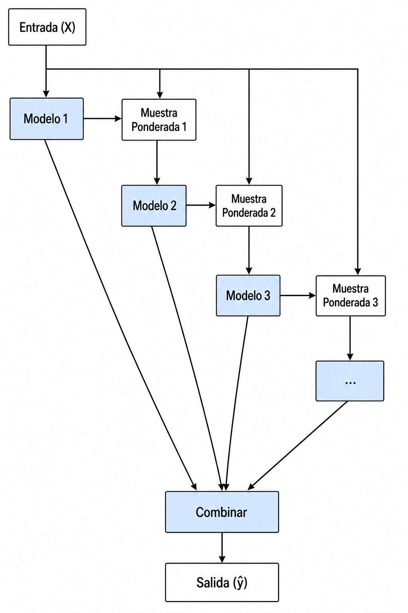

<!--
SPDX-FileCopyrightText: 2026 Colaboradores de apuntes_muicd_uned

SPDX-License-Identifier: CC-BY-4.0
-->

# AAII - Tema 2: Métodos de ensamble secuenciales

Este tema se llamaba originalmente "Intensificación", pero se renombra a "Métodos de ensamble secuenciales" para que engoble más genéricamente los distintos temas tratados.

## Intensificación

Bibliografía:

- Básica
  - [ISL 8.2.3], donde, en unos pocos párrafos, se explican estos conceptos.

\
La **intensificación** (en inglés, ***boosting***) es una estrategia de ensemble que combina muchos modelos sencillos, habitualmente árboles pequeños, construidos de forma **secuencial**.

La idea principal es:

> Cada nuevo árbol intenta corregir los errores que todavía comete el conjunto de árboles construido hasta ese momento.

Boosting puede aplicarse tanto a regresión como a clasificación. En este tema se estudia principalmente utilizando árboles de decisión como modelos base.

<!--Diferencia fundamental respecto a bagging-->
\
Bagging y boosting combinan varios árboles, pero los construyen de forma diferente:

| Método | Cómo se construyen los árboles | Fuente principal de la mejora |
| - | - | - |
| Bagging | Independientemente, sobre muestras bootstrap | Reducir varianza mediante agregación |
| Boosting | Secuencialmente, teniendo en cuenta los árboles anteriores | Corregir progresivamente los errores del modelo actual |

En bagging:

- cada árbol puede entrenarse independientemente de los demás;
- se utiliza bootstrap;
- la predicción final se obtiene por promedio o votación.

En boosting:

- cada árbol depende de lo aprendido anteriormente;
- no se basa, en su formulación básica, en generar muestras bootstrap independientes;
- los árboles se van añadiendo para mejorar la predicción acumulada.

> En boosting, a diferencia de bagging, la construcción de cada árbol depende de los árboles que ya se han construido.

<!--Cómo corrige errores boosting-->
\
En boosting, cada nuevo árbol se construye utilizando información de los errores que deja el modelo acumulado.

En regresión, una forma sencilla de entenderlo es pensar que cada árbol intenta corregir la parte de la predicción que todavía falla. El caso concreto en que estos errores son los **residuos** y equivalen al gradiente negativo de una pérdida cuadrática se estudiará en el apartado de intensificación de gradiente.

<!--Ejemplo intuitivo-->
\
Supongamos que para una observación el valor real es $100$:

| Paso | Predicción acumulada | Residuo pendiente |
| - | - | - |
| Modelo inicial | $70$ | $30$ |
| Tras añadir una corrección de $20$ | $90$ | $10$ |
| Tras añadir una corrección de $8$ | $98$ | $2$ |

Cada árbol nuevo intenta explicar la parte que todavía falta, en lugar de construir una predicción completamente independiente.

<!--Árboles pequeños y aprendizaje lento-->
\
La intensificación suele utilizar árboles pequeños, incluso árboles de una sola división, llamados **tocón** o ***stumps*** .

La razón es que no se pretende que un único árbol resuelva todo el problema:

- cada árbol aporta una corrección limitada;
- el conjunto mejora poco a poco;
- muchos árboles sencillos pueden formar un modelo final potente.

El parámetro $\lambda$, llamado **tasa de aprendizaje** (en inglés, ***shrinkage***), ralentiza todavía más el proceso:

- un $\lambda$ pequeño hace que cada árbol aporte una corrección menor;
- normalmente requiere utilizar más árboles;
- puede ayudar a que el aprendizaje sea más gradual.

Idea clave:

> Boosting aprende lentamente sumando pequeñas correcciones sucesivas.

<!--Parámetros básicos-->
\
En la introducción de ISL aparecen tres parámetros principales:

| Parámetro | Significado |
| - | - |
| $B$ | Número de árboles añadidos secuencialmente |
| $\lambda$ | Tasa de aprendizaje o peso con el que se incorpora cada nuevo árbol |
| $d$ | Número de divisiones de cada árbol, que controla su complejidad |

Interpretación rápida:

| Situación | Efecto habitual |
| - | - |
| $B$ pequeño | El modelo puede no haber corregido suficientes errores |
| $B$ demasiado grande | Puede aparecer sobreajuste |
| $\lambda$ pequeño | Aprendizaje más lento; suelen necesitarse más árboles |
| $d$ pequeño | Árboles sencillos; cada uno aporta una corrección limitada |
| $d$ grande | Árboles más complejos; pueden capturar interacciones más elaboradas |

<!--Sobreajuste: diferencia respecto a bagging-->
\
En bagging y Random Forest, aumentar mucho el número de árboles suele estabilizar la predicción sin provocar sobreajuste importante por el mero hecho de añadir árboles.

En boosting, la situación es diferente:

- cada nuevo árbol se dirige a los errores pendientes del modelo actual;
- con muchas iteraciones, el modelo puede empezar a corregir no solo señal real, sino también ruido;
- por ello, boosting puede ser más propenso al sobreajuste que bagging.

En clasificación, esta idea suele expresarse diciendo que el método se centra progresivamente en los ejemplos difíciles. Algunos de esos ejemplos pueden ser realmente informativos, pero otros pueden ser ruido, valores atípicos o etiquetas erróneas.

**Idea de examen:**

> Boosting puede ser más propenso al sobreajuste que bagging porque se centra progresivamente en los errores o ejemplos difíciles, pudiendo acabar memorizando ruido.

Por este motivo, el número de árboles $B$ suele seleccionarse mediante validación cruzada.

<!--Qué no debe confundirse-->

| Afirmación | Correcta o incorrecta | Motivo |
| - | - | - |
| En boosting los árboles se entrenan independientemente | Incorrecta | Cada árbol depende del modelo construido anteriormente |
| Boosting utiliza necesariamente muestras bootstrap independientes | Incorrecta | Esa es la idea característica de bagging |
| En regresión con pérdida cuadrática, cada árbol nuevo ajusta residuos | Correcta | Intenta corregir la predicción acumulada |
| En boosting puede ser necesario controlar $B$ para evitar sobreajuste | Correcta | Añadir demasiadas correcciones puede ajustar ruido |
| Boosting predice usando el promedio OOB | Incorrecta | OOB está ligado al uso de muestras bootstrap en bagging y Random Forest |
| En boosting los árboles suelen ser pequeños | Correcta | Cada árbol aporta una corrección parcial |

## AdaBoost

Bibliografía:

- Básica
  - [BFA 1.2] pags. 4-7
  - [BFA 1.2.1] 7-11
  - [BFA 1.2.3] 11-14
  - Bloc de notas interactivo "AdaBoost" de la asignatura.

\
<!--AdaBoost: Adaptive Boosting-->
\
**AdaBoost** (`Adaptive Boosting`) es un algoritmo de intensificación para clasificación que combina varios **clasificadores débiles** entrenados secuencialmente.

Un clasificador débil es un modelo sencillo que predice solo algo mejor que el azar. Por ejemplo, en clasificación binaria, un árbol de una sola división (`decision stump`) puede ser un clasificador débil.

La idea principal de AdaBoost es:

> Entrenar sucesivos clasificadores prestando cada vez más atención a los ejemplos que los clasificadores anteriores han predicho mal, y combinar después sus decisiones mediante una votación ponderada.

El nombre **Adaptive** indica precisamente que el método se va adaptando a los errores producidos en iteraciones anteriores.

<!--Clasificadores débiles-->
\
AdaBoost no necesita que cada clasificador individual sea extraordinario. Solo necesita que sea ligeramente mejor que predecir al azar.

En clasificación binaria:

- una predicción aleatoria tendría un error aproximado de $0.5$;
- un clasificador débil útil debe tener un error menor que $0.5$;
- cuanto mejor sea un clasificador débil, más peso tendrá en la predicción final.

Por tanto:

> AdaBoost puede transformar varios clasificadores modestos en un clasificador final mucho más preciso.

<!--Idea del procedimiento-->
\
AdaBoost mantiene una distribución de pesos sobre las observaciones de entrenamiento.

Inicialmente:

- todas las observaciones tienen el mismo peso;
- ninguna observación se considera más importante que otra.

Después de entrenar un clasificador débil:

- las observaciones correctamente clasificadas reducen su peso relativo;
- las observaciones mal clasificadas aumentan su peso relativo;
- el siguiente clasificador se ve forzado a prestar más atención a los casos difíciles.

El procedimiento conceptual es:

1. Asignar el mismo peso inicial a todas las observaciones.
2. Entrenar un clasificador débil utilizando esos pesos.
3. Calcular el error ponderado del clasificador.
4. Asignar un peso mayor al clasificador si ha cometido poco error.
5. Aumentar el peso de las observaciones mal clasificadas.
6. Disminuir el peso de las observaciones correctamente clasificadas.
7. Entrenar el siguiente clasificador con la nueva distribución de pesos.
8. Repetir el proceso y combinar los clasificadores mediante votación ponderada.

<!--Pesos de las observaciones-->
\
Si hay $m$ observaciones de entrenamiento, inicialmente todas reciben el mismo peso:

$$

D_1(i) = \frac{1}{m}

$$

donde $D_t(i)$ representa la importancia de la observación $i$ en la iteración $t$.

Tras entrenar el clasificador $h_t$:

- si una observación está bien clasificada, su peso disminuye;
- si una observación está mal clasificada, su peso aumenta.

La actualización puede expresarse como:

$$

D_{t+1}(i) = \frac{D_t(i)\exp\left(-\alpha_t y_i h_t(x_i)\right)}{Z_t}

$$

donde:

- $y_i$ es la clase real, representada como $-1$ o $+1$;
- $h_t(x_i)$ es la predicción del clasificador débil;
- $\alpha_t$ es el peso asignado al clasificador;
- $Z_t$ normaliza los pesos para que vuelvan a sumar $1$.

No es necesario memorizar toda la fórmula para un test conceptual. Lo imprescindible es:

> Las muestras mal clasificadas aumentan su peso para que los siguientes clasificadores concentren más atención en ellas.

<!--Error ponderado del clasificador débil-->
\
Cada clasificador débil se evalúa teniendo en cuenta los pesos actuales de las observaciones.

Su error ponderado es la suma de los pesos de los ejemplos que clasifica mal:

$$

\varepsilon_t = \sum_{i:h_t(x_i) \neq y_i} D_t(i)

$$

Esto significa que no todos los fallos cuentan igual:

- equivocarse en una observación de peso pequeño penaliza poco;
- equivocarse en una observación difícil, que ya tiene peso alto, penaliza mucho.

El siguiente clasificador intenta obtener un error ponderado bajo bajo la nueva distribución de pesos.

<!--Peso de cada clasificador débil-->
\
AdaBoost no solo asigna pesos a los ejemplos; también asigna un peso a cada clasificador débil.

El peso del clasificador $h_t$ se calcula a partir de su error ponderado:

$$
\alpha_t = \frac{1}{2}\ln\left(\frac{1-\varepsilon_t}{\varepsilon_t}\right)
$$

Interpretación:

| Comportamiento del clasificador débil | Peso $\alpha_t$ |
| - | - |
| Error pequeño | Peso grande |
| Error cercano a $0.5$ | Peso pequeño |
| Clasificador aproximadamente aleatorio | Apenas aporta utilidad |

Por tanto:

> Los clasificadores débiles más precisos tienen más influencia en la decisión final.

<!--Predicción final: votación ponderada-->
\
En clasificación, AdaBoost combina los clasificadores débiles mediante una **votación ponderada**.

Cada clasificador emite su predicción, pero su voto vale $\alpha_t$:

$$
H(x) = \operatorname{sign}\left(\sum_{t=1}^{T} \alpha_t h_t(x)\right)
$$

Por tanto:

- no se usa una media simple de salidas;
- no se usa una votación por mayoría simple;
- los clasificadores más acertados tienen mayor peso en la decisión.

**Idea de examen:**

> AdaBoost combina los clasificadores débiles mediante votación ponderada.

<!--Ejemplo intuitivo-->
\
Supongamos que tres clasificadores débiles votan sobre una observación:

| Clasificador | Predicción | Peso |
| - | - | - |
| $h_1$ | Positivo | $0.2$ |
| $h_2$ | Negativo | $0.8$ |
| $h_3$ | Positivo | $0.3$ |

Aunque dos clasificadores votan **positivo**, el peso total es:

- Positivo: $0.2 + 0.3 = 0.5$.
- Negativo: $0.8$.

La predicción final sería **negativo**.

Esto muestra que AdaBoost no utiliza mayoría simple, sino mayoría **ponderada**.

<!--Por qué cambia los pesos de los ejemplos-->
\
Si AdaBoost entrenase repetidamente el mismo tipo de clasificador con los mismos ejemplos y la misma importancia, probablemente produciría clasificadores muy parecidos.

Al aumentar el peso de los ejemplos mal clasificados:

- el siguiente clasificador debe buscar una regla diferente;
- los casos fáciles pierden protagonismo relativo;
- los casos difíciles reciben más atención;
- los clasificadores sucesivos tienden a complementarse.

Ejemplo conceptual:

| Iteración | Qué recibe más atención |
| - | - |
| Primera | Todas las observaciones por igual |
| Segunda | Ejemplos mal clasificados por el primer clasificador |
| Tercera | Ejemplos que siguen siendo difíciles tras los anteriores |

<!--Diferencia respecto a bagging-->

| Método | Entrenamiento de los modelos | Tratamiento de ejemplos difíciles | Combinación final |
| - | - | - | - |
| Bagging | Modelos independientes sobre muestras bootstrap | No aumenta deliberadamente su importancia | Media o votación habitual |
| AdaBoost | Modelos secuenciales | Aumenta el peso de los mal clasificados | Votación ponderada |

La diferencia fundamental es:

> Bagging busca reducir varianza mediante modelos entrenados independientemente; AdaBoost construye modelos adaptativos que se concentran progresivamente en los errores anteriores.

<!--Diferencia respecto a intensificación de gradiente-->
\
AdaBoost y la intensificación de gradiente construyen modelos secuencialmente, pero no deben confundirse.

| Método | Qué guía al siguiente modelo |
| - | - |
| AdaBoost | Una distribución de pesos sobre los ejemplos; los mal clasificados aumentan su peso |
| Intensificación de gradiente | El gradiente de la función de pérdida; con error cuadrático, los residuos |

Además, en AdaBoost:

- cada clasificador débil recibe un peso $\alpha_t$ en la votación final;
- cada ejemplo de entrenamiento recibe un peso $D_t(i)$ que cambia entre iteraciones.

**Idea de examen:**

> Una diferencia característica es que AdaBoost asigna pesos a los ejemplos, además de asignar pesos a los clasificadores débiles.

No debe confundirse con afirmar que la intensificación de gradiente no tenga pesos o contribuciones para sus árboles: la diferencia que se pregunta está en la **reponderación explícita de los ejemplos** propia de AdaBoost.

<!--Sobreajuste y ejemplos difíciles-->
\
AdaBoost dirige progresivamente su atención a las observaciones difíciles.

Esto puede ser beneficioso cuando esas observaciones representan patrones importantes que los clasificadores iniciales no han aprendido.

Sin embargo, también puede ser problemático si los ejemplos difíciles son:

- ruido;
- valores atípicos;
- datos con etiquetas incorrectas;
- casos excepcionales poco representativos.

En esas situaciones, AdaBoost puede dedicar demasiadas iteraciones a intentar corregir ejemplos que no conviene memorizar.

Por tanto:

> AdaBoost puede sobreajustar al centrarse progresivamente en ejemplos difíciles que en realidad contienen ruido.

<!--Por qué puede sobreajustar menos de lo esperado-->
\
Aunque AdaBoost aumenta mucho la atención sobre los casos difíciles, en ocasiones su rendimiento en test continúa siendo bueno incluso después de reducir mucho o eliminar el error de entrenamiento.

La intuición de examen es:

> La predicción final no depende de un único modelo obsesionado con un ejemplo, sino de la combinación ponderada de muchos clasificadores; esa combinación puede compensar el énfasis excesivo de algunos clasificadores individuales.

Una explicación más precisa se basa en el **margen de clasificación**:

- no solo importa que una observación sea clasificada correctamente;
- también importa con cuánta ventaja gana la clase correcta en la votación ponderada;
- AdaBoost puede seguir aumentando esos márgenes incluso cuando el error de entrenamiento ya es cero;
- márgenes mayores pueden hacer que la decisión final sea más estable.

Aun así, esta resistencia no es absoluta:

> AdaBoost puede resistir el sobreajuste en algunos problemas, pero también puede sobreajustar, especialmente cuando sigue concentrándose en ruido o etiquetas erróneas.

<!--Resumen de una línea-->

> AdaBoost entrena clasificadores débiles secuencialmente, aumenta el peso de los ejemplos mal clasificados y combina los modelos mediante una votación ponderada en la que los clasificadores más precisos tienen mayor influencia.

## Intensificación de gradiente

Bibliografía:

- Básica
  - [ESL 10.9 Boosting trees] Págs. 353-358
  - [ESL 10.10 Numerical Optimization via Gradient Boosting] Págs. 358-361
  - [ESL 10.13 Interpretation] Págs. 367-370
  - [ESL 10.14 Illustrations] Págs. 370-380
  - Bloc de notas interactivo "Gradient Boosting" de la asignatura.
- Complementaria
  - [AB]

\
<!--Intensificación de gradiente: Gradient Boosting-->
\
La **intensificación de gradiente** (`Gradient Boosting`) es un método de ensemble que construye un modelo sumando modelos sencillos de forma secuencial, normalmente árboles de decisión pequeños.

La idea principal es:

> En cada iteración se añade un árbol que intenta reducir los errores del modelo acumulado según una función de pérdida.

El modelo final tiene forma aditiva:

$$

f_M(x) = f_0(x) + \sum_{m=1}^{M} \nu T_m(x)

$$

donde:

- $f_0(x)$ es la predicción inicial;
- $M$ es el número de árboles o iteraciones;
- $T_m(x)$ es el árbol añadido en la iteración $m$;
- $\nu$ es la tasa de aprendizaje o `shrinkage`, que controla cuánto aporta cada árbol.

<!--Relación con la introducción a boosting-->
\
En el apartado introductorio se vio que boosting construye árboles secuencialmente para corregir errores anteriores.

Gradient Boosting generaliza esa idea:

- no se limita a una única forma de medir el error;
- permite elegir una **función de pérdida** adecuada al problema;
- cada nuevo árbol se entrena para reducir esa pérdida.

En regresión con error cuadrático, la corrección que aprende cada árbol son los residuos ordinarios. Con otras pérdidas, aprende cantidades equivalentes llamadas **pseudo-residuos**.

<!--Función de pérdida-->
\
La **función de pérdida** mide cuánto se equivoca el modelo. Gradient Boosting intenta reducir progresivamente esa cantidad.

| Problema | Ejemplo de función de pérdida | Qué mide |
| - | - | - |
| Regresión | Error cuadrático | Diferencia cuadrática entre valor real y predicción |
| Regresión robusta | Error absoluto o pérdida de Huber | Error dando menos influencia a valores extremos |
| Clasificación | Deviance o pérdida logística | Calidad de las probabilidades o decisiones de clase |

**Idea de examen:**

> La función de pérdida es el criterio utilizado para medir y minimizar los errores en cada iteración.

No representa:

- la probabilidad de error de una única observación;
- el número de árboles necesarios;
- la tasa de aprendizaje.

<!--Por qué se llama intensificación de gradiente-->
\
Gradient Boosting puede entenderse como un procedimiento de optimización.

En cada iteración:

1. Se calcula en qué dirección cambiarían las predicciones para reducir más rápidamente la pérdida.
2. Esa dirección viene dada por el **gradiente negativo** de la función de pérdida.
3. Se entrena un árbol para aproximar esos valores.
4. El árbol se añade al modelo acumulado.

Los valores que intenta predecir el nuevo árbol se llaman **pseudo-residuos**:

$$

r_{im} = - \left[\frac{\partial L(y_i, f(x_i))}{\partial f(x_i)}\right]_{f=f_{m-1}}

$$

No hace falta memorizar esta fórmula en detalle para responder las preguntas conceptuales. Lo importante es:

> Cada árbol nuevo aprende una corrección indicada por la pérdida que todavía comete el modelo actual.

<!--Caso sencillo: error cuadrático-->
\
Con pérdida cuadrática en regresión:

$$

L(y_i, f(x_i)) = \frac{1}{2}\left(y_i - f(x_i)\right)^2

$$

el gradiente negativo coincide con el residuo ordinario:

$$

r_{im} = y_i - f_{m-1}(x_i)

$$

Por tanto, en este caso:

> Cada árbol sucesivo se ajusta a los residuos de la predicción anterior.

Ejemplo:

| Valor real | Predicción actual | Residuo que intentará aprender el siguiente árbol |
| - | - | - |
| $100$ | $70$ | $30$ |
| $50$ | $62$ | $-12$ |
| $80$ | $78$ | $2$ |

Si el modelo predice demasiado bajo, el nuevo árbol intenta añadir una corrección positiva. Si predice demasiado alto, intenta añadir una corrección negativa.

<!--Algoritmo conceptual-->
\
El procedimiento general es:

1. Inicializar el modelo con una predicción sencilla, por ejemplo una constante.
2. Calcular los pseudo-residuos según la función de pérdida elegida.
3. Entrenar un árbol pequeño para predecir esos pseudo-residuos.
4. Añadir al modelo una versión reducida de la predicción del árbol, multiplicada por $\nu$.
5. Volver a calcular los pseudo-residuos del nuevo modelo.
6. Repetir el proceso durante $M$ iteraciones.

La actualización del modelo puede expresarse como:

$$

f_m(x) = f_{m-1}(x) + \nu T_m(x)

$$

<!--Diferencia respecto a AdaBoost-->
\
AdaBoost y Gradient Boosting son métodos secuenciales, pero su explicación operativa es diferente.

| Método | Qué cambia en cada iteración |
| - | - |
| AdaBoost | Aumenta explícitamente el peso de los ejemplos mal clasificados y combina clasificadores por voto ponderado |
| Gradient Boosting | Ajusta un nuevo modelo al gradiente negativo o pseudo-residuo de una función de pérdida |

En AdaBoost, el peso $D_t(i)$ de un ejemplo mide la importancia de clasificarlo correctamente en la ronda actual.

En Gradient Boosting, la idea central no es una reponderación explícita de ejemplos, sino minimizar una función de pérdida añadiendo correcciones sucesivas.

**Advertencia para el test:**

> Si una pregunta habla del peso asignado al ejemplo $i$ y de prestar más atención a ejemplos mal clasificados, está describiendo AdaBoost, aunque aparezca dentro del bloque general de intensificación.

<!--Aprendices débiles-->
\
Un **aprendiz débil** (`weak learner`) es un modelo sencillo que por sí solo tiene capacidad predictiva limitada, pero aporta información útil al ensemble.

Pueden utilizarse como aprendices débiles:

- árboles pequeños;
- regresiones lineales;
- otros modelos sencillos adecuados al problema.

En boosting con árboles, son habituales los árboles de poca profundidad, porque cada árbol solo tiene que aportar una corrección parcial.

En clasificación binaria, la **asunción de aprendizaje débil** indica que cada clasificador débil debe hacerlo ligeramente mejor que el azar. Si $\gamma > 0$, su error debe cumplir:

$$

\varepsilon < 0.5 - \gamma

$$

La intuición es:

- un clasificador aleatorio tendría error $0.5$;
- un aprendiz débil útil debe tener error menor que $0.5$ por algún margen positivo.

Este concepto está especialmente asociado a la fundamentación de AdaBoost y del boosting en clasificación.

<!--Regularización y sobreajuste-->
\
Gradient Boosting puede sobreajustar si se añaden demasiados árboles o si cada corrección es demasiado agresiva.

A diferencia de bagging o Random Forest, en boosting cada modelo nuevo se construye para corregir los fallos pendientes del ensemble actual. Si el proceso continúa demasiado, puede empezar a ajustar ruido.

**Idea de examen:**

> En intensificación de gradiente, a más árboles, mayor posibilidad de sobreaprendizaje.

Las técnicas de regularización se utilizan para:

> Reducir los efectos del sobreaprendizaje.

Las principales formas de control son:

| Mecanismo | Idea |
| - | - |
| Número de árboles $M$ | Detener el proceso antes de añadir demasiadas correcciones |
| Tasa de aprendizaje $\nu$ | Hacer que cada árbol aporte una corrección más pequeña |
| Fracción de observaciones $\eta$ | Entrenar cada árbol con una submuestra aleatoria para introducir regularización |
| Tamaño del árbol $J$ o profundidad | Limitar la complejidad de cada corrección |

<!--Tasa de aprendizaje o shrinkage-->
\
La tasa de aprendizaje $\nu$ controla cuánto se incorpora cada árbol al modelo final.

- Si $\nu$ es grande, cada árbol tiene mucho efecto y el modelo aprende rápidamente, pero puede sobreajustar antes.
- Si $\nu$ es pequeño, cada paso es más prudente y suele ser necesario utilizar más árboles.

La idea habitual es:

> Usar árboles pequeños y una tasa de aprendizaje reducida para construir el modelo de forma gradual.

<!--Número de árboles-->
\
El número de árboles $M$ determina cuántas correcciones se incorporan al modelo.

| Valor de $M$ | Riesgo habitual |
| - | - |
| Demasiado pequeño | Subajuste: el modelo no ha aprendido suficiente |
| Adecuado | Buen equilibrio de predicción |
| Demasiado grande | Sobreajuste: el modelo puede empezar a seguir ruido |

Por eso, el número de árboles suele elegirse mediante validación cruzada o controlando el error en un conjunto de validación.

<!--Fracción de observaciones: Gradient Boosting estocástico-->
\
Una variante regularizada utiliza solo una fracción aleatoria de las observaciones para entrenar cada árbol.

Si $\eta$ representa esa fracción:

- $\eta = 1$ utiliza todas las observaciones en cada iteración;
- $\eta = 0.5$ utiliza una submuestra aleatoria del $50\%$ para cada árbol.

Esta aleatoriedad puede reducir el sobreajuste y mejorar la generalización.

**Idea de examen:**

> Entre los parámetros para controlar la intensificación están la tasa de aprendizaje, el número de modelos y la fracción de observaciones utilizada en cada uno.

**Matiz:**

ESL también considera importante el tamaño o profundidad de los árboles. Sin embargo, en la pregunta de examen dada, la opción correcta destaca específicamente $\nu$, $M$ y la fracción de observaciones.

<!--Tamaño de los árboles-->
\
En Gradient Boosting no suele buscarse construir árboles muy profundos.

- Árboles pequeños producen correcciones sencillas y controladas.
- Árboles más grandes pueden capturar interacciones más complejas.
- Árboles demasiado profundos pueden aumentar la complejidad y facilitar el sobreajuste.

El tamaño del árbol controla el nivel de interacciones que puede aprender el modelo:

| Tipo de árbol | Qué puede representar |
| - | - |
| Una sola división (`stump`) | Efectos simples de una variable |
| Árbol pequeño | Interacciones de bajo orden |
| Árbol profundo | Interacciones más complejas, con mayor riesgo de sobreajuste |

Por tanto:

> No es correcto afirmar que en Gradient Boosting siempre sea mejor utilizar árboles profundos.

<!--Interpretación: importancia de variables-->
\
Un único árbol puede dibujarse e interpretarse fácilmente. Un modelo de Gradient Boosting es una suma de muchos árboles y no puede interpretarse mirando un único diagrama.

Aun así, ofrece herramientas de interpretación, especialmente la **importancia relativa de variables**.

La importancia de una variable se obtiene observando cuánto mejora el criterio de ajuste cuando esa variable se utiliza para dividir nodos, y agregando esas mejoras a lo largo de todos los árboles.

| Variable | Interpretación de una importancia alta |
| - | - |
| Muy importante | Produce frecuentemente divisiones que reducen mucho el error o la pérdida |
| Poco importante | Se usa poco o sus divisiones apenas mejoran el modelo |

**Idea de examen:**

> Los métodos basados en intensificación ofrecen posibilidades de interpretación porque es posible calcular la importancia de las variables.

No se consideran interpretables simplemente porque:

- cada árbol individual pueda dibujarse;
- pueda representarse el modelo completo en tres dimensiones;
- se usen colores en una visualización.

<!--Interpretación adicional: dependencia parcial-->
\
Además de la importancia de variables, pueden utilizarse gráficos de **dependencia parcial** para observar cómo cambia la predicción del modelo al variar una o dos variables relevantes, promediando el efecto del resto.

Estos gráficos permiten estudiar, por ejemplo:

- si una variable aumenta o disminuye la predicción;
- si la relación es aproximadamente lineal o presenta umbrales;
- si dos variables parecen interactuar.

Para el examen recopilado, lo imprescindible es recordar la **importancia de variables**; la dependencia parcial es una herramienta complementaria de interpretación.

<!--Resumen de una línea-->

> Gradient Boosting suma árboles secuenciales que aproximan el gradiente negativo de una función de pérdida; se controla con tasa de aprendizaje, número de árboles, submuestreo y complejidad de los árboles, y puede interpretarse mediante importancia de variables.

## Implementaciones de intensificación de gradiente

\
Existen varias implementaciones modernas de intensificación de gradiente orientadas a conseguir buen rendimiento y entrenamiento eficiente.

Las tres implementaciones que deben reconocerse son:

- **XGBoost** (`eXtreme Gradient Boosting`).
- **LightGBM** (`Light Gradient Boosting Machine`).
- **CatBoost** (`Category Boosting`).

Todas ellas son variantes de intensificación de gradiente basadas habitualmente en árboles.

### XGBoost

Bibliografía:

- Básica
  - [CLX]
  - Bloc de notas interactivo "XGBoost" de la asignatura.

XGBoost es una referencia general muy utilizada.

### LightGBM

Bibliografía:

- Básica
  - [CLX]
  - Bloc de notas interactivo "LightGBM" de la asignatura.

LightGBM destaca por su eficiencia.

### CatBoost

Bibliografía:

- Básica
  - [CLX]

CatBoost destaca por el tratamiento de variables categóricas.

<!--Comparación mínima-->

| Implementación | Idea distintiva básica |
| - | - |
| XGBoost | Implementación muy extendida y eficiente de Gradient Boosting; construye árboles habitualmente por niveles |
| LightGBM | Orientada a gran velocidad y eficiencia; hace crecer árboles por hojas (`leaf-wise`) |
| CatBoost | Especialmente orientada al manejo directo de variables categóricas; utiliza `ordered boosting` y árboles simétricos |

## Prácticas

Bibliografía:

- Básica
  - [PML] Capítulo 6 "Gradient Boosting Machines".

## Bibliografía

Bibliografía:

- Básica
  - [ISL] An introduction to statistical learning, G. James, D. Witten, T. Hastie and R. Tibshirani: <https://www.statlearning.com>
  - [ESL] The Elements of Statistical Learning. 2nd ed.
  - [BFA] Boosting: Foundations and Algorithms, Robert E. Schapire, Yoav Freund. <https://direct.mit.edu/books/oa-monograph/5342/BoostingFoundations-and-Algorithms>
  - [CLX] CatBoost vs. LightGBM vs. XGBoost,: <https://towardsdatascience.com/catboost-vs-lightgbm-vs-xgboost-c80f40662924/>
  - [PML] Practical machine learning with H2O, Darren Cook: <https://www.oreilly.com/library/view/practical-machine-learning/9781491964590/>
- Complementaria
  - [AB] KUNAPAREDDI, Chaitanya. Adaptive Boosting.
  - [GBA] PRASAD, Nikita. Gradient Boosting Algorithm <https://github.com/nikitaprasad21/ML-Cheat-Codes/blob/main/Voting-Ensemble/gradient_boosting_regressor.ipynb>

FAQ:

- [FAQ](https://agora.uned.es/mod/glossary/view.php?id=704365)

## Licencia y atribución

[![CC BY 4.0][cc-by-shield]][cc-by]

Este trabajo está licenciado bajo la licencia **[Creative Commons Atribución 4.0 Internacional][cc-by]**.

© 2026, [Colaboradores de apuntes_muicd_uned](https://github.com/TU_ORGANIZACION/apuntes_muicd_uned).

[cc-by]: http://creativecommons.org/licenses/by/4.0/
[cc-by-shield]: https://img.shields.io/badge/License-CC%20BY%204.0-lightgrey.svg
