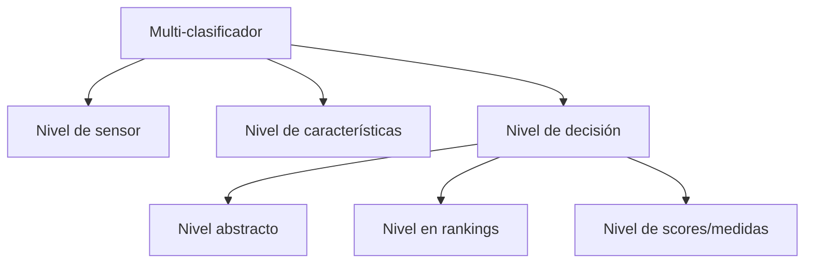

<!--
SPDX-FileCopyrightText: 2026 Colaboradores de apuntes-muicd-uned

SPDX-License-Identifier: CC-BY-4.0
-->

# AAII - Tema 3: Sistemas de clasificadores múltiples

Este tema se llamaba originalmente "Otras combinaciones de modelos", pero se renombra a "Sistemas de clasificadores múltiples" para que sea más concreto respecto a los temas tratados.

El tema revisa las técnicas de reducción de varianza consideradas dentro del término *ensemble learning*. Se observan taxonomías de clasificadores y se explica el método de apilamiento o *stacking*.

\
La estructura del tema se organiza de acuerdo al artículo [CCT], el cual también sigue el personal docente a la hora de indicar cómo seguir la teoría, añadiéndose una sección adicional que contempla los clasificadores explicados en los vídeos prácticos de la asignatura.

## 3.1 Introducción a sistemas de clasificadores múltiples

Bibliografía:

- Básica
  - [CCT] I. Introduction. Págs. 1-2

\
En este tema se estudian formas de combinar clasificadores distintas de bagging y boosting denominados en la literatura científica como **sistemas de clasificadores múltiples** (del inglés *Multiple Classifies Systems*, **MCS**).

La idea general es disponer de varios clasificadores o "expertos" y combinar sus salidas para obtener una decisión final más fiable que la de un único clasificador.

Estos clasificadores pueden ser:

- del mismo tipo, pero entrenados con diferentes variables, datos o parámetros;
- de tipos distintos, por ejemplo un árbol, una máquina de vectores de soporte y una red neuronal.

La clave no es únicamente que cada clasificador sea bueno por separado, sino que aporten información complementaria.

> Una combinación resulta útil cuando los clasificadores individuales no cometen los mismos errores en los mismos ejemplos.

Si todos fallan en los mismos casos, combinar sus predicciones aportará poca mejora.

## 3.2. Marco general para la combinación de clasificadores

- [CCT] sección II

<!--Marco general para la combinación de clasificadores-->
\
Supongamos que queremos asignar una observación a una de $N$ clases posibles utilizando $M$ clasificadores.

Cada clasificador produce algún tipo de salida y un método de combinación transforma todas esas salidas en una única decisión final.

Esquema conceptual:

1. Una observación se entrega a varios clasificadores.
2. Cada clasificador produce una salida sobre las clases posibles.
3. Un método de combinación fusiona esas salidas.
4. Se obtiene una única clase final.

## 3.3. Estrategias para la combinación de clasificadores

Bibliografía:

- Básica
  - [CCT] sección III "Classifiers Combination Strategies"
- Complementaria
  - [CCS]

\
Categorías de métodos de combinación de clasificadores según el artículo [CCT]:

- Combinación en el nivel de decisión
- Umbral duro/blando
- Adaptativas/no adaptativas
- Número de clasificadores que son combinados bajo ($<10$) o alto
- Fuera de categorías

Una vez que varios clasificadores han producido sus salidas, es necesario decidir cómo combinarlas para obtener una única predicción final.

### 3.3.1. Niveles de combinación de clasificadores

Bibliografía:

- Básica
  - [CCT] Apartado A "Levels of Classifiers Combination" de sección III "Classifiers Combination Strategies".

\
Niveles de multiclasificación:

- Nivel de sensor
- Nivel de características
- Nivel de decisión
  - Nivel abstracto
  - Nivel en rankings
  - Nivel de scores/medias

<!--Niveles de combinación-->
CCT distingue tres niveles en los que puede combinarse la información:

| Nivel de combinación | Qué se combina | Momento |
| - | - | - |
| Nivel de sensores o datos | Datos brutos procedentes de varias fuentes | Antes de extraer características |
| Nivel de características | Variables o representaciones extraídas | Antes de clasificar |
| Nivel de decisión | Salidas producidas por clasificadores ya entrenados | Después de clasificar |

La combinación a nivel de características puede consistir en concatenar variables de distintas fuentes, aunque esto puede aumentar mucho la dimensionalidad.

La combinación a nivel de decisión trabaja con las salidas de varios clasificadores ya construidos.

#### 3.3.1.1. Combinación a nivel de sensor

La combinación a **nivel de sensor** (*sensor level*) fusiona los datos brutos procedentes de varias fuentes o sensores antes de extraer características o aplicar clasificadores.

Ejemplo: combinar señales de varios sensores médicos, cámaras o dispositivos de medida para construir una entrada común.

#### 3.3.1.2. Combinación a nivel de características

La combinación a **nivel de variables** o **características** (*feature level*) fusiona atributos extraídos de distintas fuentes antes de entrenar o aplicar los clasificadores.

Ejemplo: unir variables de imagen, texto y datos numéricos en un único vector de características.

#### 3.3.1.3. Combinación a nivel de decisión

\
`EXAM=(2025SO.3)`

La combinación a **nivel de decisión** (*decision level*) consiste en agrupar información desdpués de que los clasificadores hayan realizado su etiquetado.

\
`EXAM=(2021J2.7,2023J2.9,2023SO.6)`

Según Mohandes et al. [CCT], la combinación en el nivel de decisión es la categoría más frecuente y exitosa: se combinan las salidas de clasificadores que ya han realizado su etiquetado o puntuación individual.

Dentro del nivel de decisión, pueden distinguirse tres formas principales de combinar clasificadores:

| Tipo | Salida que utiliza | Idea |
| - | - | - |
| Combinación abstracta | Una etiqueta por clasificador | Se combinan decisiones finales, por ejemplo mediante votación |
| Combinación basada en rankings | Una lista ordenada de clases por clasificador | Se combinan las posiciones asignadas a cada clase |
| Combinación basada en scores | Puntuaciones o probabilidades para las clases | Se combina el grado de confianza de cada clasificador |

##### 3.3.1.3.1. Combinación abstracta

\
En la **combinación abstracta** (*abstract level*), cada clasificador devuelve solo una etiqueta de clase.

Ejemplo:

| Clasificador | Predicción |
| - | - |
| Clasificador 1 | A |
| Clasificador 2 | B |
| Clasificador 3 | A |

El combinador trabaja directamente con esas etiquetas. El ejemplo más simple es la **votación mayoritaria**.

Esta categoría está relacionada con la **combinación dura**, porque cada clasificador aporta una decisión final sin indicar su grado de confianza.

**Idea para recordar:**

> La combinación abstracta combina etiquetas finales; la votación por mayoría es su ejemplo más sencillo.

##### 3.3.1.3.2. Combinación basada en rankings

\
En la combinación basada en **posiciones** o **rankings** (*rank level*), cada clasificador ordena las clases candidatas desde la más plausible hasta la menos plausible.

Ejemplo:

| Clasificador | Ranking de clases |
| - | - |
| Clasificador 1 | A, B, C |
| Clasificador 2 | B, A, C |
| Clasificador 3 | A, C, B |

El combinador utiliza esas posiciones para obtener una clasificación global.

`EXAM=(2024SO.6)`

La ventaja principal es que los rankings permiten combinar clasificadores heterogéneos:

- no es imprescindible que todos calculen probabilidades de la misma forma;
- basta con que todos puedan ordenar las clases;
- modelos muy diferentes pueden expresar una preferencia comparable mediante posiciones.

**Idea de examen:**

> Las combinaciones basadas en rankings facilitan la combinación de clasificadores heterogéneos.

##### 3.3.1.3.3. Combinación basada en scores

\
En la combinación basada en **scores** o **calificaciones** (*measurement level*), cada clasificador proporciona una puntuación, grado de confianza o estimación de probabilidad para cada clase.

Ejemplo:

| Clasificador | Score clase A | Score clase B |
| - | - | - |
| Clasificador 1 | $0.80$ | $0.20$ |
| Clasificador 2 | $0.55$ | $0.45$ |
| Clasificador 3 | $0.70$ | $0.30$ |

El método de combinación utiliza esos valores para obtener una decisión global.

Esta categoría está relacionada con la **combinación blanda**, porque no se utilizan solo etiquetas finales, sino información de confianza.

Ejemplos de reglas basadas en scores:

- regla de suma;
- regla de producto;
- regla de máximo;
- regla de mínimo;
- regla de mediana.

**Idea para recordar:**

> La combinación basada en scores utiliza puntuaciones o probabilidades de clase, no solo la etiqueta final elegida por cada clasificador.

### 3.3.2. Dureza de la combinación

Bibliografía:

- Básica
  - [CCT] Apartado B "Hard and Soft Level Classifiers Combination" de la sección III "Classifiers Combination Strategies".

<!--Combinación dura y combinación blanda-->
\
Otra forma de clasificar los métodos es distinguir entre combinación **dura** (*hard*) y combinación **blanda** (*soft*).

| Tipo de combinación | Qué utiliza | Ejemplo típico |
| - | - | - |
| Dura | Etiquetas finales producidas por los clasificadores | Votación mayoritaria |
| Blanda | Scores o probabilidades a posteriori de cada clase | Regla de suma, producto, máximo o mínimo |

#### Combinación dura

\
En la combinación dura, cada clasificador produce una única etiqueta.

Ejemplo:

| Clasificador | Predicción |
| - | - |
| Clasificador 1 | A |
| Clasificador 2 | B |
| Clasificador 3 | A |

Una regla de votación mayoritaria elegiría la clase **A**.

La combinación dura es sencilla, pero descarta información: no distingue entre un clasificador muy seguro y otro que elige una clase con muchas dudas.

#### Combinación blanda

\
En las preguntas de examen se utiliza la expresión **umbral blando**. En CCT esta idea aparece como combinación de nivel blando (*soft-level combination*).

En este caso, cada clasificador produce scores o aproximaciones de la probabilidad a posteriori de cada clase.

Ejemplo:

| Clasificador | $P(A)$ | $P(B)$ |
| - | - | - |
| Clasificador 1 | $0.90$ | $0.10$ |
| Clasificador 2 | $0.45$ | $0.55$ |
| Clasificador 3 | $0.80$ | $0.20$ |

Aunque el segundo clasificador elija la clase B, los scores de los otros clasificadores muestran un apoyo fuerte a A.

Por eso:

> La combinación mediante umbral blando calcula la salida global teniendo en cuenta la probabilidad a posteriori, o score, de cada clase.

Las reglas blandas habituales incluyen:

- regla de suma;
- regla de producto;
- regla de máximo;
- regla de mínimo;
- regla de mediana.

**No confundir:**

| Afirmación | Correcta o incorrecta |
| - | - |
| El umbral blando utiliza probabilidades o scores de las clases | Correcta |
| El umbral blando es simplemente mayoría simple | Incorrecta |
| El umbral blando asigna necesariamente votos fijos | Incorrecta |
| El umbral blando elige automáticamente el clasificador más preciso | Incorrecta |

<!--Por qué la diversidad de errores es esencial-->
\
Combinar clasificadores solo aporta ventaja si sus errores no coinciden completamente.

Supongamos tres clasificadores:

| Ejemplo | Clasificador 1 | Clasificador 2 | Clasificador 3 | Resultado de combinar |
| - | - | - | - | - |
| Caso A | Correcto | Correcto | Incorrecto | Puede corregirse por mayoría |
| Caso B | Incorrecto | Correcto | Correcto | Puede corregirse por mayoría |
| Caso C | Incorrecto | Incorrecto | Incorrecto | La combinación también falla |

La combinación puede compensar errores individuales cuando unos clasificadores aciertan donde otros fallan.

Por tanto:

> No basta con reunir clasificadores precisos: interesa que sean precisos y que sus errores sean distintos o complementarios.

### 3.3.3. Combinación adaptativa y no adaptativa

Bibliografía:

- Básica
  - [CCT] Apartado C "Adaptive and Non-adaptive Combiners" de sección III "Classifiers Combination Strategies".

\
Según [CCT], las técnicas de combinación de clasificadores también pueden clasificarse en **adaptativas** y **no adaptativas**.

| Tipo | Idea |
| - | - |
| No adaptativa | Usa una regla fija para combinar o seleccionar salidas |
| Adaptativa | Ajusta dinámicamente pesos o reglas de combinación antes de decidir |

`EXAM=(2021J2.16)`

El **enfoque de máxima confianza** (*highest confidence approach*) es una técnica **no adaptativa**. Consiste en ordenar los clasificadores individuales según la confianza de sus salidas y seleccionar la decisión del clasificador con mayor confianza.

**Idea de examen:**

> El enfoque de máxima confianza es un ejemplo de técnica de combinación no adaptativa.

## 3.4. Técnicas de combinación de clasificadores

En este apartado se estudian varias estrategias concretas revisadas  en la parte práctica de la asignatura, cada una con su vídeo explicativo correspondiente.

Estrategias:

- Votación
- Weighted average
- Selección de miembros del conjunto
- Apilamiento
- Blending
- Super Learner

La idea común es:

> La combinación será útil cuando los clasificadores aporten información complementaria y no se equivoquen todos en los mismos ejemplos.

### Votación

\
La **votación** es una técnica de combinación en la que varios clasificadores emiten decisiones y se selecciona una clase final según los votos recibidos.

<!--Votación dura-->
\
En la **votación dura** (`hard voting`), cada clasificador produce una única etiqueta de clase. La clase con mayor número de votos se toma como salida global.

Ejemplo:

| Clasificador | Predicción |
| - | - |
| Clasificador 1 | A |
| Clasificador 2 | B |
| Clasificador 3 | A |

La salida final es la clase **A**, porque ha recibido más votos.

CCT distingue varias posibilidades de votación:

- votación unánime: todos los clasificadores deben coincidir;
- votación por más de la mitad: la clase debe superar el $50\%$ de los votos;
- votación por mayor número de votos: se elige la clase más votada.

Para la pregunta de examen, debe recordarse:

> La votación donde la clase más votada es elegida como salida global se denomina **votación dura**.

<!--Votación dura frente a combinación blanda-->
\
No debe confundirse la votación dura con la combinación blanda ya estudiada en el marco general:

| Estrategia | Qué combina | Ejemplo |
| - | - | - |
| Votación dura | Etiquetas finales | A, B, A $\rightarrow$ A |
| Combinación blanda | Scores o probabilidades de cada clase | Sumar probabilidades y elegir la mayor |

En votación dura, un clasificador muy seguro y otro muy inseguro aportan inicialmente un voto cada uno. En combinación blanda, puede aprovecharse el grado de confianza de cada predicción.

### Votación ponderada
<!--Promedio o votación ponderada: Weighted average / Weighted voting-->
\
La votación simple trata a todos los clasificadores por igual. Sin embargo, esto puede no ser razonable si algunos clasificadores son sistemáticamente más fiables que otros.

La **combinación ponderada** asigna mayor influencia a los clasificadores considerados más precisos o fiables.

Conviene distinguir dos casos muy cercanos:

| Técnica | Qué combina |
| - | - |
| Votación ponderada | Etiquetas, pero cada voto tiene un peso diferente |
| Promedio ponderado (`weighted average`) | Scores o probabilidades, ponderados según el modelo que los produce |

<!--Votación ponderada-->
\
En votación ponderada, cada clasificador $D_i$ recibe un peso $b_i$.

Para una clase $\omega_j$, se suma el peso de los clasificadores que han votado por esa clase:

$$

g_j(x) = \sum_{i=1}^{M} b_i d_{i,j}

$$

donde $d_{i,j}$ vale $1$ si el clasificador $i$ predice la clase $\omega_j$ y $0$ en caso contrario.

La clase final será la que obtenga mayor puntuación ponderada.

Ejemplo:

| Clasificador | Predicción | Peso |
| - | - | - |
| Clasificador 1 | A | $0.20$ |
| Clasificador 2 | A | $0.15$ |
| Clasificador 3 | B | $0.65$ |

Aunque la clase A recibe dos votos y B solo uno:

- puntuación de A: $0.20 + 0.15 = 0.35$;
- puntuación de B: $0.65$.

La salida final es **B**.

<!--Promedio ponderado de scores-->

\
Si cada clasificador proporciona scores o probabilidades, también pueden combinarse mediante una media ponderada.

Por ejemplo, para una clase $\omega_j$:

$$

s_j(x) = \sum_{i=1}^{M} b_i p_i(\omega_j \mid x)

$$

donde $p_i(\omega_j \mid x)$ es la probabilidad o score asignado por el clasificador $i$ a la clase $\omega_j$.

Interpretación:

> La combinación ponderada permite que un clasificador más fiable influya más en la decisión final.

CCT indica que la votación simple es más razonable cuando los clasificadores tienen precisiones comparables; cuando no las tienen, puede resultar conveniente utilizar pesos.

<!--Lo imprescindible: combinación ponderada-->

1. La votación simple asigna la misma influencia a todos los clasificadores.
2. La votación ponderada asigna mayor influencia a algunos clasificadores.
3. El promedio ponderado combina scores o probabilidades usando pesos.
4. Los pesos pueden reflejar la precisión o fiabilidad estimada de cada clasificador.
5. Esta técnica no aprende necesariamente una regla compleja dependiente del ejemplo: puede utilizar pesos fijos.

### Selección de miembros del conjunto
<!--Selección de miembros del conjunto-->
\
La **selección de miembros del conjunto** consiste en elegir qué clasificadores se utilizarán en la combinación final, en lugar de agregar automáticamente todos los modelos disponibles.

La motivación es que añadir más clasificadores no garantiza mejorar la predicción:

- un clasificador puede ser poco preciso;
- puede cometer prácticamente los mismos errores que otros ya incluidos;
- puede introducir ruido en la decisión final;
- puede aumentar el coste sin aportar información útil.

Por tanto:

> Un conjunto reducido de clasificadores precisos y complementarios puede ser mejor que combinar todos los modelos disponibles.

<!--Selección del mejor clasificador frente a combinación-->
\
Una posibilidad extrema consiste en no combinar varios modelos, sino seleccionar el mejor clasificador individual según validación cruzada.

CCS compara precisamente:

- votar entre varios clasificadores;
- utilizar stacking;
- seleccionar el mejor clasificador individual mediante validación cruzada.

El artículo señala que algunas técnicas de stacking conocidas obtenían resultados comparables, pero no claramente superiores, a seleccionar el mejor clasificador. Por tanto, combinar modelos no debe darse por bueno automáticamente: hay que validar si realmente mejora.

<!--Lo imprescindible: selección de miembros-->

1. No todos los clasificadores disponibles tienen por qué formar parte del ensemble final.
2. Añadir clasificadores redundantes o poco fiables puede no mejorar el resultado.
3. La selección puede buscar modelos precisos y con errores complementarios.
4. Seleccionar el mejor modelo individual mediante validación cruzada es una referencia razonable frente a la que comparar stacking.

### Apilamiento

\
El **apilamiento** (`stacking` o `stacked generalization`) es una técnica de combinación en la que un modelo de nivel superior aprende cómo combinar las predicciones de varios modelos base.

La idea principal es:

> En stacking, las predicciones de los modelos base se convierten en entradas de un metamodelo que produce la predicción final.

<!--Estructura en dos niveles-->
\
Stacking utiliza dos niveles de modelos:

| Nivel | Qué contiene | Función |
| - | - | - |
| Nivel base | Varios clasificadores | Producen predicciones iniciales |
| Metanivel | Un metamodelo o metaclasificador | Aprende a combinar las predicciones base |

Ejemplo conceptual:

| Modelo base | Predicción o probabilidad producida |
| - | - |
| Árbol de decisión | $P(A) = 0.80$ |
| SVM | $P(A) = 0.45$ |
| Red neuronal | $P(A) = 0.70$ |

El metamodelo recibe esas salidas como nuevas variables y decide la predicción final.

Por eso, en los exámenes se describe stacking como modelos **en cascada**:

> La salida de los modelos base es la entrada del modelo de nivel superior.

**Matiz importante:**

No significa que el primer modelo base alimente al segundo y este al tercero. Los modelos base pueden entrenarse en paralelo; la cascada se produce entre el **nivel base** y el **metanivel**.

<!--Diferencia entre votación y stacking-->
\
En votación, la regla de combinación está fijada de antemano.

En stacking, la regla de combinación se aprende a partir de datos.

| Técnica | Regla de combinación |
| - | - |
| Votación dura | Elegir la clase con más votos |
| Votación ponderada | Sumar votos con pesos prefijados o estimados |
| Stacking | Entrenar un metamodelo que aprende cómo combinar las salidas base |

Por tanto:

> Stacking es una técnica adaptativa: la forma de combinar predicciones se aprende.

<!--Qué puede aprender el metamodelo-->
\
El metamodelo puede aprender que:

- un clasificador suele ser más fiable que otro;
- un modelo funciona mejor para determinadas clases;
- dos modelos tienden a fallar de forma parecida;
- una combinación concreta de predicciones suele indicar la clase correcta.

Por eso, su papel no es simplemente escoger una característica ni eliminar modelos malos:

> El metamodelo aprende patrones en las predicciones y errores de los clasificadores base para emitir la predicción final.

<!--Cómo se entrena correctamente el metamodelo-->
\
Para entrenar el metamodelo no conviene utilizar predicciones obtenidas por modelos base sobre los mismos ejemplos con los que fueron entrenados. Esas predicciones serían demasiado optimistas y podrían provocar sobreajuste en el nivel superior.

El procedimiento adecuado es generar predicciones mediante validación cruzada:

1. Dividir el conjunto de entrenamiento en varias particiones.
2. Entrenar los modelos base con varias particiones.
3. Obtener predicciones para la partición que quedó fuera.
4. Repetir hasta tener una predicción base para cada observación sin que el modelo que la predice se haya entrenado con ella.
5. Utilizar esas predicciones como variables de entrada del metamodelo.
6. Para predecir datos nuevos, reentrenar los modelos base y pasar sus predicciones al metamodelo.

Este conjunto de predicciones se suele denominar **predicciones fuera de muestra** u **out-of-fold**.

<!--Stacking con probabilidades-->
\
En clasificación, el metamodelo puede recibir:

- las etiquetas predichas por cada modelo base;
- preferiblemente, las probabilidades estimadas para cada clase.

Usar probabilidades permite conservar no solo la decisión de cada clasificador, sino también su confianza.

Ejemplo:

| Modelo base | $P(A)$ | $P(B)$ |
| - | - | - |
| Modelo 1 | $0.95$ | $0.05$ |
| Modelo 2 | $0.51$ | $0.49$ |

Ambos escogerían la clase A, pero el primero lo hace con mucha más seguridad. Un metamodelo que recibe probabilidades puede utilizar esta diferencia.

CCS estudia precisamente stacking utilizando distribuciones de probabilidad producidas por los modelos base como variables del metanivel.

<!--Metamodelo lineal y metamodelo no lineal-->
\
Un metamodelo sencillo puede ser lineal, por ejemplo una regresión lineal o logística que combine las predicciones base asignándoles coeficientes.

Esto tiene ventajas:

- es sencillo;
- resulta relativamente interpretable;
- reduce el riesgo de sobreajuste del metanivel.

Sin embargo, puede quedarse corto si la combinación correcta depende de relaciones no lineales entre los clasificadores base.

Ejemplo conceptual:

- el modelo A es fiable solo cuando B y C discrepan;
- el modelo B debe ignorarse cuando A produce una probabilidad muy extrema;
- cierta combinación de predicciones solo es útil para una clase concreta.

Una regla lineal puede no capturar adecuadamente esas interacciones.

<!--Relación mínima entre bagging y stacking-->
\
Bagging combina modelos mediante una regla fija:

- media en regresión;
- votación mayoritaria en clasificación.

**Stacking** utiliza normalmente un metamodelo que aprende cómo combinar las predicciones de los modelos base.

Sin embargo, stacking se comportaría de forma similar a bagging si:

> El metamodelo se limita a calcular una media directa de las predicciones de los clasificadores base.

**Idea de examen:**

> Un metamodelo lineal puede no ser adecuado cuando no consigue capturar interacciones complejas entre clasificadores base altamente no lineales.

CCS parte de stacking con regresión lineal multirrespuesta y estudia como alternativa utilizar árboles de modelos en el metanivel, que permiten combinaciones más flexibles.

### Blending

<!--Blending-->
\
**Blending** es una variante simplificada de **stacking**. Mantiene una arquitectura de dos niveles, pero cambia la forma de obtener los datos con los que se entrena el metamodelo.

| Nivel | Función |
| - | - |
| Modelos de nivel 0 o modelos base | Se entrenan con los datos de entrenamiento y producen predicciones |
| Modelo de nivel 1 o metamodelo | Aprende a combinar las predicciones de los modelos base |

<!--Procedimiento básico-->
\
En blending, el conjunto disponible se divide en:

- un conjunto para entrenar los modelos base;
- un conjunto reservado de validación para entrenar el metamodelo.

El procedimiento es:

1. Entrenar los modelos base con el conjunto de entrenamiento.
2. Obtener las predicciones de esos modelos sobre el conjunto reservado de validación.
3. Utilizar esas predicciones como nuevas variables de entrada para entrenar el metamodelo.
4. Para predecir nuevos datos, obtener primero las predicciones de los modelos base y pasarlas al metamodelo.

La idea principal es:

> En blending, el metamodelo aprende a combinar predicciones realizadas sobre un conjunto de validación reservado, que los modelos base no utilizaron durante su entrenamiento.

<!--Diferencia respecto a stacking-->

| Técnica | Datos utilizados para entrenar el metamodelo |
| - | - |
| Stacking | Predicciones fuera de fold (`out-of-fold`) obtenidas mediante validación cruzada |
| Blending | Predicciones realizadas sobre un único conjunto de validación reservado |

En stacking, todos los ejemplos pueden acabar generando una predicción fuera de muestra para entrenar el metamodelo mediante validación cruzada.

En blending, una parte de los datos se reserva desde el principio para entrenar el metamodelo.

<!--Ventajas y limitaciones-->

| Aspecto | Blending |
| - | - |
| Implementación | Más sencilla que stacking |
| Coste computacional | Menor, porque evita la validación cruzada de los modelos base |
| Uso de los datos | Menos eficiente, porque reserva una parte para el metamodelo |
| Dependencia de la partición | Mayor, porque el resultado puede depender del conjunto de validación elegido |

**Idea para recordar:**

> Blending es stacking con un conjunto de validación reservado: resulta más sencillo y barato, pero aprovecha peor los datos que el stacking basado en predicciones fuera de fold.

### Super Learner

***Super Learner***, traducido como **súper aprendiz**, es una variante de apilamiento que utiliza validación cruzada de $k$ particiones para generar las predicciones con las que se entrena el metamodelo.

La idea principal es:

> Entrenar varios modelos base sobre las mismas particiones de validación cruzada y utilizar sus predicciones fuera de fold para que un metamodelo aprenda a combinarlos.

<!--Relación con stacking y blending-->

| Técnica | Cómo se obtienen las predicciones para entrenar el metamodelo |
| - | - |
| Stacking | Predicciones fuera de fold, habitualmente mediante validación cruzada |
| Blending | Predicciones sobre un único conjunto de validación reservado |
| Super Learner | Predicciones fuera de fold de todos los modelos, usando exactamente las mismas $k$ particiones |

Super Learner puede entenderse como una forma sistemática de stacking: todos los modelos candidatos se comparan y combinan en las mismas condiciones.

<!--Procedimiento básico-->
\
El procedimiento es:

1. Definir las $k$ particiones del conjunto de entrenamiento.
2. Seleccionar varios modelos base o varias configuraciones de modelos.
3. Evaluar cada modelo con las mismas $k$ particiones.
4. Guardar las predicciones fuera de fold de cada modelo.
5. Entrenar un metamodelo utilizando esas predicciones como entradas.
6. Reentrenar los modelos base con todos los datos de entrenamiento.
7. Para predecir nuevos ejemplos, combinar sus predicciones mediante el metamodelo.

Ejemplo conceptual:

| Ejemplo | Árbol | SVM | Regresión logística | Clase real |
| - | - | - | - | - |
| 1 | $0.80$ | $0.65$ | $0.72$ | A |
| 2 | $0.25$ | $0.40$ | $0.10$ | B |

Estas predicciones fuera de fold forman el conjunto de entrenamiento del metamodelo.

<!--Intuición-->
\
En un problema real pueden probarse muchos algoritmos y configuraciones diferentes. En lugar de escoger únicamente el que mejor funciona por separado, Super Learner intenta aprovechar la información complementaria de todos ellos.

- un modelo puede funcionar mejor en unos casos;
- otro puede corregir errores del anterior;
- el metamodelo aprende cómo combinarlos.

El objetivo es obtener una combinación que rinda mejor que los modelos contribuyentes por separado, aunque esa mejora debe comprobarse empíricamente.

<!--Idea para recordar-->

> Super Learner es stacking basado en predicciones fuera de fold obtenidas con las mismas particiones de validación cruzada para todos los modelos base; después, un metamodelo aprende a combinar sus predicciones.

## Bibliografía

- Básica
  - [CCT] Classifiers Combination Techniques: A Comprehensive Review, M. Mohandes, M. Deriche and S.O. Aliyu: <https://ieeexplore.ieee.org/document/8335271>
- Complementaria
  - [CCS] Is Combining Classifiers with Stacking Better than Selecting the Best One?, S. Džeroski and B. Ženko: <https://doi.org/10.1023/B:MACH.0000015881.36452.6e>
  - [ESL 8.8 "Model Averaging and Stacking"]
  - [ESL 16 "Ensemble learning"]
- [FAQ](https://agora.uned.es/mod/glossary/view.php?id=704365)

## Licencia y atribución

[![CC BY 4.0][cc-by-shield]][cc-by]

Este trabajo está licenciado bajo la licencia **[Creative Commons Atribución 4.0 Internacional][cc-by]**.

© 2026, Colaboradores de [apuntes-muicd-uned](https://github.com/pmgallardo/apuntes-muicd-uned).

[cc-by]: http://creativecommons.org/licenses/by/4.0/
[cc-by-shield]: https://img.shields.io/badge/License-CC%20BY%204.0-lightgrey.svg
