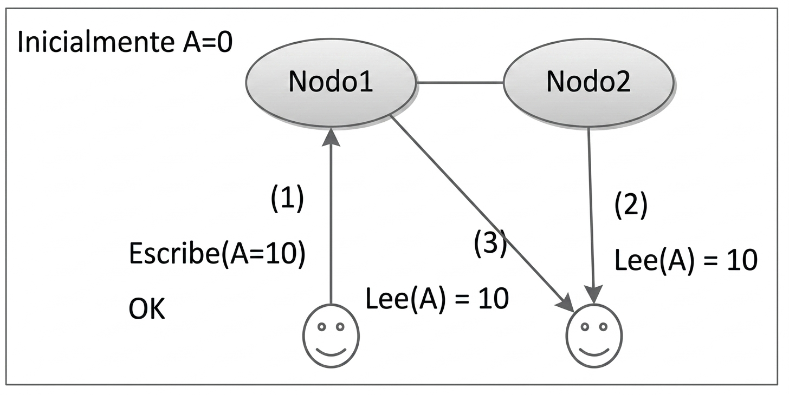

<!--
SPDX-FileCopyrightText: 2026 Colaboradores de apuntes_muicd_uned

SPDX-License-Identifier: CC-BY-4.0
-->

# GAINE.EX.2022J2

Ejercicios elaborados con fines educativos, inspirados en los contenidos evaluados en el exámen de la sesión de la 2.ª semana de la convocatoria de junio 2022 de Gestión/Almacenamiento de Información no Estructurada del MUICD de la UNED.

Este documento no es una copia ni una transcripción del examen oficial, sino una redacción propia de ejercicios conceptualmente equivalentes.

Duración máxima: 2 horas.
N.° de preguntas: 20
Pregunta correcta: +0.5 puntos
Pregunta incorrecta: -0.2 puntos.  

Si se plantean dudas al responder a una pregunta se puede justificar la decisión tomada en una hoja aparte.

## GAINE.EX.2022J2.1

### Enunciado GAINE.EX.2022J2.1

Considerando el sistema ilustrado en la figura, ¿qué combinación de propiedades del teorema CAP se está cumpliendo?



- A. CP.
- B. CA.
- C. AP.
- D. Ninguna de las anteriores.

### Solución GAINE.EX.2022J2.1

B

En el diagrama no hay particionado de la red, es decir la conexión entre el nodo 1 y el nodo 2 está abierta.

## GAINE.EX.2022J2.2

### Enunciado GAINE.EX.2022J2.2

Si una carga de trabajo incluye un número importante de consultas de agregación, ¿qué modelo de base de datos resulta más apropiado?

- A. Modelo orientado a grafos.
- B. Modelo orientado a columnas.
- C. Modelo clave-valor.
- D. Ninguna de las anteriores.

### Solución GAINE.EX.2022J2.2

B

Las consultas de agregación encajan especialmente con bases orientadas a columnas.

## GAINE.EX.2022J2.3

### Enunciado GAINE.EX.2022J2.3

Partiendo de una instancia vacía de Redis, se ejecuta la siguiente secuencia de comandos. ¿Qué salida sería coherente con su funcionamiento?

- A.

```text
  > SET server:name "uned"
  "uned"
  > GET server:name
  OK
  > EXISTS server:name
  (integer) 0
```

- B.

```text
    > SET server:name "uned"
    OK
    > GET server:name
    "null"
    > EXISTS server:name
    (integer) 1
```

- C.

```text
    > SET server:name "uned"
    OK
    > GET server:name
    "uned"
    > EXISTS server:name
    (integer) 1
```

- D. Ninguna de las opciones anteriores es correcta.

### Solución GAINE.EX.2022J2.3

C

## GAINE.EX.2022J2.4

### Enunciado GAINE.EX.2022J2.4

En una base de datos Redis inicialmente vacía se lanzan varios comandos consecutivos. ¿Cuál de los siguientes resultados sería el esperado?

- A.

```text
    > set numestudiantes 100
    OK
    > incr numestudiantes
    (integer) 1
    > del numestudiantes
    (integer) 1
    > incr numestudiantes
    (integer) 100
    > incr numestudiantes
    (integer) 101
```

- B.

```text
    > set numestudiantes 100
    OK
    > incr numestudiantes
    (integer) 101
    > del numestudiantes
    (integer) 1
    > incr numestudiantes
    (integer) 1
    > incr numestudiantes
    (integer) 2
```

- C.

```text
    > set numestudiantes 100
    (error) comando no reconocido
    > incr numestudiantes
    (error) comando no reconocido
    > del numestudiantes
    (integer) 1
    > incr numestudiantes
    (integer) 1
    > incr numestudiantes
    (integer) 2
```

- D. Ninguna de las opciones anteriores es correcta.

### Solución GAINE.EX.2022J2.4

B

`INCR` sobre 100 da 101. Tras `DEL`, la clave desaparece y el sistema devuelve 1 indicando éxito, es decir que la clave existía y fue reestablecida con valor 0; si no hubiera encontrado la clave, el prompt habría devuelto 0. Por último, los `INCR` posteriores la recrea desde 0.

## GAINE.EX.2022J2.5

### Enunciado GAINE.EX.2022J2.5

Suponiendo una base Redis vacía, se ejecuta la siguiente secuencia con claves que expiran. ¿Qué conjunto de resultados sería consistente con el comportamiento del sistema?

- A.

```text
    > SET ejemplo:lock "Examen redis"
    OK
    > expire ejemplo:lock 120
    (integer) 1
    > get ejemplo:lock
    "Examen redis"
    > TTL ejemplo:lock
    (integer) 82
    > get ejemplo:lock
    "Examen redis"
    > TTL ejemplo:lock
    (integer) -2
    > get ejemplo:lock
    (nil)
```

- B.

```text
    > SET ejemplo:lock "Examen redis"
    OK
    > expire ejemplo:lock 120
    (integer) 1
    > get ejemplo:lock
    (nil)
    > TTL ejemplo:lock
    (integer) 82
    > get ejemplo:lock
    (nil)
    > TTL ejemplo:lock
    (integer) -2
    > get ejemplo:lock
    (nil)
```

- C.

```text
    > SET ejemplo:lock "Examen redis"
    OK
    > expire ejemplo:lock 120
    (integer) 1
    > get ejemplo:lock
    "Examen redis"
    > TTL ejemplo:lock
    (integer) 82
    > get ejemplo:lock
    "Examen redis"
    > TTL ejemplo:lock
    (integer) -2
    > get ejemplo:lock
    "Examen redis"
```

- D. Ninguna de las opciones anteriores es correcta.

### Solución GAINE.EX.2022J2.5

A

## GAINE.EX.2022J2.6

### Enunciado GAINE.EX.2022J2.6

### Solución GAINE.EX.2022J2.6

A

## GAINE.EX.2022J2.7

### Enunciado GAINE.EX.2022J2.7

### Solución GAINE.EX.2022J2.7

B

## GAINE.EX.2022J2.8

### Enunciado GAINE.EX.2022J2.8

### Solución GAINE.EX.2022J2.8

B

## GAINE.EX.2022J2.9

### Enunciado GAINE.EX.2022J2.9

### Solución GAINE.EX.2022J2.9

D

De entre los elementos indicados, solamente no es obligatorio el arbiter en cada *Replica Set*.

## GAINE.EX.2022J2.10

### Enunciado GAINE.EX.2022J2.10

### Solución GAINE.EX.2022J2.10

A

Si añades la etapa `$project` para eliminar el `_id`, estarías eliminando el nombre de usuario y mostrando solamente el número de sesiones.

## GAINE.EX.2022J2.11

### Enunciado GAINE.EX.2022J2.11

### Solución GAINE.EX.2022J2.11

B

## GAINE.EX.2022J2.12

### Enunciado GAINE.EX.2022J2.12

### Solución GAINE.EX.2022J2.12

C

## GAINE.EX.2022J2.13

### Enunciado GAINE.EX.2022J2.13

### Solución GAINE.EX.2022J2.13

A

## GAINE.EX.2022J2.14

### Enunciado GAINE.EX.2022J2.14

### Solución GAINE.EX.2022J2.14

C

La consulta no devolverá resultados ya que la tabla quedó vacía tras la ejecución del `DELETE`.

## GAINE.EX.2022J2.15

### Enunciado GAINE.EX.2022J2.15

### Solución GAINE.EX.2022J2.15

B

## GAINE.EX.2022J2.16

### Enunciado GAINE.EX.2022J2.16

### Solución GAINE.EX.2022J2.16

A

## GAINE.EX.2022J2.17

### Enunciado GAINE.EX.2022J2.17

### Solución GAINE.EX.2022J2.17

C

## GAINE.EX.2022J2.18

### Enunciado GAINE.EX.2022J2.18

### Solución GAINE.EX.2022J2.18

B

## GAINE.EX.2022J2.19

### Enunciado GAINE.EX.2022J2.19

### Solución GAINE.EX.2022J2.19

D

## GAINE.EX.2022J2.20

### Enunciado GAINE.EX.2022J2.20

### Solución GAINE.EX.2022J2.20

B
