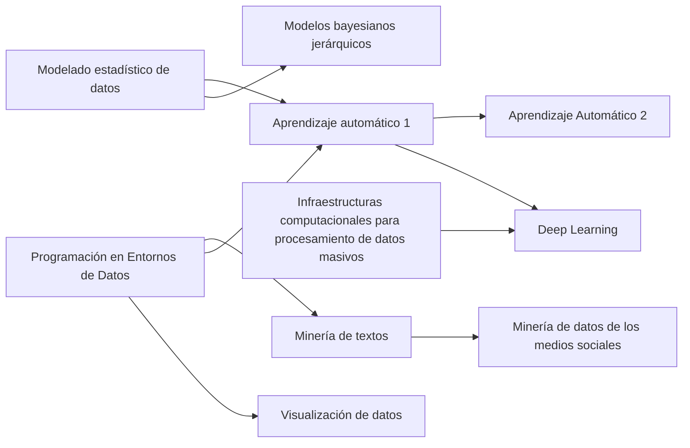

<!--
SPDX-FileCopyrightText: 2026 Colaboradores de apuntes_muicd_uned

SPDX-License-Identifier: CC-BY-4.0
-->

# MUICD - General

En esta carpeta se comparte comparte información general sobre el máster MUICD y material común a todas las asignaturas.

## Asignaturas

El **listado completo de asignaturas** se encuentra en [este enlace](asig/asignaturas.csv).

### Elección

**Consejos para la elección asignaturas**:

- Estima tu **tiempo semanal disponible para estudiar**, y determina el número de créditos a matricular en función de esto.
- Revisa las asignaturas, teniendo en cuenta:
  - **Duración** en número de créditos ECTS (4 ó 6)
  - En qué **semestre** se cursan.
  - Las [dependencias](#dependencias-de-asignaturas) con otras asignaturas.
- Suponiendo 16 semanas lectivas por semestre, la **dedicación semanal por asignatura** se calcula como:

$$\text{horas por semana necesarias} = (\text{créditos ECTS} * 25) / 16$$

En resumen:

| ECTS | Dedicación semanal (h) |
| :-: | :-: |
| 6 | 10 |
| 4 | 6 |

- Evalúa la **dificultad de las asignaturas**:
  - Pregunta en las [comunidades](#comunidades).
  - Consulta las [estadísticas de rendimiento académico](https://app.uned.es/evacal/rendac.aspx), incluyendo:
    - **Tasa de evaluación %**: porcentaje de estudiantes matriculados que se presentan al exámen o, en su defecto, realizan la evaluación.  
    - **Tasa de éxito %**: porcentaje de aprobados entre los que han sido evaluados.
    - **Tasa de rendimiento**: porcentaje de aprobados respecto a matriculados.
    - **Valoración de la asignatura**: puntuación dada por los estudiantes.

### Dependencias de asignaturas

Diagrama de **dependencias entre asignaturas** del MUICD:

[Codificación de las dependencias en formato Mermaid](depedencias_asignaturas.mmd)

## Exámenes

### Repositorios de exámenes

- [Akademos](https://akademosweb.uned.es)
- [Depósito de exámenes de UNED Calatayud](http://www.calatayud.uned.es/examenes)
- Espacios de cada asignatura (si el profesor los comparte)

### Planificación de exámenes

Los exámenes del MUICD se concentran en una única semana en cada convocatoria.

[Calendario de exámenes](https://www.uned.es/universidad/inicio/estudiantes/calendario-examenes.html)

Los exámenes se realizan en sesión ordinaria o de reserva.

La fecha de la sesión ordinaria es la marcada en el calendario, y es la que realizan por defecto los alumnos.

La **sesión de reserva** está dirigida a los alumnos a los que le coinciden exámenes o que alegan una situación extraordinaria (ej.: laboral, movilidad).

El alumno debe realizar una petición hasta la semana anterior al comienzo de exámenes, la cual es aprobada o rechazada por un tribunal. No obstante, algunos alumnos informan que no tuvieron que hacer ninguna solicitud o aviso.

[Solicitud de exámenes en reserva](https://serviweb.uned.es/matricula/examenes-extranjero/index.asp)

Cada convocatoria cuenta con uno o dos slots de exámenes de reserva. Cada slot abarca 4 horas y permite presentarse a un máximo de 3 exámenes:

- Conv. febrero: 1 slot
- Conv. junio: 1 slot
- Conv. septiembre: 2 slots, donde
  - Slot de mañana: exámenes de los 3 primeros días de la convocatoria.
  - Slot de tarde: exámenes del resto de días.

Los exámenes de reserva están reglados en el apartado 2.2. del [Reglamento de pruebas presenciales UNED](https://www.uned.es/universidad/inicio/unidad/pruebas-presenciales/reglamento-de-pruebas-presenciales.html#a4a3c2ee-eb91-4587-bdd0-b1489088ae8b)

### Lugar de exámenes

Los alumnos realizan los exámenes por defecto en el centro en el que están adscritos, aunque pueden realizarlo en otro centro si lo solictan.

A los alumnos de los centros de la Comunidad de Madrid se les convoca en un centro concreto en función de su apellido. Esto se puede comprobar en la [sección de exámenes](https://www.uned.es/universidad/centros/madrid/medios-y-servicios/examenes.htmls) del portal UNED Madrid.

### Realización del exámen

Recuerda llevar:

- Carnet de la UNED.
- Boligrafo(s) (no se permite lápiz)
- Calculadora (si se permite)
- Material escrito (si se permite)

## Comunidades

Comunidades y repositorios no oficiales de alumnos y alumni del máster:

- Activas
  - Comunidad [UNED Data Science](https://t.me/uneddatascience) en Telegram
- Inactivas
  - Grupo [Grupo Master Ingenieria y Ciencias de Datos](https://unedo365.sharepoint.com/sites/GrupoMasterIngenieriayCienciasdeDatos/) en SharePoint UNED
  - [Repositorio `uned-master-bigdata` (curso 2019/2020)](https://github.com/adzarei/uned-master-bigdata/) de Adrián José Zapater Reig
