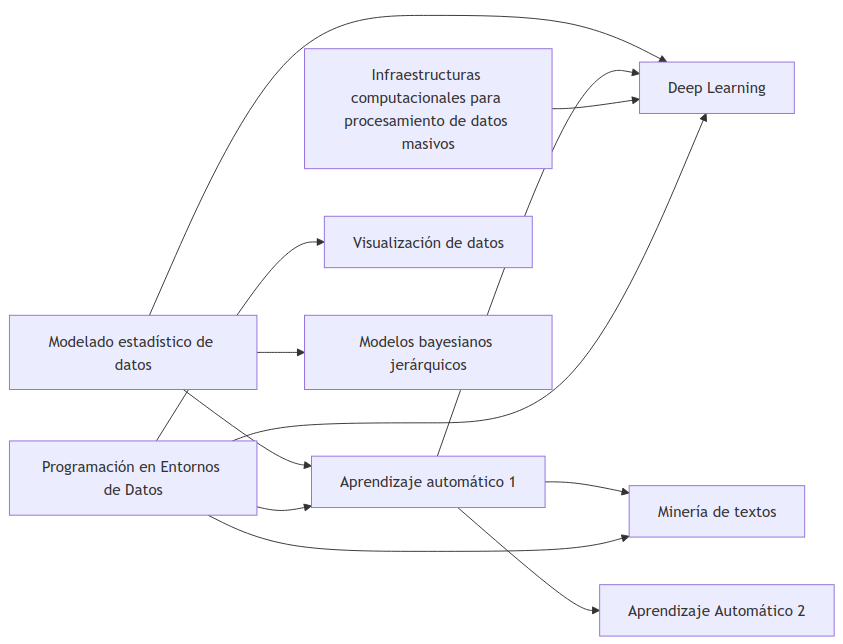

<!--
SPDX-FileCopyrightText: 2026 Colaboradores de apuntes_muicd_uned

SPDX-License-Identifier: CC-BY-4.0
-->

# MUICD - General

En esta carpeta se comparte comparte información general sobre el máster MUICD y material común a todas las asignaturas.

## Selección de asignaturas

El listado completo de asignaturas se encuentra en [este enlace](asig/asignaturas.csv).

Consejos para elegir asignaturas:

- Calcula primeramente el tiempo semanal que estás dispuesto/a a estudiar, y escoge las asignaturas en función de esto.
- Revisa las fichas de cada asignaturam teniendo en cuenta:
  - En qué semestre se cursan.
  - Si tiene interdependencias con otras asignaturas.
- Comprueba el porcentaje de presentados y aprobados y la valoración de la asignatura en [estadísticas de rendimiento académico](https://app.uned.es/evacal/rendac.aspx).  
  - La **tasa de evaluación %** es el porcentaje de estudiantes matriculados que se presentan al examen o, en su defecto, realizan la evaluación.  
  - La **tasa de éxito %** es el porcentaje de aprobados entre los que han sido evaluados.
  - La **tasa de rendimiento** es el porcentaje de aprobado respecto a lo matriculado.

Diagrama de dependencias entre asignaturas del MUICD:

También lo puedes visualizar en el [fichero Mermaid de dependencias de asignaturas](depedencias_asignaturas.mmd).

## Repositorios de exámenes

- [Akademos](https://akademosweb.uned.es)
- [Depósito de exámenes de UNED Calatayud](http://www.calatayud.uned.es/examenes)
- Espacios de cada asignatura (si el profesor los comparte)

## Comunidades

Comunidades y repositorios no oficiales de alumnos y alumni del máster:

- Comunidad [UNED Data Science](https://t.me/uneddatascience) en Telegram
- Grupo [Grupo Master Ingenieria y Ciencias de Datos](https://unedo365.sharepoint.com/sites/GrupoMasterIngenieriayCienciasdeDatos/) en SharePoint UNED
- [Repositorio `uned-master-bigdata` (curso 2019/2020)](https://github.com/adzarei/uned-master-bigdata/) de azdarei
