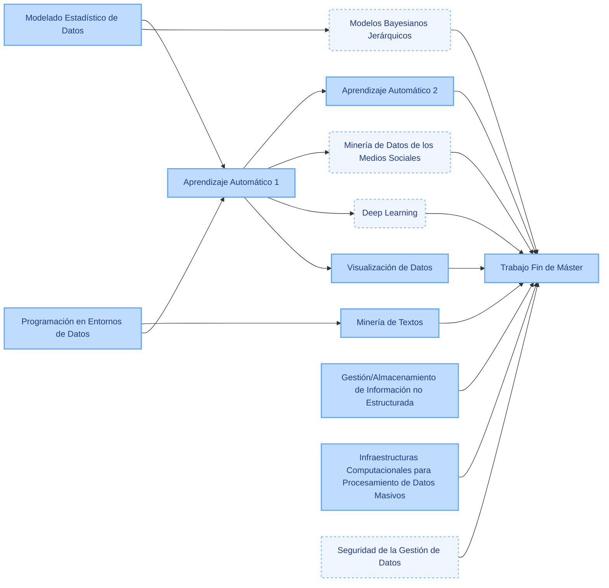

<!--
SPDX-FileCopyrightText: 2026 Colaboradores de apuntes_muicd_uned

SPDX-License-Identifier: CC-BY-4.0
-->

# MUICD - General

En esta carpeta se comparte comparte información general sobre el máster MUICD y material común a todas las asignaturas.

## Asignaturas

El **listado completo de asignaturas** se encuentra en [este enlace](src/asig/asignaturas.csv).

### Elección

**Consejos para la elección asignaturas**:

- Estima tu **tiempo semanal disponible para estudiar**, y determina el número de créditos a matricular en función de esto.
- Revisa las asignaturas, teniendo en cuenta:
  - **Duración** en número de créditos ECTS (4 ó 6)
  - En qué **semestre** se cursan.
  - Las [dependencias](#dependencias-de-asignaturas) con otras asignaturas.
- Suponiendo 16 semanas lectivas por semestre, la **dedicación semanal por asignatura** se calcula como:

$$\text{horas por semana necesarias} = (\text{créditos ECTS} * 25) / 16$$

En resumen:

| ECTS | Dedicación semanal (h) |
| :-: | :-: |
| 6 | 10 |
| 4 | 6 |

- Evalúa la **dificultad de las asignaturas**:
  - Pregunta en las [comunidades](#comunidades).
  - Consulta las [estadísticas de rendimiento académico](https://app.uned.es/evacal/rendac.aspx), incluyendo:
    - **Tasa de evaluación %**: porcentaje de estudiantes matriculados que se presentan al exámen o, en su defecto, realizan la evaluación.  
    - **Tasa de éxito %**: porcentaje de aprobados entre los que han sido evaluados.
    - **Tasa de rendimiento**: porcentaje de aprobados respecto a matriculados.
    - **Valoración de la asignatura**: puntuación dada por los estudiantes.

### Dependencias de asignaturas

Diagrama de **dependencias entre asignaturas** del MUICD en función del contenido del temario, de acuerdo a las opiniones de los alumnos:

```mermaid
graph LR
   MED[Modelado Estadístico de Datos] --> AAI[Aprendizaje Automático 1]
   MED --> MBJ(Modelos Bayesianos Jerárquicos)
   PED[Programación en Entornos de Datos] --> MT[Minería de Textos]
   PED --> AAI
   AAI --> AAII[Aprendizaje Automático 2]
   AAI --> MDMS(Minería de Datos de los Medios Sociales)
   AAI --> DL(Deep Learning)
   AAI --> VD[Visualización de Datos]
   AAII --> TFM[Trabajo Fin de Máster]
   GAINE[Gestión/Almacenamiento de Información no Estructurada] --> TFM
   DL --> TFM
   ICPDM[Infraestructuras Computacionales para Procesamiento de Datos Masivos] --> TFM
   MBJ --> TFM
   MDMS --> TFM
   MT --> TFM
   SGD[Seguridad de la Gestión de Datos] --> TFM
   VD --> TFM

  classDef obligatoria fill:#bfdbfe,color:#1e3a8a,stroke:#60a5fa,stroke-width:2px;
  classDef optativa fill:#eff6ff,color:#1e3a8a,stroke:#93c5fd,stroke-width:2px,stroke-dasharray: 4 4;
    
  class DL,MBJ,MDMS,SGD optativa;
  class AAI,AAII,GAINE,ICPDM,MED,MT,PED,TFM,VD obligatoria;
```

Adicionalmente, para poder presentar el Trabajo Fin de Máster es requisito haber superado todas las asignaturas en la convocatoria ordinaria de ese curso, o en cualquiera para cursos anteriores.

## Pruebas de evaluación continua

En algunas asignaturas, el profesorado permite expresamente el uso de inteligencia artificial generativa.

En el resto de casos que no se comente nada, se entiende que se debe seguir las guías sobre el [Uso de la Inteligencia Artificial Generativa](https://www.uned.es/universidad/inicio/institucional/areas-direccion/vicerrectorados/innovacion/iaeducativa.html) del Vicerrectorado de Innovación Educativa de la UNED, y más concretamente la [Guía de uso de las herramientas de Inteligencia Artificial Generativa para el estudiantado](https://unedo365-my.sharepoint.com/:b:/g/personal/smartin_ieec_uned_es/Ef6tiDpSXUJHrb7usuE1JWsB0rSJFaED09CB6ofqQnXzvg?e=YKII1P).

## Exámenes

### Repositorios de exámenes

- [Akademos](https://akademosweb.uned.es)
- [Depósito de exámenes de UNED Calatayud](http://www.calatayud.uned.es/Examenes/auth/step2.asp?NewExams=Continuar&ID_Carrera=3110)
- Espacios de cada asignatura (si el profesor los comparte)

### Planificación de exámenes

Los exámenes del MUICD se concentran en una única semana en cada convocatoria.

[Calendario de exámenes](https://www.uned.es/universidad/inicio/estudiantes/calendario-examenes.html)

Los exámenes se pueden realizar cada exámen en la sesión ordinaria o en la de reserva.

La fecha de la sesión ordinaria es la marcada en el calendario. Opcionalmente y sin necesidad de preaviso, los alumnos pueden presentarse a la sesión de reserva siempre y cuando no se han presentado a la ordinaria y no superen un máximo de 3 exámenes en la misma sesión de reserva.

Cada convocatoria cuenta con uno o dos slots de exámenes de reserva. Cada slot abarca 4 horas y permite presentarse a un máximo de 3 exámenes:

- Conv. febrero: 1 slot  
- Conv. junio: 1 slot  
- Conv. septiembre: 2 slots, donde  
  - Slot de mañana: exámenes de los 3 primeros días de la convocatoria.  
  - Slot de tarde: exámenes del resto de días.  

Los exámenes de reserva están regulados en el apartado 2.2. del [Reglamento de pruebas presenciales UNED](https://www.uned.es/universidad/inicio/unidad/pruebas-presenciales/reglamento-de-pruebas-presenciales.html#a4a3c2ee-eb91-4587-bdd0-b1489088ae8b)

### Lugar de exámenes

Los alumnos realizan los exámenes por defecto en el centro en el que están adscritos, aunque pueden realizarlo en otro centro si lo solictan.

A los alumnos de los centros de la Comunidad de Madrid se les convoca en un centro concreto en función de su apellido. Esto se puede comprobar en la [sección de exámenes](https://www.uned.es/universidad/centros/madrid/medios-y-servicios/examenes.htmls) del portal UNED Madrid.

### Realización del exámen

Recuerda llevar:

- Carnet de la UNED  
- Boligrafo/s (no se permite entregar el exámen a lápiz)  
- Calculadora (si se permite)  
- Material escrito (si se permite)  

### Calificaciones

Las calificaciones se pueden revisar:

- Campus UNED - Identificarse - Acceder a la Secretaría Virtual - Ver Calificaciones
- App "Calificaciones" de la UNED

La manera más cómoda de recibir un aviso sobre cuándo está una nota disponible es instalarse la app para móvil "Calificaciones" de la UNED, disponible para [Android](https://play.google.com/store/apps/details?id=es.uned.intecca.calificaciones&hl=es) y [iOS](https://apps.apple.com/es/app/calificaciones/id1006830451) y activar las notificaciones.

### Evaluación asignaturas por alumnos

Al finalizar los exámenes los alumnos pueden valorar las asignaturas desde el enlace <https://app.uned.es/evacal/q_misq.aspx> (hace falta estar logueado antes).

Fechas límite para la evaluación:

| Convocatoria | Fecha límite |
| - | - |
| Febrero | 15-Mar |
| Junio | 15-Jul |

Para saber más sobre la confidencialidad de las respuestas y otros aspectos, leer la página de [información sobre cuestionarios y formularios de recogida de información](https://www.uned.es/universidad/inicio/unidad/oficina-calidad/informacion-sobre-cuestionarios-y-formularios-de-recogida-de-informacion.html) de la UNED.

## Comunidades

Comunidades y repositorios no oficiales de alumnos y alumni del máster:

- Activas
  - Comunidad [UNED Data Science](https://t.me/uneddatascience) en Telegram
- Inactivas
  - Grupo [Grupo Master Ingenieria y Ciencias de Datos](https://unedo365.sharepoint.com/sites/GrupoMasterIngenieriayCienciasdeDatos/) en SharePoint UNED
  - [Repositorio `uned-master-bigdata` (curso 2019/2020)](https://github.com/adzarei/uned-master-bigdata/) de Adrián José Zapater Reig
