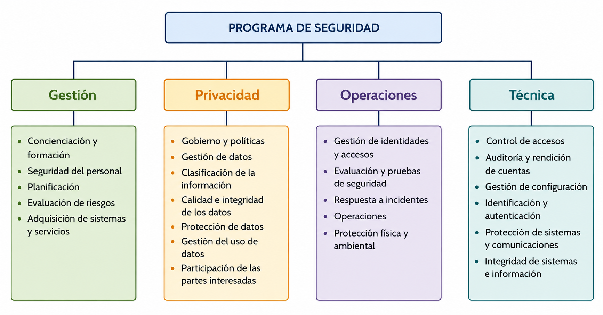
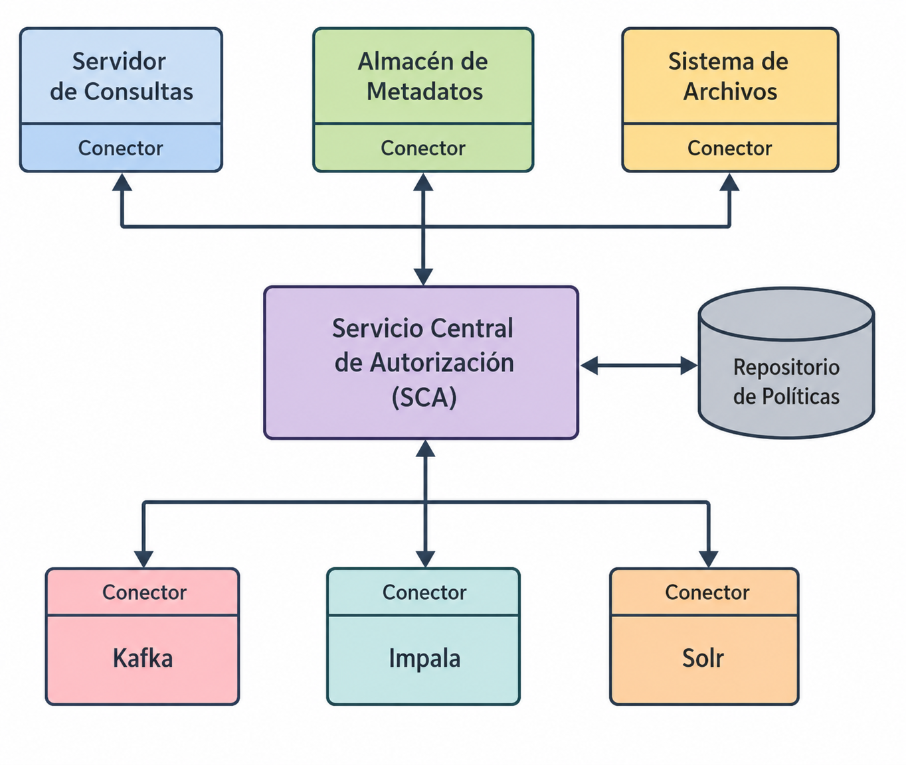

<!--
SPDX-FileCopyrightText: 2026 Colaboradores de apuntes-muicd-uned

SPDX-License-Identifier: CC-BY-4.0
-->

# SGD - Tema 2: Administración y autorización en entornos de análisis/computación dedatos masivos

## Administración de la seguridad: políticas

`SGD.EX.2022J2.8 / SGD.EX.2022SO.5 / SGD.EX.2023J2.2 / SGD.EX.2025J2.19 / SGD.EX.2025SO.4`

Un **programa de seguridad** se divide en:

- Gestión (Management)
- Técnica (Technical Controls)
- Privacidad (Privacy)
- Operaciones (Operational)

## Gestión de accesos: AAA

## Autorización

Criterios de control de acceso para las listas de control de acceso (ACL):

- Function grained access control (FGAC)
- Role-based access control (RBAC)
- Group access control (GAC)
- Discretionary access control (DAC)
- ...

`SGD.EX.2022J2.3 / SGD.EX.2023SO.3 / SGD.EX.2024SO.12 / SGD.EX.2025J2.17 / SGD.EX.2025SO.5`

El **control de acceso basado en roles** (*role-based access control* ,**RBAC**) establece los permisos de acceso según el rol o responsabilidad que desempeña el usuario dentro de la organización.

`SGD.EX.2022J2.5 / SGD.EX.2023SO.6 / SGD.EX.2024J2.9 / SGD.EX.2024SO.17 / SGD.EX.2025SO.6`

**Apache Sentry** es una herramienta que se puede usar como servicio de gestión de la autorización en entornos Hadoop.

## Licencia y atribución

[![CC BY 4.0][cc-by-shield]][cc-by]

Este trabajo está licenciado bajo la licencia **[Creative Commons Atribución 4.0 Internacional][cc-by]**.

© 2026, Colaboradores de [apuntes-muicd-uned](https://github.com/pmgallardo/apuntes-muicd-uned).

[cc-by]: http://creativecommons.org/licenses/by/4.0/
[cc-by-shield]: https://img.shields.io/badge/License-CC%20BY%204.0-lightgrey.svg
