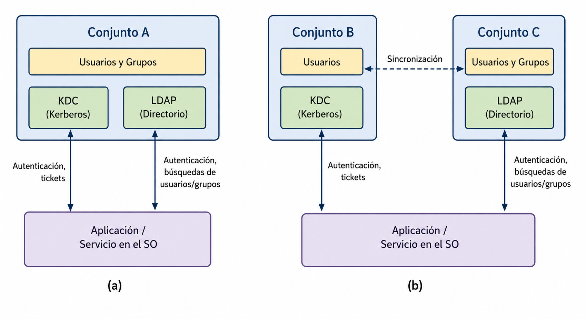
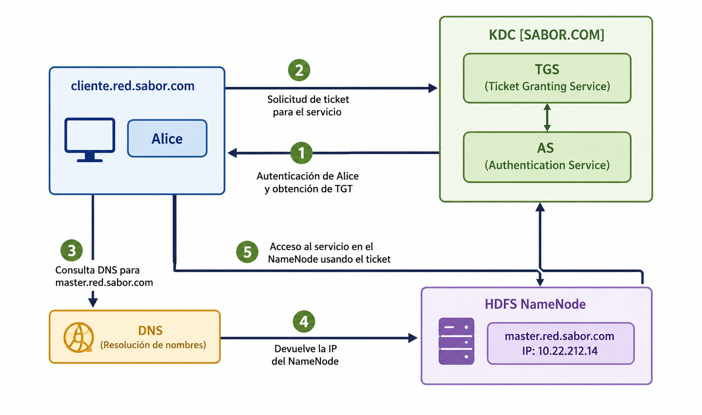

<!--
SPDX-FileCopyrightText: 2026 Colaboradores de apuntes-muicd-uned

SPDX-License-Identifier: CC-BY-4.0
-->

# SGD - Tema 3: Autenticación y Seguridad Perimetral en sistemas de análisis de datos

## Autenticación

`SGD.EX.2022J2.10 / SGD.EX.2022SO.8 / SGD.EX.2023J2.8 / SGD.EX.2024J2.10 / SGD.EX.2025J2.9`

**Microsoft Active Directory** integra servicios de dominio con Kerberos/KDC y LDAP; además, en el ecosistema Microsoft se integra con servicios de certificados. En el temario aparece que en Active Directory un realm Kerberos se mapea a un dominio y que AD proporciona servicios KDC y LDAP para ese dominio.

\
`SGD.EX.2022SO.10 / SGD.EX.2023J2.10 / SGD.EX.2023SO.10 / SGD.EX.2024SO.16 / SGD.EX.2025J2.16`

El grupo B es un proveedor de MIT Kerberos, con Users + KDC.

El grupo C es un proveedor de OpenLDAP, se corresponde con Users, Groups, LDAP y el uso para authentication, user/group lookups.

MSAD es una solución que integra KDC + LDAP + certificados.

\
`SGD.EX.2022J2.11 / SGD.EX.2023SO.12 / SGD.EX.2024J2.13 / SGD.EX.2024SO.18 / SGD.EX.2025SO.11`

Mediante el uso de salteado en almacenamiento de contraseñas se evita que distintos usuarios compartan el valor de hash almacenado en la base de datos de la aplicación de acceso.

\
`SGD.EX.2023J2.5 / SGD.EX.2023SO.5 / SGD.EX.2022SO.6 / SGD.EX.2024J2.7 / SGD.EX.2025SO.3`

En el paso 2, el usuario hace una petición de un ticket de uso del servicio proporcionado por el nodo HDFS `NameNode`:

## Seguridad perimetral

`SGD.EX.2024J2.18 / SGD.EX.2025J2.18 / SGD.EX.2025SO.8`

**Apache Knox** es un framework que proporciona un proxy reverso sin estado (*stateless*).

`SGD.EX.2022J2.6 / SGD.EX.2022SO.4 / SGD.EX.2023J2.7 / SGD.EX.2023SO.9 / SGD.EX.2024J2.19 / SGD.EX.2024SO.11 / SGD.EX.2025SO.7`

Apache Knox proporciona seguridad para clústeres Hadoop en el perímetro de la red.

`SGD.EX.2022J2.7 / SGD.EX.2023SO.7 / SGD.EX.2024SO.15 / SGD.EX.2025SO.10`

El procolo usado por Apache Knox para dar acceso a los servicios del clúster Hadoop es HTTP.

## Licencia y atribución

[![CC BY 4.0][cc-by-shield]][cc-by]

Este trabajo está licenciado bajo la licencia **[Creative Commons Atribución 4.0 Internacional][cc-by]**.

© 2026, Colaboradores de [apuntes-muicd-uned](https://github.com/pmgallardo/apuntes-muicd-uned).

[cc-by]: http://creativecommons.org/licenses/by/4.0/
[cc-by-shield]: https://img.shields.io/badge/License-CC%20BY%204.0-lightgrey.svg
