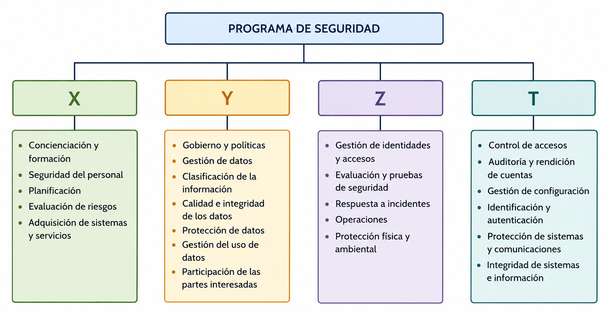

<!--
SPDX-FileCopyrightText: 2026 Colaboradores de apuntes_muicd_uned

SPDX-License-Identifier: CC-BY-4.0
-->

# SGD.EX.2022SO

Ejercicios elaborados con fines educativos, inspirados en los contenidos evaluados en el exámen de la convocatoria Sep-2022 de Seguridad de la Gestión de Datos del Máster Universitario de Ingeniería y Ciencia de Datos (MUICD) de la UNED.

Este documento no es una copia ni una transcripción del examen oficial, sino una redacción propia de ejercicios conceptualmente equivalentes.

Duración: 2 horas  
Material: Calculadora no programable  

ANTES DE EMPEZAR LA PRUEBA, LEA ATENTAMENTE LAS SIGUIENTES INDICACIONES

1. Únicamente debe entregar al tribunal la hoja de lectura óptica con sus datos personales, los datos de la asignatura, el tipo de examen y las respuestas seleccionadas.

2. Si observa alguna irregularidad en el enunciado, podrá entregar también una hoja adicional explicando aquello que estime oportuno. Estas observaciones serán relevantes en caso de posibles reclamaciones.

3. La prueba está formada por 20 preguntas tipo test. Para aprobar será necesario alcanzar una puntuación mínima de 5 puntos. Cada pregunta incluye cuatro opciones de respuesta, de las cuales solo una es correcta. Solo se puntuarán las preguntas respondidas. Cada respuesta correcta suma 0,5 puntos y cada respuesta incorrecta resta 0,2 puntos.

4. Está permitido utilizar calculadora NO CIENTÍFICA.

5. Cuando alguna pregunta incluya como opción “Dos o más son ciertas” o “Todas son falsas”, deberá marcarse dicha opción si se cumplen esas condiciones en el resto de alternativas. Es decir, si existen dos o más opciones correctas, o si todas las opciones son falsas, debe elegirse la alternativa de ese tipo. No se considerarán válidas las respuestas individuales en esos casos.

## SGD.EX.2022SO.1

### Enunciado SGD.EX.2022SO.1

¿Qué se entiende por vector de ataque?

A) Una amenaza posible que no llega a aprovechar una vulnerabilidad  
B) La posibilidad de que un riesgo llegue a producirse  
C) La vía o recorrido que utiliza un ataque para llegar a su objetivo  
D) La cantidad de vulnerabilidades que utiliza un ataque  

### Solución SGD.EX.2022SO.1

## SGD.EX.2022SO.2

### Enunciado SGD.EX.2022SO.2

Si llevamos a cabo un análisis exploratorio de datos recogidos por un hospital para estudiar secuencias comunes de ADN en pacientes con una enfermedad rara, desde la perspectiva del GDPR debemos realizar:

A) Únicamente un análisis de riesgos sobre los datos  
B) No se trata de datos sensibles, por lo que no quedan afectados por la normativa europea de protección de datos  
C) Un análisis de riesgos junto con una evaluación de impacto  
D) Solo una evaluación de impacto  

### Solución SGD.EX.2022SO.2

## SGD.EX.2022SO.3

### Enunciado SGD.EX.2022SO.3

¿Con qué modalidad de bastionado o hardening se relaciona el concepto “Host hardening”?

A) System Hardening  
B) Network Hardening  
C) Hardware Hardening  
D) OS Hardening  

### Solución SGD.EX.2022SO.3

## SGD.EX.2022SO.4

### Enunciado SGD.EX.2022SO.4

Apache Knox ofrece una funcionalidad concreta para clústeres Hadoop situados en el perímetro de la red. ¿Cuál de las siguientes características proporciona?

A) Flexibilidad  
B) Seguridad  
C) Tolerancia a fallos  
D) Fiabilidad  

### Solución SGD.EX.2022SO.4

## SGD.EX.2022SO.5

### Enunciado SGD.EX.2022SO.5

A partir de la figura siguiente, indique a qué ámbito del programa de seguridad corresponde la incógnita Z.

A) Privacidad (Privacy)  
B) Gestión (Management)  
C) Operaciones (Operational)  
D) Técnica (Technical Controls)  

### Solución SGD.EX.2022SO.5

## SGD.EX.2022SO.6

### Enunciado SGD.EX.2022SO.6

Observando la figura siguiente, indique en qué paso Alice solicita un ticket para utilizar el servicio proporcionado por el nodo HDFS `NameNode`.

A) Paso 2  
B) Paso 1  
C) Paso 4  
D) Paso 3  

### Solución SGD.EX.2022SO.6

## SGD.EX.2022SO.7

### Enunciado SGD.EX.2022SO.7

Indique cuál de las siguientes afirmaciones es correcta sobre SCAP (Security Content Automation Protocol):

I. SCAP es una especificación destinada a representar/modelar y manipular datos de seguridad de forma estandarizada.  
II. SCAP fue definido por ENISA (European Union Agency for Network and Information Security).

A) I verdadera; II verdadera  
B) I verdadera; II falsa  
C) I falsa; II verdadera  
D) I falsa; II falsa  

### Solución SGD.EX.2022SO.7

## SGD.EX.2022SO.8

### Enunciado SGD.EX.2022SO.8

¿Cuál de las siguientes opciones integra Kerberos mediante KDC, LDAP y gestión de certificados?

A) OpenLDAP  
B) MIT Kerberos  
C) OpenSSL  
D) Microsoft Active Directory  

### Solución SGD.EX.2022SO.8

## SGD.EX.2022SO.9

### Enunciado SGD.EX.2022SO.9

¿Cuál de los siguientes comandos puede utilizarse para generar un par de claves pública y privada? No considere los parámetros necesarios, solo la opción correspondiente al comando de OpenSSL.

A) `openssl verify`  
B) `openssl pkcs12`  
C) `openssl convert`  
D) `openssl genrsa`  

### Solución SGD.EX.2022SO.9

## SGD.EX.2022SO.10

### Enunciado SGD.EX.2022SO.10

En la figura se muestran dos posibles estructuras para integrar proveedores de identidad con servicios o aplicaciones del sistema operativo subyacente, como Hadoop o Spark. Indique cuál de las siguientes opciones corresponde al grupo de proveedores identificado como Grupo C.

A) OpenLDAP  
B) Microsoft Active Directory  
C) OpenSSL  
D) MIT Kerberos  

### Solución SGD.EX.2022SO.10

## SGD.EX.2022SO.11

### Enunciado SGD.EX.2022SO.11

Se trabaja con un conjunto de datos de compras realizadas en un centro comercial durante la campaña de Navidad. Para cumplir con el GDPR, se han cifrado mediante un algoritmo simétrico los campos nombre, apellidos y tarjeta de crédito. ¿Qué técnica de protección de datos se ha aplicado?

A) Anonimización  
B) Generalización  
C) Eliminación  
D) Seudonimización  

### Solución SGD.EX.2022SO.11

## SGD.EX.2022SO.12

### Enunciado SGD.EX.2022SO.12

Si queremos administrar un trabajo distribuido en un clúster Hadoop, ¿cuál de los siguientes protocolos facilita su lanzamiento remoto de forma segura?

A) TLS para órdenes y comandos remotos, y SSH para transferir información de forma segura  
B) TLS tanto para órdenes y comandos remotos como para la transferencia segura de información  
C) SSH para órdenes y comandos remotos, y TLS para la transferencia segura de información  
D) SSH tanto para órdenes y comandos remotos como para la transferencia segura de información  

### Solución SGD.EX.2022SO.12

## SGD.EX.2022SO.13

### Enunciado SGD.EX.2022SO.13

Estamos usando un conjunto de datos médicos para predecir el tratamiento más efectivo. La tabla incluye los campos nombre, apellidos, edad, sexo, gravedad, tratamiento aplicado y resultado. Según el proceso de protección de datos, la edad y el sexo se consideran:

A) Microdatos  
B) Datos especialmente protegidos  
C) Identificadores directos  
D) Identificadores indirectos  

### Solución SGD.EX.2022SO.13

## SGD.EX.2022SO.14

### Enunciado SGD.EX.2022SO.14

En un conjunto de datos médicos orientado a predecir el tratamiento más eficaz, la tabla contiene nombre, apellidos, edad, sexo, gravedad, tratamiento aplicado y resultado. Si se desea aplicar k-anonimización, ¿qué mecanismo se usaría sobre el campo edad?

A) Supresión, reemplazando esos valores por `*`.  
B) Generalización, sustituyendo las edades por rangos como 30-40, 40-50, etc.  
C) Inserción de ruido, cambiando las edades por otras distintas.  
D) Aleatorización, mezclando los valores de edad dentro de la columna.  

### Solución SGD.EX.2022SO.14

## SGD.EX.2022SO.15

### Enunciado SGD.EX.2022SO.15

¿Cuál de las siguientes opciones no permite realizar una conexión remota mediante SSH?

A) Un certificado RSA  
B) Autenticación GSSAPI mediante un servidor Kerberos  
C) Una clave simétrica Fernet  
D) La contraseña de una cuenta de usuario del sistema remoto  

### Solución SGD.EX.2022SO.15

## SGD.EX.2022SO.16

### Enunciado SGD.EX.2022SO.16

En el almacén de datos de una empresa se han definido políticas de gestión basadas en el cumplimiento mínimo de la normativa de protección de datos. Sin embargo, no se ha implantado ningún mecanismo para utilizar el seguimiento del uso de los datos en la toma de decisiones del almacén. Según ARMA, ¿a qué nivel corresponde?

A) Nivel 2  
B) Nivel 4  
C) Nivel 1  
D) Nivel 3  

### Solución SGD.EX.2022SO.16

## SGD.EX.2022SO.17

### Enunciado SGD.EX.2022SO.17

¿Cuál de los siguientes conceptos se centra en asegurar la calidad de los datos mediante acciones como la limpieza de datos y la eliminación de duplicidades?

A) Gobierno de la información  
B) Gobierno corporativo  
C) Gobierno de datos  
D) Gobierno de las tecnologías de la información  

### Solución SGD.EX.2022SO.17

## SGD.EX.2022SO.18

### Enunciado SGD.EX.2022SO.18

Desde el punto de vista de la gobernanza de la información, ¿cómo podemos proteger las aplicaciones en la nube frente a ataques basados en botnets y spam?

A) Implantando procesos de identificación de usuarios y monitorización de actividad  
B) Solicitando la actualización de listas de reputación  
C) Realizando una monitorización completa de los servicios  
D) Aplicando tecnologías y políticas antifraude  

### Solución SGD.EX.2022SO.18

## SGD.EX.2022SO.19

### Enunciado SGD.EX.2022SO.19

¿Cuál es la función principal de los programas de gobernanza de la información respecto al análisis de datos en las organizaciones?

A) Desplegar mecanismos de análisis de datos para descubrir información a partir de datos estructurados.  
B) Desplegar mecanismos de análisis de datos para descubrir información a partir de datos no estructurados.  
C) Desplegar mecanismos de análisis de datos para detectar vulnerabilidades a partir de datos no estructurados.  
D) Desplegar mecanismos de análisis de datos para implantar mecanismos de calidad a partir de datos no estructurados.  

### Solución SGD.EX.2022SO.19

## SGD.EX.2022SO.20

### Enunciado SGD.EX.2022SO.20

¿Cuál es uno de los principales desafíos que plantea el GDPR respecto al uso de Machine Learning e Inteligencia Artificial?

A) Es necesario realizar un análisis de riesgos cuando estas técnicas se usan para tomar decisiones sin intervención humana en la decisión final.  
B) No pueden emplearse en procesos de toma de decisiones bajo ningún supuesto.  
C) No es posible adoptar decisiones automáticas mediante estas técnicas sin intervención humana en la decisión final.  
D) No se permite la toma de decisiones automáticas con estas técnicas si tienen impacto legal sobre el usuario y no existe intervención humana en la decisión final.  

### Solución SGD.EX.2022SO.20
