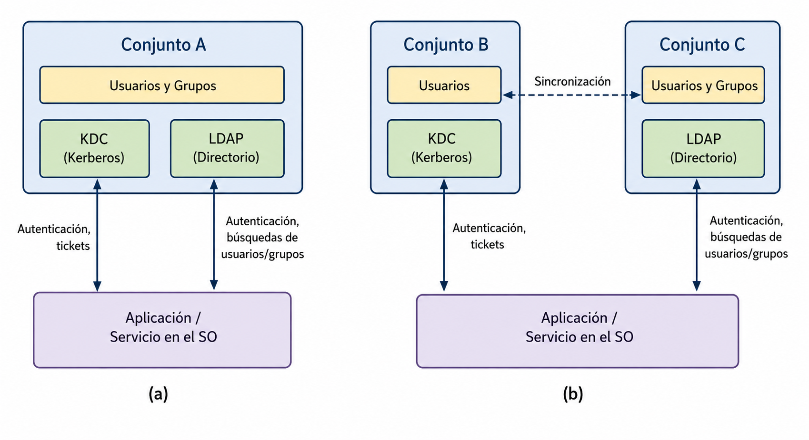

<!--
SPDX-FileCopyrightText: 2026 Colaboradores de apuntes_muicd_uned

SPDX-License-Identifier: CC-BY-4.0
-->

# SGD.EX.2022J2

E.T.S. de Ingeniería Informática (UNED)

Carrera: Máster en Ingeniería y Ciencia de Datos (Código: 311001)  
Asignatura: Seguridad de la Gestión de Datos (Código: 31110126)

P.P.: Nacional UE - Original  
Convocatoria: Junio 2023  
Duración: 2 horas  
Material: Calculadora no programable  
Tipo de Examen: A  

ANTES DE INICIAR LA PRUEBA, LEA CON ATENCIÓN LAS SIGUIENTES INDICACIONES

1. El estudiante únicamente deberá entregar al tribunal la hoja de lectura óptica con sus datos personales, los datos de la asignatura, el tipo de examen y las respuestas seleccionadas.

2. Si se detecta alguna incidencia o posible error en el enunciado, también podrá entregarse una hoja adicional explicando la observación correspondiente. Dichos comentarios podrán ser relevantes ante eventuales reclamaciones.

3. La prueba consiste en un cuestionario tipo test de 20 preguntas. Para superarla será necesario obtener al menos 5 puntos. Cada pregunta incluye cuatro alternativas, de las cuales solo una es correcta. Solo se valorarán las preguntas contestadas. Cada acierto suma 0,5 puntos y cada fallo resta 0,2 puntos.

4. Se permite el uso de calculadora NO CIENTÍFICA.

5. Si en alguna pregunta aparece como alternativa “Dos o más son ciertas” o “Todas son falsas”, deberá marcarse dicha opción cuando se cumpla esa condición en el resto de respuestas. No se aceptarán como válidas las opciones individuales en esos casos.

## SGD.EX.2023J2.1

### Enunciado SGD.EX.2023J2.1

¿Con qué clase de bastionado o hardening se relaciona el concepto “Host hardening”?

A) System Hardening  
B) Network Hardening  
C) Hardware Hardening  
D) OS Hardening  

### Solución SGD.EX.2023J2.1

## SGD.EX.2023J2.2

### Enunciado SGD.EX.2023J2.2

A partir de la figura siguiente, señale a qué ámbito del programa de seguridad corresponde la incógnita Z.

A) Privacidad (Privacy)  
B) Gestión (Management)  
C) Operaciones (Operational)  
D) Técnica (Technical Controls)  

### Solución SGD.EX.2023J2.2

## SGD.EX.2023J2.3

### Enunciado SGD.EX.2023J2.3

¿Qué significa el término vector de ataque?

A) Una amenaza potencial que no llega a explotar una vulnerabilidad  
B) La probabilidad de que un riesgo llegue a producirse  
C) La vía que emplea un ataque para alcanzar su objetivo  
D) El número de vulnerabilidades utilizadas por un ataque  

### Solución SGD.EX.2023J2.3

## SGD.EX.2023J2.4

### Enunciado SGD.EX.2023J2.4

Si se realiza un análisis exploratorio sobre datos recogidos por un hospital para identificar cadenas de ADN comunes en pacientes con una enfermedad rara, desde el punto de vista del GDPR será necesario realizar:

A) Solo un análisis de riesgos sobre los datos  
B) Ninguna acción, ya que no son datos sensibles y no quedan afectados por la normativa europea de protección de datos  
C) Un análisis de riesgos y una evaluación de impacto  
D) Únicamente una evaluación de impacto  

### Solución SGD.EX.2023J2.4

## SGD.EX.2023J2.5

### Enunciado SGD.EX.2023J2.5

Observando la figura siguiente, indique en qué paso Alice solicita un ticket para utilizar el servicio ofrecido por el nodo HDFS NameNode.

A) Paso 1  
B) Paso 2  
C) Paso 3  
D) Paso 4  

### Solución SGD.EX.2023J2.5

## SGD.EX.2023J2.6

### Enunciado SGD.EX.2023J2.6

Indique cuál de las siguientes afirmaciones es correcta sobre SCAP (Security Content Automation Protocol):

I. SCAP es una especificación orientada a representar/modelar y manipular datos de seguridad de forma normalizada.  
II. SCAP fue definido por ENISA.

A) I verdadera; II verdadera  
B) I verdadera; II falsa  
C) I falsa; II verdadera  
D) I falsa; II falsa  

### Solución SGD.EX.2023J2.6

## SGD.EX.2023J2.7

### Enunciado SGD.EX.2023J2.7

Apache Knox aporta una funcionalidad concreta para clústeres Hadoop situados en el perímetro de la red. ¿Cuál de las siguientes proporciona?

A) Flexibilidad  
B) Seguridad  
C) Tolerancia a fallos  
D) Fiabilidad  

### Solución SGD.EX.2023J2.7

## SGD.EX.2023J2.8

### Enunciado SGD.EX.2023J2.8

¿Cuál de las siguientes alternativas integra Kerberos mediante KDC, LDAP y administración de certificados?

A) MIT Kerberos  
B) OpenSSL  
C) OpenLDAP  
D) Microsoft Active Directory  

### Solución SGD.EX.2023J2.8

## SGD.EX.2023J2.9

### Enunciado SGD.EX.2023J2.9

¿Qué comando de OpenSSL permite generar un par de claves?

A) `openssl verify`  
B) `openssl genrsa`  
C) `openssl pkcs12`  
D) `openssl convert`  

### Solución SGD.EX.2023J2.9

## SGD.EX.2023J2.10

### Enunciado SGD.EX.2023J2.10

Según la figura, indique qué proveedor se corresponde con el Grupo C.

A) OpenLDAP  
B) Microsoft Active Directory  
C) OpenSSL  
D) MIT Kerberos  

### Solución SGD.EX.2023J2.10

## SGD.EX.2023J2.11

### Enunciado SGD.EX.2023J2.11

Se trabaja con un conjunto de datos de compras realizadas en un centro comercial durante la campaña navideña. Para cumplir con el GDPR, se han cifrado con un algoritmo simétrico los campos nombre, apellidos y tarjeta de crédito. ¿Qué mecanismo de protección de datos se ha empleado?

A) Anonimización.  
B) Generalización.  
C) Eliminación.  
D) Seudonimización.  

### Solución SGD.EX.2023J2.11

## SGD.EX.2023J2.12

### Enunciado SGD.EX.2023J2.12

Si se desea administrar un trabajo distribuido en un clúster Hadoop, ¿qué combinación de protocolos facilita su ejecución remota de forma segura?

A) TLS para las órdenes y comandos remotos, y SSH para la transferencia segura de información.  
B) TLS para las órdenes y comandos remotos, y también para la transferencia segura de información.  
C) SSH para las órdenes y comandos remotos, y TLS para la transferencia segura de información.  
D) SSH para las órdenes y comandos remotos, y también para la transferencia segura de información.  

### Solución SGD.EX.2023J2.12

## SGD.EX.2023J2.13

### Enunciado SGD.EX.2023J2.13

Estamos trabajando con un conjunto de datos médicos para predecir el tratamiento más eficaz. La tabla contiene los campos nombre, apellidos, edad, sexo, gravedad, tratamiento aplicado y resultado. En el proceso de protección de datos, la edad y el sexo se consideran:

A) Microdatos.  
B) Datos especialmente protegidos.  
C) Identificadores directos.  
D) Identificadores indirectos.  

### Solución SGD.EX.2023J2.13

## SGD.EX.2023J2.14

### Enunciado SGD.EX.2023J2.14

¿Cuál es uno de los principales retos que plantea el GDPR respecto al uso de Machine Learning e Inteligencia Artificial?

A) Es necesario efectuar un análisis de riesgos cuando estas técnicas se emplean para tomar decisiones sin intervención humana en la decisión final.  
B) No pueden utilizarse para tomar decisiones en ningún caso.  
C) No se permite tomar decisiones automáticas mediante estas técnicas si no interviene una persona en la decisión final.  
D) No es posible adoptar decisiones automáticas con estas técnicas cuando tengan efectos legales sobre el usuario y no exista intervención humana en la decisión final.  

### Solución SGD.EX.2023J2.14

## SGD.EX.2023J2.15

### Enunciado SGD.EX.2023J2.15

¿Con cuál de las siguientes opciones no sería posible establecer una conexión remota mediante SSH?

A) Una clave simétrica Fernet.  
B) Un certificado RSA.  
C) Autenticación GSSAPI mediante un servidor Kerberos.  
D) La contraseña de una cuenta de usuario del sistema remoto.  

### Solución SGD.EX.2023J2.15

## SGD.EX.2023J2.16

### Enunciado SGD.EX.2023J2.16

En el almacén de una empresa se han definido políticas de gestión de datos basadas en el cumplimiento básico de la normativa de protección de datos. Sin embargo, no se han implantado mecanismos para usar el seguimiento del uso de los datos en la toma de decisiones del almacén. Según los criterios de ARMA, el seguimiento del acceso a los datos se encuentra en:

A) Nivel 1.  
B) Nivel 2.  
C) Nivel 3.  
D) Nivel 3.  

### Solución SGD.EX.2023J2.16

## SGD.EX.2023J2.17

### Enunciado SGD.EX.2023J2.17

¿Cuál de los siguientes conceptos se ocupa de asegurar la calidad de los datos mediante estrategias como la limpieza de datos y la eliminación de duplicados?

A) Gobierno de la información.  
B) Gobierno corporativo.  
C) Gobierno de datos.  
D) Gobierno de las tecnologías de la información.  

### Solución SGD.EX.2023J2.17

## SGD.EX.2023J2.18

### Enunciado SGD.EX.2023J2.18

Desde la perspectiva de la gobernanza de la información, ¿cómo pueden protegerse las aplicaciones en la nube frente a ataques basados en botnets y spam?

A) Implantando procesos de identificación de usuarios y monitorización de actividad.  
B) Mediante la monitorización completa de los servicios.  
C) Solicitando periódicamente al proveedor cloud que actualice las listas públicas de reputación y listas negras utilizadas en los monitores de acceso.  
D) Mediante tecnologías y políticas orientadas a combatir el fraude.  

### Solución SGD.EX.2023J2.18

## SGD.EX.2023J2.19

### Enunciado SGD.EX.2023J2.19

Se trabaja con un conjunto de datos médicos para predecir el tratamiento más eficaz. La tabla incluye nombre, apellidos, edad, sexo, gravedad, tratamiento aplicado y resultado. Si se desea aplicar k-anonimización, ¿qué tratamiento se aplicaría al campo edad?

A) Supresión, reemplazando esos valores por `*`.  
B) Generalización, sustituyendo las edades por rangos como 30-40, 40-50, etc.  
C) Inserción de ruido, cambiando las edades por otras diferentes.  
D) Aleatorización, mezclando los distintos valores de edad dentro de la columna.  

### Solución SGD.EX.2023J2.19

## SGD.EX.2023J2.20

### Enunciado SGD.EX.2023J2.20

¿Cuál es la función principal de los programas de gobernanza de la información en relación con el análisis de datos en las organizaciones?

A) Desplegar mecanismos de análisis de datos para descubrir información a partir de datos estructurados.  
B) Desplegar mecanismos de análisis de datos para descubrir información a partir de datos no estructurados.  
C) Desplegar mecanismos de análisis de datos para detectar vulnerabilidades a partir de datos no estructurados.  
D) Desplegar mecanismos de análisis de datos para implantar mecanismos de calidad a partir de datos no estructurados.

### Solución SGD.EX.2023J2.20
