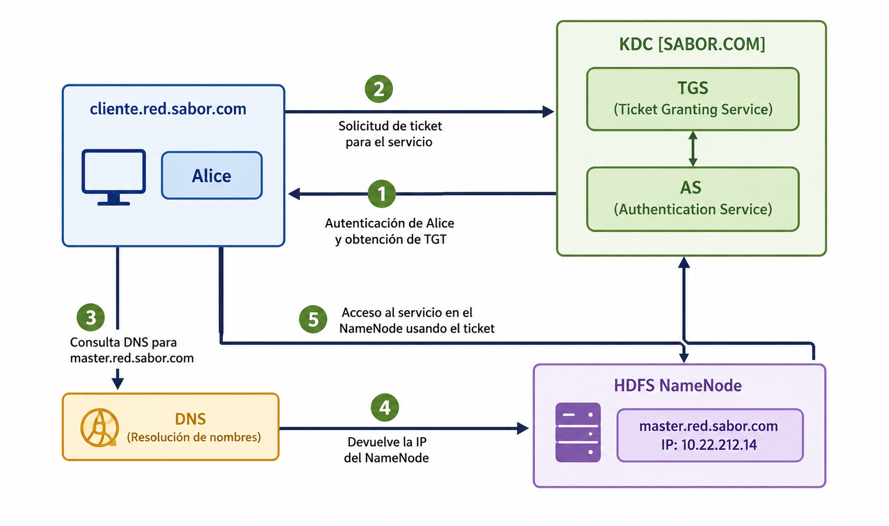

<!--
SPDX-FileCopyrightText: 2026 Colaboradores de apuntes_muicd_uned

SPDX-License-Identifier: CC-BY-4.0
-->

# SGD.EX.2024J2

Asignatura: Seguridad de la Gestión de Datos  
Duración: 120 minutos  

ANTES DE INICIAR LA PRUEBA, LEA ATENTAMENTE LAS SIGUIENTES INSTRUCCIONES

1. El estudiante deberá entregar al tribunal únicamente la hoja de lectura óptica con sus datos personales, los datos de la asignatura, el tipo de examen y las respuestas marcadas.
2. Si se identifica alguna incidencia o posible error en el enunciado, también podrá entregarse una hoja adicional con las observaciones que se consideren oportunas. Estos comentarios podrán ser relevantes ante posibles reclamaciones.
3. La prueba consta de 20 preguntas tipo test. Para superarla será necesario obtener una puntuación mínima de 5 puntos. Cada pregunta presenta cuatro alternativas, de las cuales solo una es correcta. Solo se tendrán en cuenta las preguntas contestadas. Cada respuesta correcta suma 0,5 puntos y cada respuesta incorrecta resta 0,2 puntos.
4. Está permitido utilizar calculadora NO CIENTÍFICA.
5. Cuando alguna pregunta incluya como opción “Dos o más son ciertas” o “todas son falsas”, deberá seleccionarse dicha alternativa si se cumplen esas condiciones en el resto de opciones. No se considerarán válidas las respuestas individuales en esos casos.

## SGD.EX.2024J2.1

### Enunciado SGD.EX.2024J2.1

¿Cómo pueden mitigarse los riesgos de seguridad provocados por contraseñas débiles y accesos anónimos a los servicios dentro de una infraestructura cloud?

A) Desarrollando APIs específicas de control de acceso  
B) Cifrando los datos durante su transmisión  
C) Conociendo en detalle las dependencias con módulos de terceros  
D) Aplicando autenticación multifactor y controles de acceso más robustos  

### Solución SGD.EX.2024J2.1

## SGD.EX.2024J2.2

### Enunciado SGD.EX.2024J2.2

Indique cuál de las siguientes afirmaciones sobre SCAP es correcta.

I. SCAP es una especificación destinada a expresar/modelar y manipular datos de seguridad de forma estandarizada.  
II. SCAP fue definido por ENISA.

A) I falsa; II verdadera  
B) I falsa; II falsa  
C) I verdadera; II verdadera  
D) I verdadera; II falsa  

### Solución SGD.EX.2024J2.2

## SGD.EX.2024J2.3

### Enunciado SGD.EX.2024J2.3

¿Cuáles son los principios definidos por los GAR Principles?

A) Rendición de cuentas, Transparencia, Integridad, Protección, Cumplimiento, Disponibilidad, Retención, Disposición.  
B) Rendición de cuentas, Transparencia, Integridad, Protección, Confidencialidad, Disponibilidad, Retención, Autenticación.  
C) Rendición de cuentas, Opacidad, Integridad, Protección, Cumplimiento, No repudio, Retención, Reciclaje.  
D) Rendición de cuentas, Transparencia, Confidencialidad, Protección, Cumplimiento, Disponibilidad, Retención, Calidad.  

### Solución SGD.EX.2024J2.3

## SGD.EX.2024J2.4

### Enunciado SGD.EX.2024J2.4

Se trabaja con un conjunto de datos de compras realizadas en un centro comercial durante la campaña navideña. Para cumplir con el GDPR, se han cifrado mediante un algoritmo simétrico los campos nombre, apellidos y tarjeta de crédito. ¿Qué mecanismo de protección de datos se ha aplicado?

A. Anonimización.  
B. Generalización.  
C. Seudonimización.  
D. Eliminación.  

### Solución SGD.EX.2024J2.4

## SGD.EX.2024J2.5

### Enunciado SGD.EX.2024J2.5

Estamos trabajando con un conjunto de datos médicos para predecir el tratamiento más eficaz. La tabla contiene los campos nombre, apellidos, edad, sexo, gravedad, tratamiento aplicado y resultado. Para aplicar k-anonimización, ¿qué tratamiento se aplicaría sobre los campos nombre y apellidos?

A. Aleatorización, mezclando nombres y apellidos de los registros al azar.  
B. Generalización, agrupando nombres y apellidos según su primera letra.  
C. Supresión, reemplazando esos campos por `*`.  
D. Sustitución, cambiando los nombres por otros similares.  

### Solución SGD.EX.2024J2.5

## SGD.EX.2024J2.6

### Enunciado SGD.EX.2024J2.6

¿Cuál de los siguientes conceptos se centra en garantizar la calidad de los datos mediante prácticas como la limpieza de datos y la eliminación de duplicados?

A. Gobierno de las tecnologías de la información.  
B. Gobierno de la información.  
C. Gobierno de datos.  
D. Gobierno corporativo.  

### Solución SGD.EX.2024J2.6

## SGD.EX.2024J2.7

### Enunciado SGD.EX.2024J2.7

A partir de la figura siguiente, indique en qué paso Alice solicita un ticket para utilizar el servicio proporcionado por el nodo HDFS NameNode.

A. Paso 4  
B. Paso 3  
C. Paso 1  
D. Paso 2  

### Solución SGD.EX.2024J2.7

## SGD.EX.2024J2.8

### Enunciado SGD.EX.2024J2.8

Si se realiza un análisis exploratorio de datos recogidos por un hospital para estudiar cadenas de ADN comunes en pacientes con una enfermedad rara, desde el punto de vista del GDPR será necesario realizar:

A. Únicamente una evaluación de impacto.  
B. Nada, ya que no se consideran datos sensibles y no quedan afectados por la normativa europea de protección de datos.  
C. Un análisis de riesgos y una evaluación de impacto.  
D. Solo un análisis de riesgos sobre los datos.  

### Solución SGD.EX.2024J2.8

## SGD.EX.2024J2.9

### Enunciado SGD.EX.2024J2.9

Observando la figura siguiente, indique cuál de las siguientes herramientas puede utilizarse como servicio de gestión de la autorización.

A. Apache Sentry  
B. Apache Knox  
C. Apache Access Control Service  
D. Apache Spark  

### Solución SGD.EX.2024J2.9

## SGD.EX.2024J2.10

### Enunciado SGD.EX.2024J2.10

¿Cuál de las siguientes opciones integra el protocolo Kerberos mediante KDC, LDAP y gestión de certificados?

A. OpenLDAP  
B. Microsoft Active Directory  
C. OpenSSL  
D. MIT Kerberos  

### Solución SGD.EX.2024J2.10

## SGD.EX.2024J2.11

### Enunciado SGD.EX.2024J2.11

Dados dos documentos, A y B, si al aplicarles la función `HASH_SIN_COLISION` se obtiene 123456 para A y 123457 para B, ¿qué se puede concluir?

A. El contenido de B está incluido en A.  
B. El contenido de A está incluido en B.  
C. Ambos documentos tienen el mismo contenido.  
D. Son dos archivos diferentes.  

### Solución SGD.EX.2024J2.11

## SGD.EX.2024J2.12

### Enunciado SGD.EX.2024J2.12

En el contexto de una base de datos, ¿cuál de los siguientes elementos no se considera un metadato asociado?

A. Una tabla incluida en la base de datos.  
B. El usuario que creó la base de datos.  
C. La fecha de creación.  
D. El nombre de la base de datos.  

### Solución SGD.EX.2024J2.12

## SGD.EX.2024J2.13

### Enunciado SGD.EX.2024J2.13

Si Paco y Juan utilizan ambos la contraseña Feliz, ¿cómo puede evitarse que el hash almacenado para sus contraseñas sea idéntico en la base de datos de la aplicación?

A. Utilizando cifrado asimétrico.  
B. Utilizando cifrado simétrico.  
C. Utilizando una función hash sin colisiones.  
D. Incorporando una salt al almacenamiento de las contraseñas.  

### Solución SGD.EX.2024J2.13

## SGD.EX.2024J2.14

### Enunciado SGD.EX.2024J2.14

Si un mensaje se cifra utilizando la clave pública de un par de claves, ¿qué propiedad se está garantizando?

A. La integridad de la información.  
B. La identidad del emisor de los datos.  
C. La accesibilidad de la información.  
D. La confidencialidad de la información.  

### Solución SGD.EX.2024J2.14

## SGD.EX.2024J2.15

### Enunciado SGD.EX.2024J2.15

¿A qué propiedad de la seguridad afecta principalmente un ataque de Denegación de Servicio?

A. Autenticación  
B. Disponibilidad  
C. Integridad  
D. Confidencialidad  

### Solución SGD.EX.2024J2.15

## SGD.EX.2024J2.16

### Enunciado SGD.EX.2024J2.16

En el almacén de una empresa se han definido políticas de gestión de datos basadas en el cumplimiento básico de la normativa de protección de datos. Sin embargo, no se han desarrollado mecanismos para emplear el seguimiento del uso de los datos en la toma de decisiones del almacén. Según los criterios de ARMA, el seguimiento del acceso a los datos se encuentra en:

A. Nivel 3.  
B. Nivel 4.  
C. Nivel 2.  
D. Nivel 1.  

### Solución SGD.EX.2024J2.16

## SGD.EX.2024J2.17

### Enunciado SGD.EX.2024J2.17

Desde la perspectiva de la gobernanza de la información, ¿cómo pueden protegerse las aplicaciones en la nube frente a ataques basados en botnets y spam?

A. Mediante la monitorización completa de los servicios.  
B. Implantando procesos de identificación de usuarios y monitorización de actividad.  
C. Solicitando periódicamente al proveedor cloud que actualice las listas públicas de reputación y listas negras utilizadas en los monitores de acceso.  
D. Aplicando tecnologías y políticas orientadas a combatir el fraude.  

### Solución SGD.EX.2024J2.17

## SGD.EX.2024J2.18

### Enunciado SGD.EX.2024J2.18

Indique cuál de las siguientes afirmaciones es correcta.

A. Knox es un framework que ofrece un proxy inverso sin estado, o stateless.  
B. Knox muestra la topología interna de las redes que forman el clúster.  
C. Knox no puede escalar linealmente añadiendo más nodos cuando aumenta el número de peticiones.  
D. Knox proporciona autenticación únicamente para clústeres Hadoop, sin incluir Spark.  

### Solución SGD.EX.2024J2.18

## SGD.EX.2024J2.19

### Enunciado SGD.EX.2024J2.19

Apache Knox proporciona una característica específica para clústeres Hadoop situados en el perímetro de red. ¿Cuál de las siguientes características ofrece?

A. Flexibilidad  
B. Seguridad  
C. Tolerancia a fallos  
D. Fiabilidad  

### Solución SGD.EX.2024J2.19

## SGD.EX.2024J2.20

### Enunciado SGD.EX.2024J2.20

Estamos trabajando con un conjunto de datos médicos para predecir el tratamiento más eficaz. La tabla contiene nombre, apellidos, edad, sexo, gravedad, tratamiento aplicado y resultado. Para aplicar k-anonimización, ¿qué mecanismo se usaría sobre el campo edad?

A. Insertar ruido, sustituyendo las edades por otras diferentes.  
B. Generalización, reemplazando las edades por rangos como 30-40, 40-50, etc.  
C. Supresión, sustituyendo esos campos por `*`.  
D. Aleatorización, mezclando los distintos valores de edad dentro de la columna.  

### Solución SGD.EX.2024J2.20
