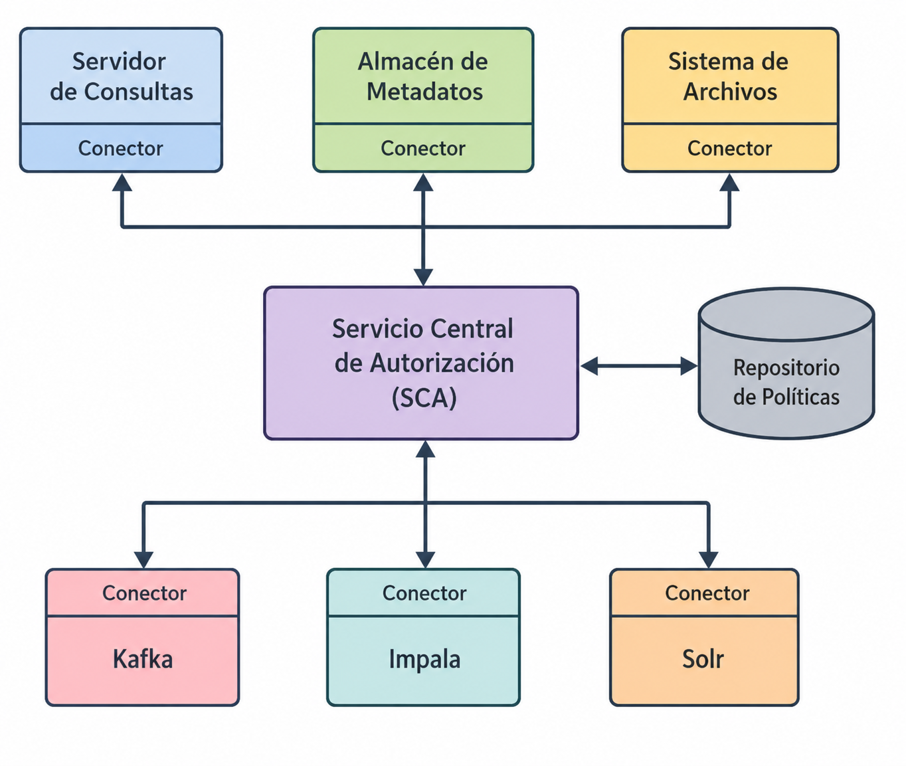

<!--
SPDX-FileCopyrightText: 2026 Colaboradores de apuntes_muicd_uned

SPDX-License-Identifier: CC-BY-4.0
-->

# SGD.EX.2024SO

Asignatura: Seguridad de la Gestión de Datos  
Duración: 120 minutos  

ANTES DE INICIAR LA PRUEBA, LEA ATENTAMENTE LAS SIGUIENTES INSTRUCCIONES

1. El estudiante deberá entregar únicamente al tribunal la hoja de lectura óptica con sus datos personales, los datos de la asignatura, el tipo de examen y las respuestas seleccionadas.
2. Si se detecta alguna incidencia o posible error en el enunciado, también podrá entregarse una hoja adicional explicando aquello que se considere oportuno. Estas observaciones podrán ser relevantes ante posibles reclamaciones.
3. La prueba consta de 20 preguntas tipo test. Para superarla será necesario alcanzar una puntuación mínima de 5 puntos. Cada pregunta incluye cuatro alternativas, de las cuales solo una es correcta. Solo se tendrán en cuenta las preguntas contestadas. Cada respuesta correcta suma 0,5 puntos y cada respuesta incorrecta resta 0,2 puntos.
4. Se permite utilizar calculadora NO CIENTÍFICA.
5. Si alguna pregunta incluye como opción “Dos o más son ciertas” o “todas son falsas”, deberá marcarse esa alternativa cuando se cumplan dichas condiciones en el resto de opciones. No se aceptarán como válidas las respuestas individuales en esos casos.

## SGD.EX.2024SO.1

### Enunciado SGD.EX.2024SO.1

Si se desea administrar un trabajo distribuido en un clúster Hadoop, ¿cuál de los siguientes protocolos permite lanzarlo de forma remota y segura?

A. TLS para las órdenes y comandos remotos, y también para la transferencia segura de información.  
B. TLS para las órdenes y comandos remotos, y SSH para la transferencia segura de información.  
C. SSH para las órdenes y comandos remotos, y también para la transferencia segura de información.  
D. SSH para las órdenes y comandos remotos, y TLS para la transferencia segura de información.  

### Solución SGD.EX.2024SO.2

## SGD.EX.2024SO.2

### Enunciado SGD.EX.2024SO.2

Dados dos documentos, A y B, si al aplicarles la función `HASH_SIN_COLISION` se obtiene 123456 para A y 123457 para B, ¿qué conclusión puede extraerse?

A. Se trata de dos ficheros distintos.  
B. El contenido de B está incluido dentro de A.  
C. Ambos documentos contienen exactamente la misma información.  
D. El contenido de A está incluido dentro de B.  

## SGD.EX.2024SO.3

### Enunciado SGD.EX.2024SO.3

Desde la perspectiva de la gobernanza de la información, ¿cómo pueden protegerse las aplicaciones en la nube frente a ataques basados en botnets y spam?

A. Mediante una monitorización completa de los servicios.  
B. Implantando procesos de identificación de usuarios y seguimiento de actividad.  
C. Aplicando tecnologías y políticas orientadas a combatir el fraude.  
D. Solicitando periódicamente al proveedor cloud la actualización de listas públicas de reputación y listas negras usadas en los monitores de acceso.  

### Solución SGD.EX.2024SO.3

## SGD.EX.2024SO.4

### Enunciado SGD.EX.2024SO.4

En el almacén de una empresa se han definido políticas de gestión de datos basadas en el cumplimiento básico de la normativa de protección de datos. Sin embargo, no se han implantado mecanismos para utilizar el seguimiento del uso de datos en la toma de decisiones del almacén. Según los criterios de ARMA, el seguimiento del acceso a los datos se encuentra en:

A. Nivel 4.  
B. Nivel 2.  
C. Nivel 3.  
D. Nivel 1.  

### Solución SGD.EX.2024SO.4

## SGD.EX.2024SO.5

### Enunciado SGD.EX.2024SO.5

¿A qué propiedad de la seguridad afecta principalmente un ataque de Denegación de Servicio?

A. Integridad.  
B. Disponibilidad.  
C. Autenticación.  
D. Confidencialidad.  

### Solución SGD.EX.2024SO.5

## SGD.EX.2024SO.6

### Enunciado SGD.EX.2024SO.6

¿Cuál de los siguientes conceptos se encarga de asegurar la calidad de los datos mediante prácticas como la depuración de datos y la eliminación de duplicidades?

A. Gobierno corporativo.  
B. Gobierno de datos.  
C. Gobierno de las tecnologías de la información.  
D. Gobierno de la información.  

### Solución SGD.EX.2024SO.6

## SGD.EX.2024SO.7

### Enunciado SGD.EX.2024SO.7

Estamos trabajando con un conjunto de datos médicos para predecir el tratamiento más eficaz. La tabla contiene los campos nombre, apellidos, edad, sexo, gravedad, tratamiento aplicado y resultado. Si se desea aplicar k-anonimización, ¿qué tratamiento se aplicaría a los campos nombre y apellidos?

A. Aleatorización, mezclando de forma aleatoria los nombres y apellidos entre los registros.  
B. Supresión, sustituyendo esos campos por `*`.  
C. Sustitución, reemplazando los nombres por otros similares.  
D. Generalización, agrupando nombres y apellidos según su primera letra.  

### Solución SGD.EX.2024SO.7

## SGD.EX.2024SO.8

### Enunciado SGD.EX.2024SO.8

La configuración de seguridad y los parámetros de una conexión TLS se acuerdan mediante el protocolo:

A. TLS Record.  
B. TLS Configure.  
C. TLS Alert.  
D. TLS Handshake.  

### Solución SGD.EX.2024SO.8

## SGD.EX.2024SO.9

### Enunciado SGD.EX.2024SO.9

¿Qué se entiende por vector de ataque?

A. La probabilidad de que un riesgo llegue a materializarse.  
B. El número de vulnerabilidades que aprovecha un ataque.  
C. La vía o recorrido que sigue un ataque para alcanzar su objetivo.  
D. Una amenaza potencial que no llega a explotar una vulnerabilidad.  

### Solución SGD.EX.2024SO.9

## SGD.EX.2024SO.10

### Enunciado SGD.EX.2024SO.10

Se trabaja con un conjunto de datos de compras realizadas en un centro comercial durante la campaña navideña. Para cumplir con el GDPR, se han cifrado mediante un algoritmo simétrico los campos nombre, apellidos y tarjeta de crédito. ¿Qué mecanismo de protección de datos se ha empleado?

A. Seudonimización.  
B. Eliminación.  
C. Generalización.  
D. Anonimización.  

### Solución SGD.EX.2024SO.10

## SGD.EX.2024SO.11

### Enunciado SGD.EX.2024SO.11

Apache Knox proporciona una característica concreta para clústeres Hadoop situados en el perímetro de la red. ¿Cuál de las siguientes características ofrece?

A. Fiabilidad.  
B. Flexibilidad.  
C. Seguridad.  
D. Tolerancia a fallos.  

### Solución SGD.EX.2024SO.11

## SGD.EX.2024SO.12

### Enunciado SGD.EX.2024SO.12

Existen distintos criterios para definir permisos en las listas de control de acceso, o ACL. ¿Cuál de las siguientes opciones establece el acceso según la función que desempeña el usuario dentro de la organización?

A. Discretionary access control (DAC).  
B. Group access control (GAC).  
C. Function grained access control (FGAC).  
D. Role-based access control (RBAC).  

### Solución SGD.EX.2024SO.12

## SGD.EX.2024SO.13

### Enunciado SGD.EX.2024SO.13

¿Qué beneficio aporta el uso de taxonomías para organizar los datos a partir de sus metadatos?

A. Asegurar la calidad de los datos mediante su clasificación.  
B. Facilitar el cumplimiento legal de diversas normativas.  
C. Permitir una búsqueda eficiente de la información en toda la organización y mejorar la productividad de los empleados.  
D. Hacer posible una auditoría completa del uso de la información.  

### Solución SGD.EX.2024SO.13

## SGD.EX.2024SO.14

### Enunciado SGD.EX.2024SO.14

Si un mensaje se cifra utilizando la clave pública de un par de claves, ¿qué propiedad se está garantizando?

A. La confidencialidad de la información.  
B. La integridad de la información.  
C. La accesibilidad de la información.  
D. La identidad del emisor de los datos.  

### Solución SGD.EX.2024SO.14

## SGD.EX.2024SO.15

### Enunciado SGD.EX.2024SO.15

¿Qué protocolo utiliza Apache Knox para proporcionar acceso a los servicios de un clúster Hadoop?

A. FTP.  
B. SSL.  
C. ICMP.  
D. HTTP.  

### Solución SGD.EX.2024SO.15

## SGD.EX.2024SO.16

### Enunciado SGD.EX.2024SO.16

A partir de la figura, indique qué proveedor corresponde al Grupo C.

A. Microsoft Active Directory.  
B. OpenSSL.  
C. MIT Kerberos.  
D. OpenLDAP.  

### Solución SGD.EX.2024SO.16

## SGD.EX.2024SO.17

### Enunciado SGD.EX.2024SO.17

Observando la figura, indique cuál de las siguientes herramientas puede emplearse como servicio de gestión de la autorización.

A. Apache Sentry.  
B. Apache Knox.  
C. Apache Access Control Service.  
D. Apache Spark.  

### Solución SGD.EX.2024SO.17

## SGD.EX.2024SO.18

### Enunciado SGD.EX.2024SO.18

Si Paco y Juan utilizan ambos la contraseña Feliz, ¿cómo puede evitarse que se almacene el mismo valor hash para ambos usuarios?

A. Usando una salt al almacenar las contraseñas.  
B. Usando cifrado asimétrico.  
C. Usando cifrado simétrico.  
D. Usando una función hash sin colisiones.  

### Solución SGD.EX.2024SO.18

## SGD.EX.2024SO.19

### Enunciado SGD.EX.2024SO.19

¿Cuál es uno de los principales retos que plantea el GDPR respecto al uso de Machine Learning e Inteligencia Artificial?

A. No pueden utilizarse en procesos de toma de decisiones bajo ningún supuesto.  
B. No es posible tomar decisiones automáticas con efectos legales si no existe intervención humana.  
C. No es posible tomar decisiones automáticas sin intervención humana.  
D. Debe realizarse un análisis de riesgos para poder utilizarlas.  

### Solución SGD.EX.2024SO.19

## SGD.EX.2024SO.20

### Enunciado SGD.EX.2024SO.20

¿Qué comando puede utilizarse para generar un par de claves con OpenSSL?

A. `openssl pkcs12`  
B. `openssl genrsa`  
C. `openssl verify`  
D. `openssl convert`  

### Solución SGD.EX.2024SO.20
