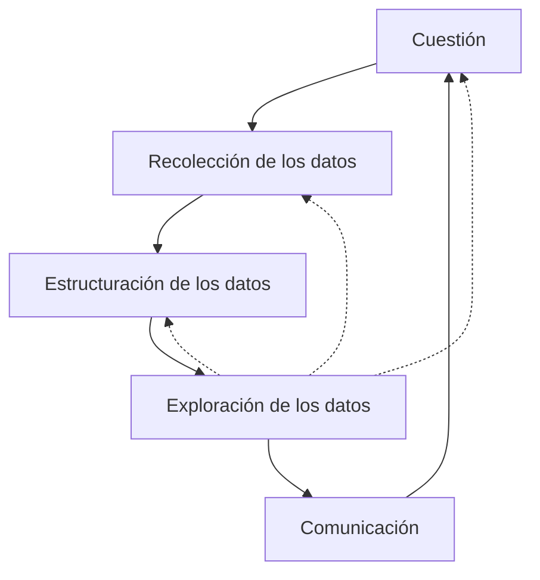

<!--
SPDX-FileCopyrightText: 2026 Colaboradores de apuntes-muicd-uned

SPDX-License-Identifier: CC-BY-4.0
-->

# VD - Tema 1

La estructura utilizada en los apuntes es la misma que la empleada en el material propio de la asignatura.

## Introducción

### Introducción a la visualización

#### Propiedades de Big Data )

\
`EXAM=(2023SO.C.2)`

Propiedades de Big Data:

- Velocidad de creación
- Volúmen en términos de cantidad de datos
- Gran variedad respecto a la naturaleza de los datos

### Reto de la visualización

## Definición de visualización para ingeniería de datos

### Definiendo la visualización

Elementos de la visualización:

- Emisor
- Mensaje
- Receptor

La **visualización de datos** es la representación y presentación gráfica de información con un objetivo concreto, aprovechando la capacidad de percepción visual humana para facilitar su comprensión, análisis y comunicación.

Mediante gráficos, mapas, infografías o cuadros de mando, permite descubrir patrones, tendencias, relaciones, excepciones y posibles conclusiones que podrían resultar difíciles de identificar en los datos originales.

Para que sea eficaz, debe diseñarse teniendo en cuenta el mensaje que se desea transmitir, las características de los datos y las necesidades del usuario al que va dirigida.

La **representación de datos** es la codificación escogida mostrar los valores o atributos de un conjunto de datos mediante elementos visuales, como puntos, líneas, barras, áreas, posiciones, tamaños o colores.

Por ejemplo, representar el número de ventas de varios productos mediante barras cuya longitud sea proporcional a las ventas constituye una representación de los datos.

La **presentación de datos** es la comunicación de una o varias representaciones visuales a una audiencia determinada mediante su selección, organización y complemento con elementos de apoyo, como títulos, colores, anotaciones, leyendas, contexto o recursos interactivos.

Se considera la fase final del proceso de visualización de datos en la que los resultados del análisis se organizan, resumen y muestran de forma comprensible para facilitar su interpretación o comunicarlos a otras personas.

Puede realizarse mediante informes, gráficos, cuadros de mando u otras representaciones visuales.

### Otras definiciones necesarias

- Una **infografía** es una representación visual que combina gráficos, mapas, ilustraciones y texto para comunicar de forma clara y contextualizada uno o varios mensajes concretos.  

[VD] también define en este apartado los siguientes términos, que aquí se omiten para tratarse en el apartado correspondiente donde se estudia en detalle:

- Presentación: tema 1.
- Preprocesado: tema 2.
- Procesado: tema 2.
- Dashboard: tema 4.; en estos apuntes se dejan para el tema 2, donde se estudian en más detalle.

## Necesidad de la visualización de datos
<!-- Necesidad creciente de la visualización de datos por el incremento de la información digital-->

## Visualización en el proceso de análisis de información
<!-- "Presentación de información" frente a "análisis de información" -->

### Proceso de análisis de la información

### Creación de una visualización

#### Proceso para abordar visualización )

`EXAM=(2024SO.1.B,2025J2.1.A)`

El **proceso para abordar una visualización** es un procedimiento iterativo que permite pasar de una pregunta inicial a una representación visual capaz de comunicar o analizar los resultados obtenidos.

Proceso de abordar una visualización:

Este proceso consta de las siguientes etapas:

1. **Cuestión**  
   El proceso comienza planteando la pregunta que se desea responder y determinando la intención de la visualización. Es necesario concretar qué se quiere conocer, analizar o comunicar y a quién estará dirigida la representación.

2. **Recolección de los datos**  
   A partir del objetivo, se seleccionan los datos necesarios para responder a la cuestión planteada. Si dichos datos no están disponibles, habrá que obtenerlos mediante nuevas fuentes o generarlos a partir de transformaciones de datos ya existentes.

3. **Estructuración de los datos**  
   Una vez reunidos los datos, se identifican las variables disponibles, sus tipos y la forma en que se relacionan. La estructura de los datos condiciona qué representaciones visuales pueden utilizarse: no se representa igual una variable categórica, una variable cuantitativa, una serie temporal o una relación espacial.

4. **Exploración de los datos**  
   Se seleccionan y aplican las visualizaciones más adecuadas según el objetivo y la estructura de los datos. Mediante estas representaciones se analizan los resultados, se buscan patrones, tendencias, relaciones o valores atípicos y se comprueba si la información obtenida permite responder a la cuestión inicial.

5. **Comunicación de los resultados**  
   Una vez identificados los resultados relevantes, se eligen las visualizaciones que los presentan de forma más clara para la audiencia destinataria. La representación final debe facilitar la comprensión de las conclusiones y transmitir el mensaje de forma eficaz.

### Roles en el proceso de visualización

La creación de una visualización suele requerir la participación de varios perfiles, cada uno encargado de una parte del proceso.

`EXAM=(2024J2.1.C)`

Roles en el proceso de visualización:

- Iniciador
- Científico de datos
- Periodista
- Informático
- Diseñador
- Científico cognitivo
- Comunicador
- Coordinador

Revisados más en detalle:

- **Iniciador:** define el problema, los objetivos, la audiencia y la orientación general del proyecto. Su tarea principal es explorar posibilidades para encontrar respuestas.

- **Científico de datos:** obtiene, prepara y analiza los datos, aplicando conocimientos estadísticos y matemáticos para descubrir patrones y relaciones.

- **Periodista o narrador:** formula las preguntas clave y construye el hilo narrativo que permite explicar los resultados dentro de su contexto.

- **Informático:** implementa la solución técnica, utilizando herramientas de programación y visualización para construir el producto final.

- **Diseñador:** se ocupa de la forma visual de la solución, buscando que sea atractiva y, al mismo tiempo, clara y eficaz para transmitir el mensaje.

- **Científico cognitivo:** aporta conocimientos sobre percepción visual, atención, memoria, color, principios de la Gestalt e interacción persona-ordenador, con el fin de mejorar la comprensión de la visualización.

`EXAM=(2023J2.C.4)`

- **Comunicador:** facilita la relación entre usuarios, clientes y responsables técnicos, informa sobre el progreso y presenta el resultado final.

- **Coordinador:** organiza el proyecto, controla plazos y recursos y vela por la coherencia, la calidad y la ética de la visualización.

## Presentación de la información frente a análisis de la información

En ingeniería de datos, la visualización puede emplearse con dos objetivos principales:

- **Presentación y gestión de la información:** busca mostrar y manejar los datos de manera eficiente, permitiendo consultar casos concretos, navegar, filtrar, ampliar detalles o visualizar la información desde distintos puntos de vista.

- **Análisis de la información:** utiliza la visualización no solo para mostrar datos, sino también para obtener conclusiones, descubrir patrones, comparar distribuciones, identificar relaciones o agrupar observaciones con características comunes.

## Visualización en ingeniería de datos
<!-- Presentación de información” frente a “análisis de información” -->

Se distinguen dos líneas de uso de la visualización en el área de ingeniería de datos:

- **Presentación y gestión de la información:** busca mostrar y manejar los datos de manera eficiente, permitiendo consultar casos concretos, navegar, filtrar, ampliar detalles o visualizar la información desde distintos puntos de vista.

- **Análisis de la información:** utiliza la visualización no solo para mostrar datos, sino también para obtener conclusiones, descubrir patrones, comparar distribuciones, identificar relaciones o agrupar observaciones con características comunes.

## Bibliografía

- Básica
  - [VD] RINCÓN ZAMORANO, M., RODRIGO YUSTE, A., TOBARRA ABAD, Ll., ROBLES GÓMEZ, A. *Visualización de los Datos*. Versión 1.0. 2020.
- Complementaria
  - WILKE, Claus O. Fundamentals of Data Visualization. 1.ª ed. Sebastopol, EEUU: O'Reilly, 2019. ISBN 9781492031086.
  - MALAMED, Connie. Visual Design Solutions: Principles and Creative Inspiration for Learning Professionals. Wiley, 2015.
  - GONNELLA, R., NAVETTA C., Friedman, M. [Design Fundamentals: Notes on Visual Elements and Principles of Composition](https://learning.oreilly.com/library/view/design-fundamentals-notes/9780133930290/). USA: Peachpit Press, 2015. ISBN: 9780133930290.

## Licencia y atribución

[![CC BY 4.0][cc-by-shield]][cc-by]

Este trabajo está licenciado bajo la licencia **[Creative Commons Atribución 4.0 Internacional][cc-by]**.

© 2026, Colaboradores de [apuntes-muicd-uned](https://github.com/pmgallardo/apuntes-muicd-uned).

[cc-by]: http://creativecommons.org/licenses/by/4.0/
[cc-by-shield]: https://img.shields.io/badge/License-CC%20BY%204.0-lightgrey.svg
