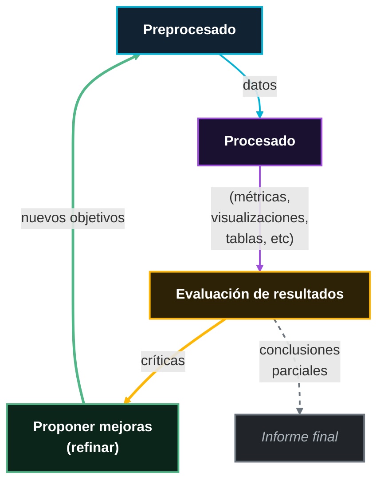
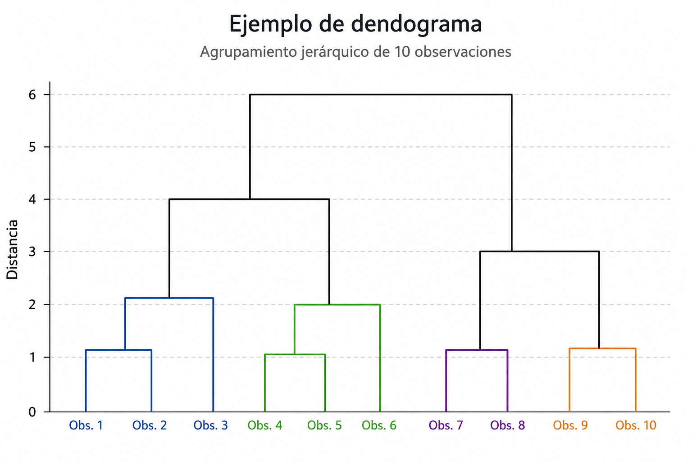

<!--
SPDX-FileCopyrightText: 2026 Colaboradores de apuntes-muicd-uned

SPDX-License-Identifier: CC-BY-4.0
-->

# VD - Unidad 2: Representación de la información

## Representación formal/de datos: Tipos de variables de datos y su estructura

### Introducción a la teoría de sistemas

`EXAM=(2023J2.C.1)`

La **teoría de sistemas** es un enfoque para describir y modelar una realidad mediante la identificación de los objetos que intervienen en ella y de las relaciones que existen entre dichos objetos.

El objetivo de su aplicación en visualización de datos es **determinar qué elementos y relaciones deben representarse** antes de decidir cómo se visualizarán gráficamente los datos.

`EXAM=(2023SO.C.2)`

La teoría de sistemas considera dos aproximaciones complementarias para describir la realidad:

- *Analítica*  
- *Sistemática*  

La **aproximación analítica**, basada en operaciones de **reducción**, descompone un problema en sus elementos esenciales para describirlo mediante un conjunto reducido de variables y relaciones.

Resulta adecuada cuando el problema puede resumirse mediante pocas variables. Por ejemplo, para analizar el consumo energético de un dispositivo puede bastar con considerar su potencia y el tiempo de funcionamiento.

La **aproximación sistémica**, basada en operaciones de **composición**, estudia el escenario como un conjunto de elementos relacionados, atendiendo a cómo interactúan y forman estructuras más complejas.

Resulta más conveniente en escenarios complejos. Por ejemplo, para representar el funcionamiento de una plataforma de transporte habría que considerar objetos como `viajeros`, `vehículos`, `trayectos`, `paradas` y `billetes`, además de las relaciones entre ellos.

Dentro de un sistema se distinguen los siguientes elementos:

- **Objetos:** son las entidades concretas o abstractas que forman parte del escenario. En una plataforma de transporte, pueden ser los `viajeros`, los `autobuses` o las `líneas`.
- **Relaciones
  - **Relaciones intra-objeto o atributos:** son las propiedades que describen cada objeto. Por ejemplo, un autobús puede tener `matrícula`, `capacidad` y `tipo de combustible`.
  - **Relaciones inter-objeto:** son las conexiones entre distintos objetos. Por ejemplo, un `viajero` utiliza una `línea`, o un `autobús` realiza un determinado `trayecto`.

En algunos casos, una relación puede modelarse como un objeto propio cuando interesa almacenar información adicional sobre ella. Por ejemplo, el `viaje` de un usuario puede representarse como una entidad con atributos como `hora de inicio`, `duración`, `precio` o `parada de destino`.

### Representación de objetos y relaciones

### Tipos de variables

`EXAM=(2022J2.C.1,2023so.e.2,2024j2.2.a)`

Tipos de variables:

- Cualitativa
  - Nominal
  - Ordinal
- Cuantitativa
  - Discreta
  - Continua

### Estructuras formales de representación de datos

Una **estructura formal de representación de datos** es la forma en que se organizan los valores y variables de un problema para poder almacenarlos, analizarlos y visualizarlos.

La estructura de datos debe elegirse atendiendo al tipo de objetos, variables y relaciones que se desea representar.

Algunas estructuras de datos:

- Variable
- Lista
- Tabla

#### Variable )

Una **variable** simple contiene un único valor para una observación.

#### Lista )

La **lista** o **array** se emplea cuando se requiere almacenar varios valores relacionados, especialmente cuando dichos valores siguen un orden. Este orden suele venir dado por variables como:

- El **tiempo**, por ejemplo, el consumo eléctrico medido cada hora.
- El **espacio**, por ejemplo, la temperatura registrada en distintas habitaciones de un edificio.

#### Tabla )

`EXAM=(2024J2.2.B)`

La **tabla** se emplea cuando el problema contiene varios objetos descritos mediante distintos atributos. En ella:

- Cada **fila** representa una instancia u observación.
- Cada **columna** representa una variable o atributo.

Por ejemplo, para estudiar los dispositivos de un edificio inteligente, cada fila puede representar un dispositivo y las columnas pueden almacenar su tipo, ubicación, estado, consumo energético y temperatura.

- Ventajas
  - Organización sencilla, facilidad para filtrar.
  - Comparar y visualizar los datos.
  - Compatibilidad con herramientas de análisis.
- Inconvenientes
  - Puede resultar limitada si existen relaciones complejas entre objetos, atributos específicos solo para algunos tipos de dispositivo o mediciones repetidas en el tiempo y en el espacio.

En Python se implementa a través del objeto `DataFrame` de la biblioteca pandas.

### Conversión entre estructuras de datos

La **conversión entre estructuras de datos** consiste en representar una misma información mediante formatos diferentes, eligiendo en cada caso el que resulte más adecuado para almacenarla, procesarla o visualizarla.

La estructura más habitual es la **tabla**, donde cada fila representa una observación y cada columna una variable. Es un formato sencillo y útil, aunque puede resultar poco práctico cuando existen demasiadas observaciones, muchas variables o relaciones complejas entre elementos.

Cuando la información es más compleja, puede organizarse mediante **bases de datos** formadas por varias tablas relacionadas, de las que posteriormente se extrae una tabla concreta con los datos necesarios para el análisis.

También es posible convertir variables de un tipo a otro, pero debe hacerse con cuidado, ya que puede alterar su significado. Por ejemplo, asignar números a categorías no implica necesariamente que exista un orden o una distancia real entre ellas.

Por tanto, la estructura elegida debe facilitar el análisis y la visualización sin introducir relaciones que los datos originales no poseen.

## Proceso de análisis de datos

`EXAM=(2023J2.C.3,2025J2.2.A)`

Este apartado no aparece listado en la web dentro de la unidad 2, pero sí aparece y se desarrolla en los apuntes oficiales.

El **análisis de datos** es el proceso de examinar un conjunto de datos representativo de una situación o fenómeno para descubrir qué elementos se parecen, en qué se diferencian y qué patrones permiten resumir y comprender la información de forma más sencilla.

La relación entre los conceptos puede ser tanto cuantitativa, cuando existe una relación directa entre los conceptos, como cualitativa, cuando tal relación es más subjetiva. El preprocesado se considera una etapa previa del análisis porque es independiente del dominio, pero en realidad sus objetivos son similares. El análisis puede dar lugar a nuevo conocimiento o simplemente actualizar los valores de un modelo previamente conocido.

**Metodología en espiral para el análisis de datos**:

El proceso de análisis de datos se puede desglosar en las siguientes fases y tareas:

- Preprocesado
  - Limpieza de datos
  - Filtrado de datos
  - Transformación de variables
- Procesado
  - Ordenación
  - Agrupación
  - Correlación
  - Combinación de información
  - Normalización
  - Escalado
- Evaluación
- Mejora

### Preprocesado de datos

El **preprocesado** es la fase previa al análisis en la que se limpian, seleccionan, organizan o transforman los datos originales para reducir el ruido y obtener un conjunto de datos más manejable y adecuado al objetivo del estudio.

Tareas:

- Limpieza de datos
- Filtrado de datos
- Transformación de variables

#### Limpieza de datos

\
La **limpieza de datos**, también conocida como **data cleaning** o **data scrubbing**, es el proceso de identificar y corregir, sustituir o eliminar los datos problemáticos de un conjunto de datos, como valores ausentes, vacíos, incorrectos, imprecisos, duplicados o irrelevantes.

Esta tarea es importante porque la calidad de los resultados del análisis depende de la calidad de los datos de partida. Además, determinados algoritmos no pueden trabajar correctamente con valores nulos o inconsistentes, por lo que es necesario tratarlos antes de aplicar técnicas de análisis o de aprendizaje automático.

`EXAM=(2023J2.C.2)`

Los **valores nulos** pueden aparecer, por ejemplo, porque un usuario no haya proporcionado cierta información o porque el dato se haya perdido durante su recogida o almacenamiento.

Cuando no se desea trabajar con valores nulos, pueden adoptarse principalmente dos soluciones:

- **Sustituirlos** por un valor adecuado, como cero, la media, la mediana, un valor mínimo u otro valor previamente definido. En Python/pandas se usa el método `df.fillna()`.
- **Eliminar** las filas o registros que contengan valores nulos, siempre que esta eliminación no reduzca de forma significativa la información disponible ni introduzca sesgos en el análisis. En Python/pandas se usa el método `df.dropna()`.

#### Filtrado de datos
<!-- Filtrado/selección de variables y/o instancias -->

\
El **filtrado de datos** es el proceso mediante el cual se selecciona, dentro de un conjunto de datos completo, únicamente la información relevante para un análisis concreto. Consiste en conservar las variables y observaciones necesarias para estudiar el problema planteado, descartando aquellas que no aportan utilidad para dicho objetivo.

Aunque puede distinguirse entre **seleccionar**, cuando se indican los datos que se desean conservar, y **filtrar**, cuando se especifican los datos que se desean excluir, ambos términos suelen utilizarse de forma equivalente, ya que el resultado es trabajar con un subconjunto de datos adecuado al estudio.

El filtrado simplifica las etapas posteriores del análisis, reduce el espacio ocupado por los datos y disminuye el tiempo de procesamiento, al evitar trabajar con información innecesaria o irrelevante.

En Python/pandas se emplea el método `df.drop()`.

#### Transformación de variables

\
`EXAM=(2022J2.C.2)`

La **transformación de variables** es el proceso de modificar los valores de una o varias variables existentes, o de generar nuevas variables a partir de la información contenida en los datos originales, con el fin de facilitar su análisis y representación.

Una transformación puede consistir en cambiar la escala, el formato o el sistema de referencia de una variable. Por ejemplo, una columna que almacena la duración de varias películas en minutos puede transformarse para expresarla en horas y minutos, facilitando su interpretación.

También permite crear variables derivadas que describan mejor la información disponible. Por ejemplo, a partir del número de compras realizadas por un cliente durante el último año puede generarse una nueva variable categórica, `tipo_cliente`, que lo clasifique como `ocasional`, `frecuente` o `premium`.

En otros casos, la transformación implica agrupar varias observaciones para obtener información resumida en un nivel distinto de análisis. Por ejemplo, a partir de los importes de todas las compras realizadas diariamente en varias tiendas, puede calcularse una nueva variable `ventas_mensuales` para cada establecimiento.

### Procesado de datos

El **procesado de datos** es la fase en la que se aplican técnicas y operaciones sobre los datos previamente preparados para extraer nueva información, comprobar las hipótesis planteadas y responder a las preguntas del estudio.

Su objetivo es descubrir patrones, estudiar relaciones entre variables o generar resultados más abstractos que puedan ser interpretados y representados visualmente.

En el tema 1 se define el concepto como análisis, si bien en este tema resultaría ambiguo ya que se considera el procesado de datos una subfase del análisis.

`EXAM=(2023SO.P.1,2024J2.1.A)`

Tareas de procesado:

- Ordenación
- Agrupamiento
- Correlación
- Combinación de información
- Normalización
- Escalado

#### Ordenación )

\
La **ordenación** es el proceso de organizar los datos o las categorías siguiendo un criterio significativo, como un orden cronológico, alfabético, jerárquico o basado en sus valores.

En una visualización, ordenar correctamente los elementos facilita que el usuario perciba relaciones, comparaciones, tendencias y agrupaciones. De acuerdo con los principios de la Gestalt, los elementos relacionados deben presentarse de manera que puedan identificarse como parte de un mismo conjunto. Por ello, una ordenación adecuada puede convertir una representación confusa en una visualización clara y fácil de interpretar.

#### Agrupamiento )

\
El **agrupamiento** o *clustering* es una técnica de análisis que permite identificar automáticamente conjuntos de observaciones similares dentro de un conjunto de datos. Su objetivo es reunir en un mismo grupo aquellas instancias que comparten características y separar aquellas que presentan diferencias relevantes.

Por ejemplo, en un conjunto de clientes, un algoritmo de agrupamiento podría detectar grupos con comportamientos de compra similares, como clientes ocasionales, compradores frecuentes o clientes interesados en determinados tipos de productos.

`EXAM=(2024SO.2.C)`

Un **dendrograma** es una representación visual en forma de árbol que muestra cómo se forman los grupos en un proceso de agrupamiento jerárquico. Las observaciones o grupos aparecen conectados mediante ramas, y la altura a la que se unen indica el grado de diferencia o distancia existente entre ellos: cuanto más baja sea la unión, mayor será su similitud.

Los dendogramas son empleados habitualmente en agrupación.

#### Correlación )

\
`EXAM=(2025J2.2.B)`

La **correlación** es una tarea de análisis que consiste en estudiar si existe alguna relación entre dos o más variables, es decir, si los cambios en los valores de una variable están asociados con cambios en los valores de otra.

Algunos **tipos de correlaciones**:

- **Positiva**: cuando al aumentar una variable también tiende a aumentar la otra.
- **Negativa**: cuando al aumentar una variable la otra tiende a disminuir
- **Nula**: cuando no se observa una relación clara.
- **Lineal**
- **No lineal**

Por ejemplo, puede estudiarse la relación entre el número de horas de estudio de un conjunto de estudiantes y la calificación obtenida en un examen. Si los estudiantes que estudian más horas tienden a obtener calificaciones más altas, existiría una correlación positiva entre ambas variables.

Es importante recordar que la **correlación no implica causalidad**: observar que dos variables están relacionadas no permite afirmar, por sí solo, que una sea la causa de la otra. Podrían existir otros factores que expliquen la relación observada.

**Gráficos para representar la correlación**:

- **Gráfico de dispersión**: cuando hay dos variables cuantitativas en el que cada observación se representa mediante un punto situado según sus valores en los dos ejes. Este gráfico permite observar la dirección y forma de la relación, su intensidad aproximada, la posible existencia de valores atípicos y si el patrón es lineal o no lineal.
- **Mapa de calor de correlaciones**: para representar simultáneamente la relación entre muchas variables, en el que cada celda representa la correlación entre un par de variables y el color indica la intensidad y, en su caso, el signo de dicha relación.

`EXAM=(2025J2.2.C)`

No debe confundirse la correlación con la coocurrencia. La **coocurrencia** estudia con qué frecuencia aparecen juntos dos elementos o valores, y puede representarse mediante un mapa de calor de coocurrencias, en el que cada celda muestra la frecuencia de aparición conjunta mediante una intensidad de color.

En un conjunto de recetas de cocina, podemos estudiar qué ingredientes aparecen juntos en una misma receta. Por ejemplo, si `tomate` y `cebolla` aparecen conjuntamente en 120 recetas, mientras que `tomate` y `chocolate` solo aparecen juntos en 2, diremos que existe una mayor coocurrencia entre `tomate` y `cebolla`.

En este caso no estamos estudiando si al aumentar una variable aumenta o disminuye otra, como ocurriría en una correlación. Simplemente estamos contando la frecuencia con la que dos elementos aparecen juntos.

#### Combinación de información )

\
La **combinación de información** es el proceso de integrar varias observaciones o atributos originales para construir entidades nuevas y más resumidas, adecuadas al objetivo del análisis.

En lugar de estudiar cada registro de forma individual, puede ser más útil analizar valores agregados que representen grupos completos. Por ejemplo, a partir de todas las compras realizadas por clientes de distintas ciudades, pueden obtenerse entidades correspondientes a cada ciudad con atributos como el gasto medio, el número total de compras o el producto más adquirido.

De este modo, el análisis visual deja de centrarse en operaciones individuales y pasa a realizarse sobre unidades más abstractas y significativas para el problema estudiado.

En la combinación de información, a diferencia de en la transformación de variables del preprocesado, se reduce el número de instancias debido a agregaciones o agrupaciones.

#### Normalización )

\
La **normalización** es el proceso de transformar los valores de una variable para situarlos en un formato común, facilitando así su comparación con otros valores o variables.

En el contexto de análisis y visualización de datos, el concepto de normalización suele utilizarse para expresar valores en una referencia compartida.

Por ejemplo, si se desea comparar la asistencia a diferentes eventos con capacidades muy distintas, no sería suficiente comparar el número absoluto de asistentes. Resultaría más informativo representar el porcentaje de ocupación de cada evento, situando todos los valores en una escala común de 0 a 100.

Otro caso habitual es transformar los recuentos de un histograma en proporciones o densidades, de forma que puedan compararse distribuciones procedentes de conjuntos de datos de distinto tamaño.

En estadística, el término también puede referirse a la transformación de una variable para obtener una distribución normal estandarizada, con media 0 y varianza 1.

#### Escalado )

\
El **escalado** es la transformación de los valores de una variable mediante un cambio en su escala de representación, con el fin de facilitar su análisis o mejorar la interpretación visual de sus diferencias.

Un escalado adecuado puede hacer visibles variaciones importantes que quedarían ocultas en una escala poco apropiada. Por ejemplo, una escala logarítmica puede ser útil para comparar cantidades que difieren en varios órdenes de magnitud, como el número de habitantes de ciudades de tamaños muy diferentes.

No obstante, el escalado debe utilizarse de forma transparente y justificada, ya que una escala inadecuada o manipulada puede exagerar diferencias pequeñas y conducir a interpretaciones engañosas de los datos.

### Evaluación

La **evaluación** es la fase del análisis de datos en la que se revisan e interpretan los resultados obtenidos tras el procesado, con el fin de comprobar si son coherentes con el objetivo del estudio, las hipótesis planteadas y el conocimiento disponible sobre el problema.

En esta fase, la visualización permite examinar los resultados de forma clara para identificar tendencias esperadas, comportamientos anómalos, valores atípicos o posibles errores. La pregunta principal que guía la evaluación es si los resultados obtenidos son congruentes y suficientes, o existe alguna anomalía que deba investigarse.

Si los resultados coinciden con lo esperado y permiten responder adecuadamente al problema planteado, el análisis puede considerarse válido.

En cambio, cuando aparecen resultados inesperados, es necesario determinar su causa:

- Si los **resultados inesperados** corresponden a casos reales no previstos inicialmente, pueden revelar nueva información relevante. En ese caso, puede ser necesario ampliar el estudio, modificar las hipótesis o mejorar el modelo de análisis.
- Si se deben a **datos incorrectos**, incompletos o excepcionales que no representan observaciones válidas, será necesario corregir, limpiar o eliminar dichos datos y repetir el procesado.

Por tanto, la evaluación no consiste únicamente en confirmar los resultados, sino también en detectar limitaciones, errores o nuevos hallazgos que permitan mejorar la calidad y la validez del análisis realizado.

### Mejora

La **mejora** es la fase del análisis en la que, a partir de los resultados obtenidos y de las limitaciones o problemas detectados durante la evaluación, se introducen cambios para aumentar la calidad del estudio o de su representación visual.

Tipos principales de actuación en la mejora:

- **Mejoras en el análisis**
  - Los resultados pueden sugerir nuevas preguntas, hipótesis u objetivos de estudio.
  - Por ejemplo, puede resultar interesante analizar por separado un grupo concreto de observaciones, incorporar nuevas variables, cambiar el nivel de agregación de los datos o aplicar otra técnica de análisis que permita profundizar en un patrón detectado.

- **Mejoras en la visualización**
  - La evaluación también puede mostrar que la representación utilizada no comunica los resultados de forma suficientemente clara o fiel.
  - Por ejemplo, pueden modificarse aspectos como el tipo de gráfico, la escala de los ejes, la ordenación de los elementos, la gama de colores, el contraste, las etiquetas, las leyendas o la disposición general de la información.

## Representación gráfica: Elementos gráficos

Este apartado aparece listado en la web dentro de la unidad 2, pero no se desarrolla en los apuntes oficiales.

## Canales de información gráfica

Este apartado aparece listado en la web dentro de la unidad 2, pero no se desarrolla en los apuntes oficiales.

## Capacidades y limitaciones perceptuales humanas

Este apartado aparece listado en la web dentro de la unidad 2, pero no se desarrolla en los apuntes oficiales.

## Bibliografía

- Básica
  - [VD] RINCÓN ZAMORANO, M., RODRIGO YUSTE, A., TOBARRA ABAD, Ll., ROBLES GÓMEZ, A. *Visualización de los Datos*. Versión 1.0. 2020.
- Complementaria
  - WILKE, Claus O. Fundamentals of Data Visualization. 1.ª ed. Sebastopol, EEUU: O'Reilly, 2019. ISBN 9781492031086.
  - MALAMED, Connie. Visual Design Solutions: Principles and Creative Inspiration for Learning Professionals. Wiley, 2015.
  - GONNELLA, R., NAVETTA C., Friedman, M. [Design Fundamentals: Notes on Visual Elements and Principles of Composition](https://learning.oreilly.com/library/view/design-fundamentals-notes/9780133930290/). USA: Peachpit Press, 2015. ISBN: 9780133930290.

## Licencia y atribución

[![CC BY 4.0][cc-by-shield]][cc-by]

Este trabajo está licenciado bajo la licencia **[Creative Commons Atribución 4.0 Internacional][cc-by]**.

© 2026, Colaboradores de [apuntes-muicd-uned](https://github.com/pmgallardo/apuntes-muicd-uned).

[cc-by]: http://creativecommons.org/licenses/by/4.0/
[cc-by-shield]: https://img.shields.io/badge/License-CC%20BY%204.0-lightgrey.svg
