<!--
SPDX-FileCopyrightText: 2026 Colaboradores de apuntes_muicd_uned

SPDX-License-Identifier: CC-BY-4.0
-->

# Unidad 4. Técnicas de representación visual

## Elementos formales

### Objetivo de una representación visual

`EXAM=(2022J2.C.3,2023SO.C.5,2025SO.4.A)`

El **objetivo de una representación visual** determina qué información se desea destacar y condiciona la elección del gráfico más adecuado. Una visualización debe mostrar aquello que interesa analizar o comunicar de la forma más intuitiva posible.

Según el objetivo, una representación puede utilizarse para:

- **Describir una instancia concreta**, mostrando los valores de sus atributos.
- **Comparar varias instancias o categorías**, destacando semejanzas y diferencias.
- **Mostrar la composición o distribución de una variable**, mediante gráficos como barras, sectores o histogramas.
- **Representar la evolución de una variable**, especialmente cuando los datos siguen un orden temporal, mediante gráficos de líneas.
- **Mostrar relaciones entre elementos o variables**, cuando interesa analizar asociaciones, conexiones o patrones conjuntos.

Por tanto, antes de elegir un gráfico debe identificarse qué se desea destacar: una comparación, una distribución, una evolución o una relación.

### Métodos de selección de gráficos

#### Tipos de representaciones visuales )

\
`EXAM=(2023J2.C.5,2024SO.4.B)`

Se ofrece a continuación una clasificación de tipos de representaciones visuales en función del tipo de información que se desea resaltar. Es de elaboración propia de la asignatura, basada en el artículo [DV101]:

- Comparación de categorías
- Composición (jerarquía)
- Evolución a lo largo del tiempo
- Conexiones y relaciones
- Mapas geoespaciales

| Objetivo de la representación | Qué permite mostrar | Gráficos habituales |
| - | - | - |
| **Comparación de categorías** | Comparar valores entre categorías | Barras, columnas, puntos |
| **Composición** | Mostrar partes de un total o niveles jerárquicos | Circular, barras apiladas, árboles |
| **Evolución temporal** | Mostrar cambios y tendencias a lo largo del tiempo | Líneas, áreas |
| **Conexiones y relaciones** | Analizar asociaciones, patrones o vínculos | Dispersión, burbujas, grafos |
| **Mapas geoespaciales** | Representar datos asociados a ubicaciones | Mapas, mapas de calor geográficos |

La clasificación "composición" aparece en [DV] como "jerarquía"; se ha modificado ya que el término original resultaba confuso.

##### Comparación de categorías

\
**Comparación de categorías.**  
   Se utiliza para comparar valores asociados a distintas categorías, ya sea en términos absolutos o relativos. El gráfico más habitual es el **gráfico de barras o columnas**, porque permite comparar fácilmente la magnitud de cada categoría.

##### Composición

\
LA **Composición** o **Jerarquía** permite mostrar cómo un conjunto total se divide en partes o cómo se organizan elementos dentro de una estructura jerárquica. Pueden utilizarse **gráficos circulares**, **barras apiladas**, **árboles** o representaciones similares.

##### Evolución a lo largo del tiempo

\
`EXAM=(2024SO.4.B)`

\
**Evolución a lo largo del tiempo.**  
   Se emplea cuando interesa observar cómo cambia una variable en una secuencia temporal, identificando tendencias, aumentos, descensos o patrones. El ejemplo más representativo es el **gráfico de líneas**.

##### Conexiones y relaciones

\
**Conexiones y relaciones.**  
   Se utiliza para analizar asociaciones, distribuciones o patrones entre variables o elementos. Es especialmente útil en el análisis exploratorio de datos. Algunos ejemplos son los **diagramas de dispersión**, los **gráficos de burbujas** o los **grafos**, según el tipo de relación representada.

##### Mapas geoespaciales

\
**Mapas geoespaciales.**  
   Se utilizan cuando la información está asociada a una localización geográfica. Permiten analizar distribuciones, diferencias o patrones espaciales mediante la representación de los datos sobre un mapa.

## Representación estática

La **representación estática** se refiere a gráficas no interactivas que permanecen estáticas.

`EXAM=(2023SO.P.3)`

En este apartado se ven los siguientes tipos de gráficas:

- Gráfico de columnas/barras
- Gráfico de líneas
- Gráfico de área
- Gráfico de barras apiladas
- Gráfico circular
- Gráfico de dispersión
- Gráfico de burbujas
- Gráfico en cascada
- Mapa de calor
- Grafos
- Visualización de textos

### Gráfico de columnas/barras

`EXAM=(2022J2.C.4,2024J2.4.A)`

El **gráfico de columnas** representa categorías mediante barras verticales cuya altura indica el valor asociado a cada una. Su principal objetivo es **comparar varios elementos entre sí**, aunque también puede mostrar una evolución general cuando las categorías siguen un orden temporal.

El **gráfico de barras** presenta la misma finalidad, pero mediante barras horizontales. Resulta especialmente útil cuando las etiquetas de las categorías son largas y también puede representar valores negativos.

**Buenas prácticas:**

- Iniciar el eje de valores en `0` para no distorsionar las proporciones.
- Utilizar colores consistentes y reservar el contraste para destacar información relevante.
- Mantener las etiquetas legibles.
- Evitar representar demasiadas categorías en un único gráfico.

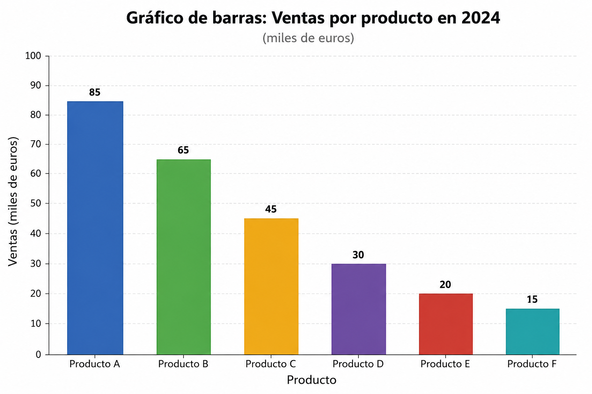

### Gráfico de líneas

El **gráfico de líneas** representa la evolución o tendencia de una variable respecto a otra variable ordenada, normalmente el tiempo. Los valores se muestran como puntos conectados por líneas, lo que permite identificar aumentos, descensos, máximos, mínimos y cambios de tendencia.

Es adecuado para datos continuos o para observaciones discretas conectadas cuando interesa mostrar su evolución.

**Buenas prácticas:**

- Utilizar líneas sólidas y claramente diferenciables.
- Evitar incluir más de cuatro líneas para no dificultar la lectura.
- Mantener una escala adecuada que permita apreciar la evolución sin exagerarla.
- En gráficos con doble eje, situar la variable principal en el eje izquierdo y diferenciar claramente las series representadas.

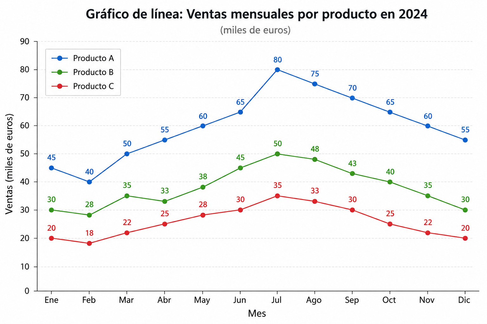

### Gráfico de área

El **gráfico de área** representa la evolución de una o varias variables rellenando el espacio situado bajo una línea. Su principal objetivo es mostrar una **tendencia general** y, cuando se utilizan varias áreas, observar la contribución de cada categoría al total a lo largo del tiempo.

Por ejemplo, puede utilizarse para mostrar cómo las ventas de distintas categorías contribuyen a las ventas totales de una empresa durante varios meses.

**Buenas prácticas:**

- Utilizar transparencias cuando las áreas puedan superponerse.
- Evitar representar más de cuatro categorías para no sobrecargar el gráfico.
- Situar las series más variables en una posición que facilite su lectura.

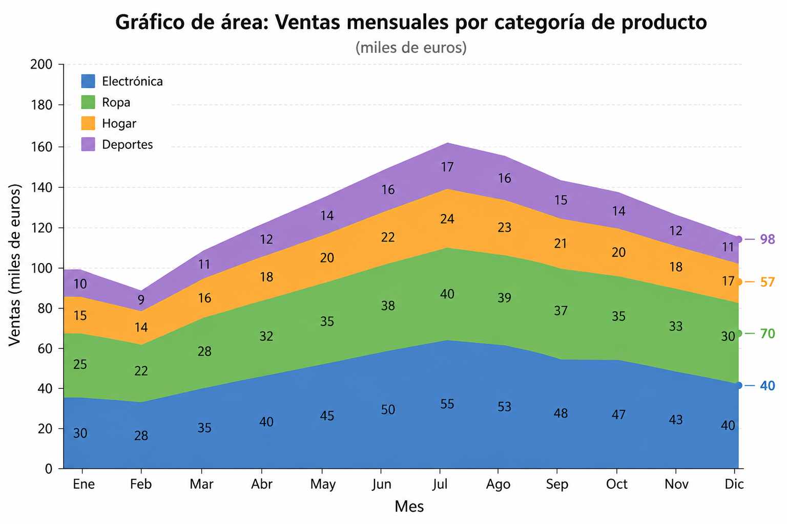

### Gráfico de barras apiladas

`EXAM=(2022J2.C.5)`

El **gráfico de barras apiladas** permite comparar varios elementos mostrando, al mismo tiempo, la composición interna de cada uno. Cada barra representa un total y sus segmentos indican las partes que lo forman, por lo que es útil para analizar relaciones **parte–todo** entre diferentes categorías.

**Buenas prácticas:**

- Utilizar colores claramente diferenciables para cada componente.
- Emplear una escala suficientemente grande para comparar los segmentos.
- Evitar demasiadas subdivisiones, ya que dificultan la lectura.

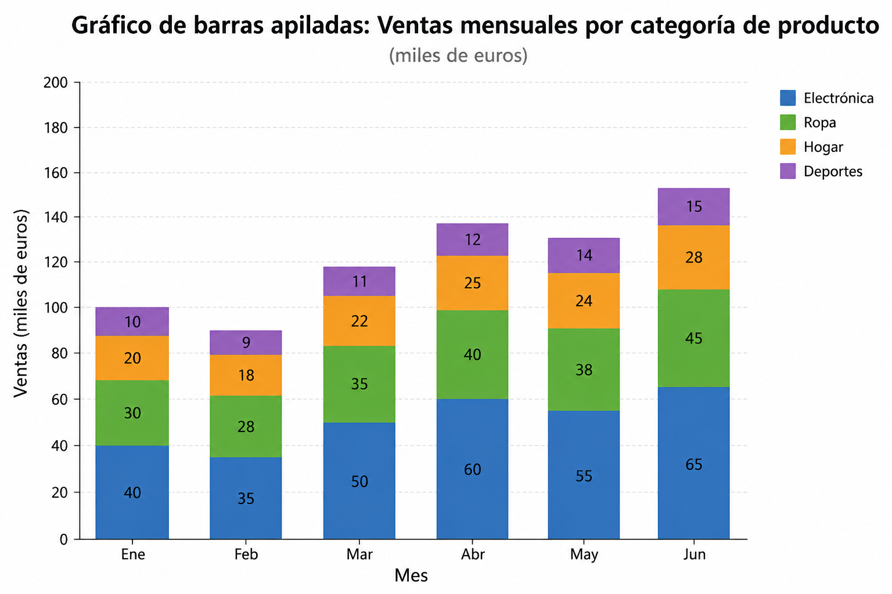

### Gráfico circular

El **gráfico circular** muestra cómo un valor total se distribuye entre distintas categorías. Cada sector representa una parte del conjunto y su tamaño es proporcional al porcentaje correspondiente; la suma de todos los sectores debe ser el `100 %`.

**Buenas prácticas:**

- Utilizar pocas categorías para que los sectores puedan distinguirse con claridad.
- Comprobar que los porcentajes suman `100 %`.
- Ordenar los sectores según su tamaño para facilitar la comparación.

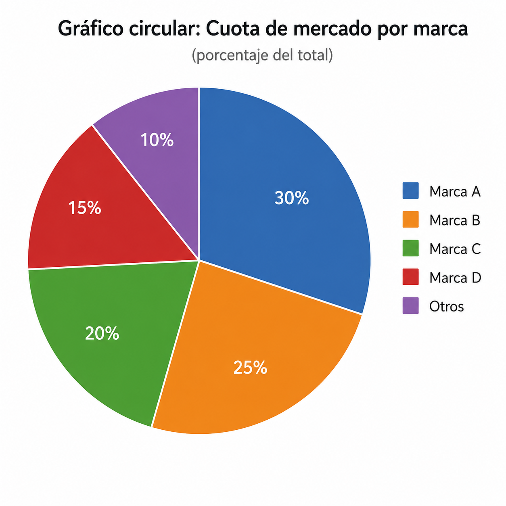

### Gráfico de dispersión

El **gráfico de dispersión** representa observaciones independientes mediante puntos situados según los valores de dos variables. Su objetivo es analizar la relación entre dichas variables, observar la distribución de los datos e identificar agrupaciones, tendencias o valores atípicos.

Puede ampliarse incorporando otros canales visuales, como el color o el tamaño, para representar variables adicionales.

**Buenas prácticas:**

- Utilizar escalas claras y adecuadas al objetivo del análisis.
- Evitar añadir demasiadas líneas de tendencia.
- Diferenciar mediante color o forma solo cuando aporte información relevante.

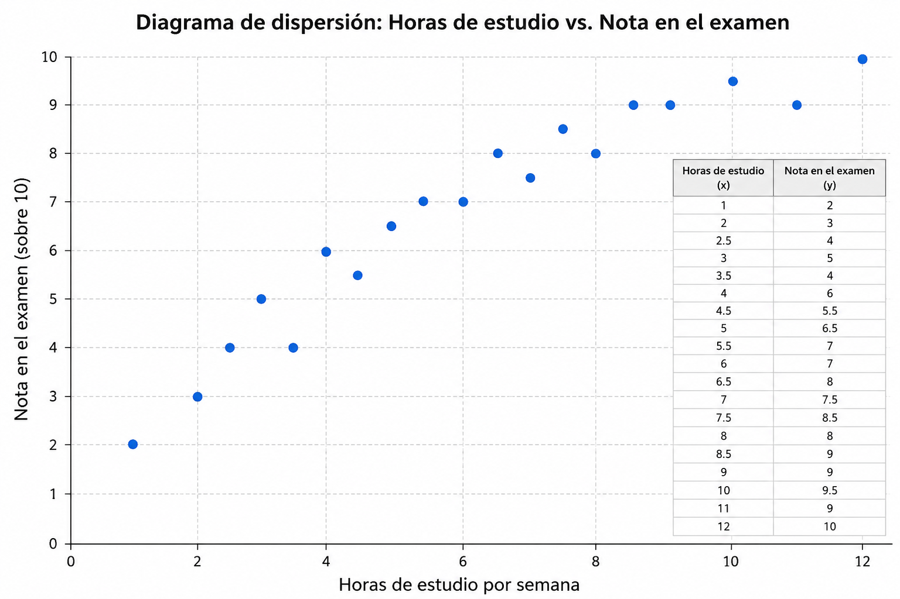

### Gráfico de burbujas

El **gráfico de burbujas** es una variante del gráfico de dispersión que incorpora una variable adicional mediante el tamaño de los círculos. Permite estudiar relaciones o distribuciones entre dos variables y, al mismo tiempo, comparar la magnitud de una tercera.

**Buenas prácticas:**

- Utilizar etiquetas y leyendas claras.
- Escalar las burbujas según su **área**, no según su diámetro.
- Emplear círculos para facilitar la comparación visual de tamaños.

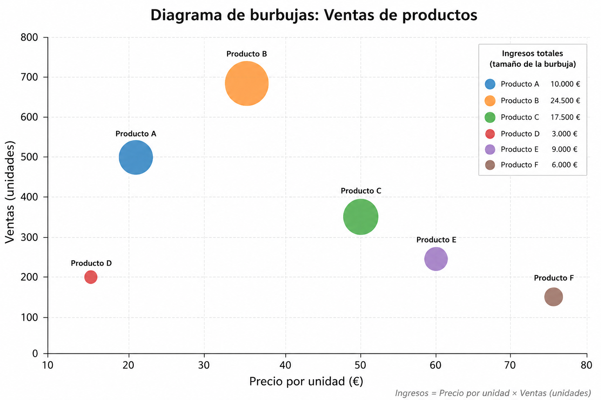

### Gráfico en cascada

El **gráfico en cascada** muestra cómo un valor inicial se modifica mediante aumentos y disminuciones sucesivas hasta alcanzar un valor final. Es útil para explicar la composición de un resultado y la contribución positiva o negativa de cada elemento.

**Buenas prácticas:**

- Diferenciar claramente los aumentos y las disminuciones mediante colores.
- Mantener visible el valor inicial y el resultado final.
- Ordenar los cambios de forma lógica o cronológica.

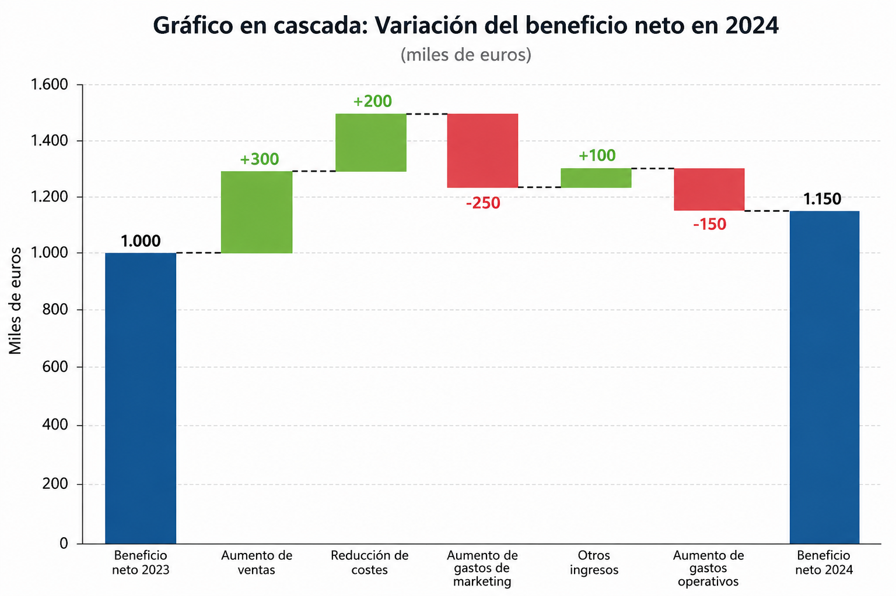

### Mapa de calor

El **mapa de calor** o *heatmap* representa la relación entre dos dimensiones mediante una matriz de celdas, cuyo color indica la intensidad o magnitud del valor correspondiente. Permite identificar rápidamente valores altos y bajos, patrones, concentraciones o coocurrencias.

Cuando los valores son continuos, puede emplearse una gradación de color para representar el cambio de menor a mayor intensidad.

`EXAM=2025J2.2.C`

Como se vió en el tema 2, son adecuados para representar la correlación y la coocurrencia.

**Buenas prácticas:**

- Utilizar una escala de color sencilla y fácilmente interpretable.
- Preferir variaciones de intensidad de un mismo color cuando se representa una magnitud ordenada.
- Evitar patrones o colores excesivos que dificulten la lectura.

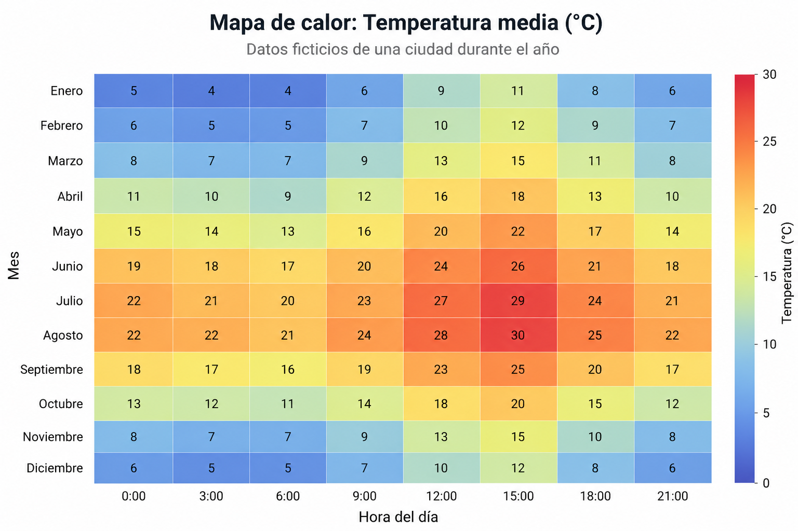

### Grafos

Un **grafo** es una representación visual de relaciones en la que las instancias se muestran mediante **nodos** y las conexiones entre ellas mediante **enlaces** o aristas. Los enlaces pueden diferenciar tipos de relación mediante colores, formas o direcciones distintas.

Los grafos pueden utilizarse con dos finalidades:

- **Comunicación visual:** permiten que una persona explore e interprete relaciones entre elementos, incluso cuando existen distintos tipos de enlaces.
- **Análisis automático de redes:** suelen utilizar un tipo de relación bien definido y permiten aplicar técnicas de teoría de grafos sobre grandes conjuntos de datos.

Mediante un grafo pueden identificarse elementos aislados, grupos o comunidades, nodos centrales, puentes entre grupos, caminos entre nodos o puntos débiles de una red.

Ejemplos de grafos:

- Redes sociales
- Árboles genealógicos
- Mapas conceptuales

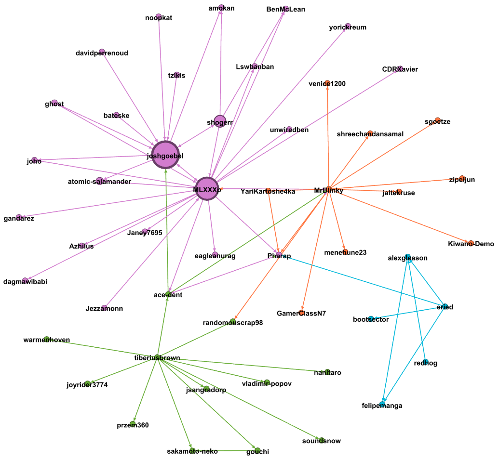

### Visualización de textos

La **visualización de textos** permite representar de forma gráfica información extraída de documentos, mensajes o discursos, como la frecuencia de palabras, su contexto de uso, la polaridad de los mensajes o las relaciones entre términos.

- Mapa de etiquetas
- Diagramas de dispersión

El dendograma ya se vió en el tema 2, por lo que no se detalla aquí.

#### Mapa de etiquetas

- **Mapa de etiquetas:** representación de valores categóricos mediante etiquetas cuyo tamaño indica su frecuencia o importancia. Puede utilizar posición, color u orientación para diferenciar elementos. Permite comparar categorías, aunque no muestra con precisión la proporción respecto al total.

#### Nube de de palabras

\
`EXAM=(2023J2.C.5)`

- **Nube de palabras:** tipo de mapa de etiquetas aplicado a textos. Representa las palabras más relevantes de un conjunto documental, normalmente haciendo que las más frecuentes aparezcan con mayor tamaño. Para construirla es necesario extraer las palabras, eliminar términos poco informativos —como artículos o preposiciones— y calcular su frecuencia.

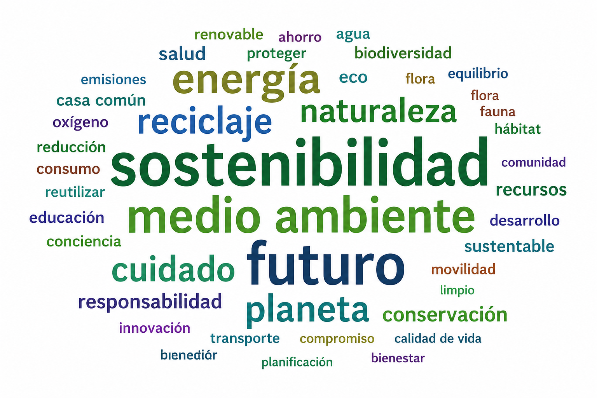

#### Análisis de polaridad o sentimiento

- **Análisis de polaridad o sentimiento:** permite representar si los textos expresan opiniones positivas, negativas o neutras. Puede mostrarse mediante gráficos de dispersión u otras visualizaciones que comparen los mensajes según su valoración.

#### Mapa de árbol

- **Mapa de árbol** o **treemap:** representa categorías mediante áreas proporcionales a su peso respecto al total. Puede utilizarse para mostrar muchos términos o temas y, mediante color o agrupaciones, incorporar distintos niveles de detalle.

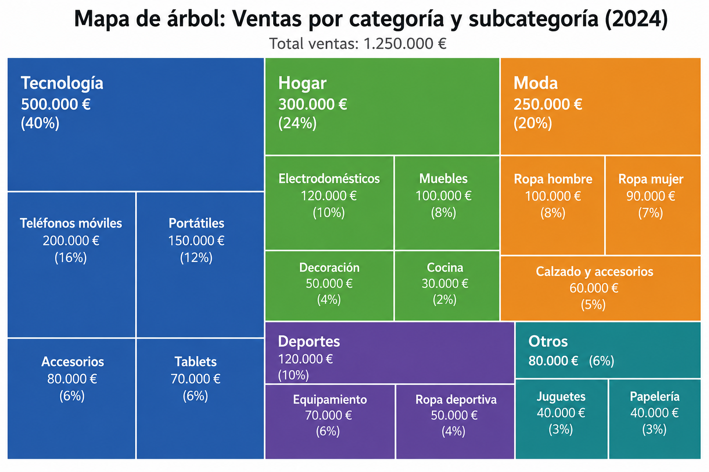

#### Árbol de palabras

- **Árbol de palabras:** muestra una palabra dentro de los contextos o secuencias en los que aparece, permitiendo analizar qué términos la preceden o la siguen habitualmente.

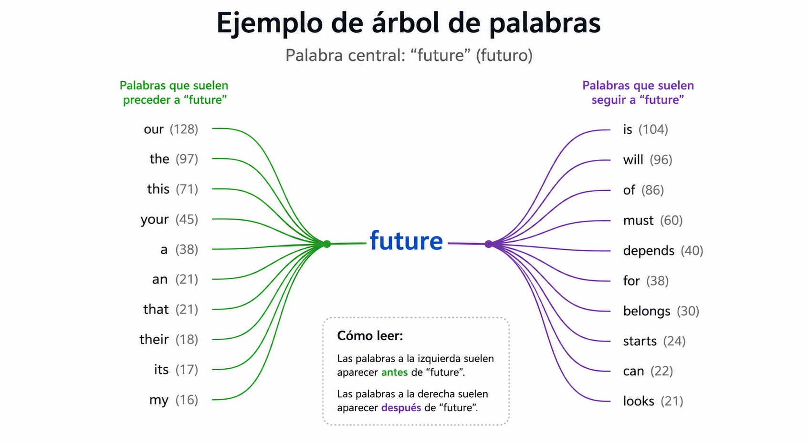

## Representación dinámica

La **representación dinámica** se refiere a sistemas interactivos donde se navega a través de los datos.

### Dashboards

- Un **dashboard** o **cuadro de mandos** es una representación visual que reúne los indicadores y métricas más importantes de una organización, proceso o estrategia, con el fin de supervisar su evolución y facilitar la toma de decisiones.  
  Su función es convertir los datos en información comprensible y útil, permitiendo detectar problemas, identificar oportunidades de mejora y comprobar si se están alcanzando los objetivos establecidos.

Este concepto se introduce en [VD] en el apartado 1.2.2 "Otras definiciones necesarias". En estos apuntes se tratan únicamente en este apartado.

## Bibliografía

- Básica
  - [VD] RINCÓN ZAMORANO, M., RODRIGO YUSTE, A., TOBARRA ABAD, Ll., ROBLES GÓMEZ, A. *Visualización de los Datos*. Versión 1.0. 2020.
- Complementaria
  - [DV101] OETTING, Jami. [Data Visualization 101: How to Choose the Right Chart or Graph for Your Data](https://web.archive.org/web/20201113193458/https://blog.hubspot.com/marketing/types-of-graphs-for-data-visualization), 2018.
  - WILKE, Claus O. Fundamentals of Data Visualization. 1.ª ed. Sebastopol, EEUU: O'Reilly, 2019. ISBN 9781492031086.
  - MALAMED, Connie. Visual Design Solutions: Principles and Creative Inspiration for Learning Professionals. Wiley, 2015.
  - GONNELLA, R., NAVETTA C., Friedman, M. [Design Fundamentals: Notes on Visual Elements and Principles of Composition](https://learning.oreilly.com/library/view/design-fundamentals-notes/9780133930290/). USA: Peachpit Press, 2015. ISBN: 9780133930290.

## Licencia y atribución

[![CC BY 4.0][cc-by-shield]][cc-by]

Este trabajo está licenciado bajo la licencia **[Creative Commons Atribución 4.0 Internacional][cc-by]**.

© 2026, Colaboradores de [apuntes-muicd-uned](https://github.com/pmgallardo/apuntes-muicd-uned).

[cc-by]: http://creativecommons.org/licenses/by/4.0/
[cc-by-shield]: https://img.shields.io/badge/License-CC%20BY%204.0-lightgrey.svg
