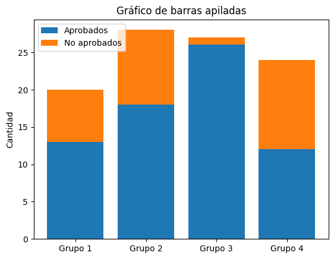

# VD.EX.2022J2

Ejercicios elaborados con fines educativos, inspirados en los contenidos evaluados en el exámen de la sesión de la 2.ª semana de junio 2022 de Visualización de Datos del MUICD de la UNED.

Este documento no es una copia ni una transcripción del examen oficial, sino una redacción propia de ejercicios conceptualmente equivalentes.

Asignatura: Visualización de datos
Duración máxima: 120 minutos.
Material autorizado: ninguno.

## VD.EX.2022J2.C

Tipo de preguntas: multiopción
Pregunta acertada: +1 punto
Pregunta fallada: -0,5 puntos

Si surge alguna ambigüedad, se debe justificar en una hoja adicional el criterio seguido.

### VD.EX.2022J2.C.1

#### Enunciado VD.EX.2022J2.C.1

¿Qué clase de variables se emplea para guardar categorías, etiquetas o nombres?

   a. Variables cuantitativas.  
   b. Variables discretas.  
   c. Variables nominales.  
   d. Variables deterministas.  

#### Solución VD.EX.2022J2.C.1

### VD.EX.2022J2.C.2

#### Enunciado VD.EX.2022J2.C.2

La creación de nuevas variables a partir de otras ya disponibles forma parte de la fase de:

a. Depuración o limpieza de datos.  
b. Filtrado o selección de variables y/o registros.  
c. Transformación de variables.  
d. Agrupamiento (clustering).  

#### Solución VD.EX.2022J2.C.2

### VD.EX.2022J2.C.3

#### Enunciado VD.EX.2022J2.C.3

Cuando se afirma que el objetivo de la visualización debe quedar reflejado al construir un gráfico, ¿qué implica esto?

a. Que lo que no se quiere resaltar aparezca de la forma menos intuitiva posible.  
b. Que lo que se desea destacar se muestre de la manera más clara e intuitiva posible.  
c. Que lo que no se quiere resaltar se presente de la forma más intuitiva posible.  
d. Que lo que se desea destacar se represente de la forma menos intuitiva posible.  

#### Solución VD.EX.2022J2.C.3

### VD.EX.2022J2.C.4

#### Enunciado VD.EX.2022J2.C.4

A partir de la representación gráfica proporcionada, indica cuál afirmación describe correctamente el gráfico:

a. Se trata de un gráfico de columnas que facilita la comparación entre elementos, sin representar evolución temporal, y cuyo eje horizontal parte de cero para no distorsionar los valores.  
b. Es un gráfico de barras que permite comparar elementos y además sugiere evolución temporal, con el eje horizontal iniciando en cero para mantener la proporcionalidad.  
c. Es un gráfico de columnas que compara elementos y refleja evolución temporal, con el eje vertical comenzando en cero para respetar la escala.  
d. Es un gráfico de barras que compara elementos y muestra evolución temporal, con el eje vertical iniciando en cero para asegurar una lectura correcta.  

#### Solución VD.EX.2022J2.C.4

### VD.EX.2022J2.C.5

#### Enunciado VD.EX.2022J2.C.5

Respecto a técnicas de visualización estática, ¿cuál es la finalidad principal de un gráfico de barras apiladas como el ilustrado?

a. Comparar múltiples categorías y, simultáneamente, evidenciar la composición interna de cada una.  
b. Resulta inadecuado para mostrar relaciones entre partes de un conjunto.  
c. No requiere una escala amplia para apreciar diferencias de tamaño entre grupos; por tanto, comparar   aprobados y no aprobados sería irrelevante.
d. Ninguna de las anteriores es correcta.  

#### Solución VD.EX.2022J2.C.5

### VD.EX.2022J2.E

EJERCICIO (máximo dos caras de un folio)

Tipo de pregunta: desarrollo
Puntuación máxima: 5 puntos
Longitud máxima: dos caras de un folio

#### Enunciado VD.EX.2022J2.E

Un medio deportivo desea elaborar una infografía que muestre, en función de la posición de los jugadores antes de disparar a portería, la probabilidad de marcar gol.

Los datos proceden de un repositorio estadístico perteneciente a una casa de apuestas y están organizados en una única tabla con los campos: fecha del encuentro, jugador, posición en el campo (delantero, defensa, centrocampista, etc.), equipo, coordenadas del disparo, minuto del gol y marcador final.

Ejemplo de registros:

| Fecha      | Jugador | Demarcación | Equipo | Coordenadas | Minuto | Resultado |
| ---------- | ------- | ----------- | ------ | ----------- | ------ | --------- |
| 12/02/2016 | 5       | Delantero   | B      | (100,250)   | 85     | 2-0       |
| 12/06/2016 | 15      | Defensa     | B      | (100,400)   | 15     | 2-0       |
| 15/02/2016 | 8       | Delantero   | R      | (201,314)   | 45     | 3-0       |

Cuestiones:

1. Indica qué tipo de preprocesamiento considerarías necesario a partir de los datos de ejemplo.

2. Clasifica cada variable según su tipo de dato.

3. Propón una visualización alineada con el objetivo descrito, justificando tu elección.

4. Opcional: realiza un boceto de la visualización usando los datos proporcionados.

#### Solución VD.EX.2022J2.E
