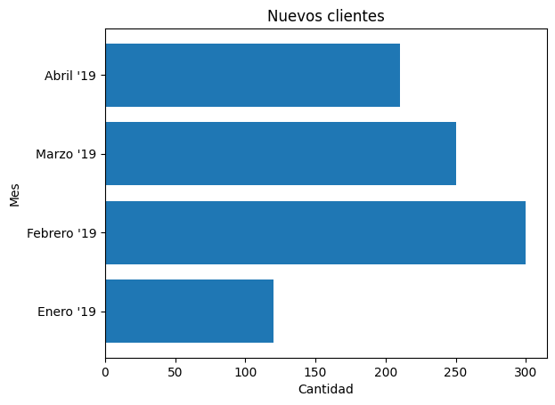

<!--
SPDX-FileCopyrightText: 2026 Colaboradores de apuntes_muicd_uned

SPDX-License-Identifier: CC-BY-4.0
-->

# VD.EX.2024SO

Ejercicios elaborados con fines educativos, inspirados en los contenidos evaluados en el exámen de la sesión ordinaria de septiembre 2024 de Visualización de Datos del MUICD de la UNED.

Este documento no es una copia ni una transcripción del examen oficial, sino una redacción propia de ejercicios conceptualmente equivalentes.

La prueba es de desarrollo y está compuesta por cuatro cuestiones teórico-prácticas. Cada una tiene un valor de 2,5 puntos. El tiempo disponible para completarla es de 120 minutos y no se permite el uso de material de apoyo.

Para responder a todas las preguntas se podrá utilizar, como máximo, el espacio equivalente a dos caras de un folio.

PREGUNTAS

## VD.EX.2024SO.1

### Enunciado VD.EX.2024SO.1

La selección española femenina de fútbol pretende integrar tecnologías IoT en sus sesiones de entrenamiento. Para ello dispone de chalecos inteligentes que registran continuamente la posición de las jugadoras, su distancia respecto al balón, la frecuencia cardiaca y un indicador de fatiga. Se quiere aprovechar esta información desde una perspectiva estratégica para optimizar la colocación de las jugadoras en el campo y decidir el momento más adecuado para realizar sustituciones.

a. ¿Qué tipo de aplicación de visualización de datos, de las estudiadas en la asignatura, resultaría más adecuada para este escenario?

b. Describe los pasos principales necesarios para crear una visualización como la planteada.

c. ¿Este proceso de visualización está orientado principalmente a la presentación de la información o al análisis de la información? Justifica tu respuesta.

### Solución VD.EX.2024SO.1

## VD.EX.2024SO.2

### Enunciado VD.EX.2024SO.2

Se dispone de un conjunto de datos con información de pacientes de un hospital español. Para cada persona se registran: nombre, temperatura corporal, edad, alergias, nivel de urgencia (escala ascendente de 1 a 5) y concentración de proteína C. Responde a las siguientes cuestiones relacionadas con la representación de la información.

a. Se desea determinar si un paciente presenta COVID-19, considerando que su proteína C supera los 10 mg/L y además tiene fiebre. ¿Qué técnicas serían apropiadas para ello? Justifica tu respuesta.

b. Propón una implementación sencilla en código para el apartado anterior utilizando una estructura tipo DataFrame o equivalente.

c. Explica qué es un dendrograma, en qué etapa se emplea y si podría aplicarse a las variables descritas. Justifica tu respuesta.

### Solución VD.EX.2024SO.2

## VD.EX.2024SO.3

### Enunciado VD.EX.2024SO.3

Evalúa la idoneidad de distintas características visuales para representar tres variables —una cuantitativa, una ordinal y una categórica— cuando cada una puede tomar tres valores.

a. En cada celda de la tabla, indica una de las siguientes valoraciones: ideal (+), capacidad limitada (—) o no adecuada (X).

b. Justifica específicamente tus decisiones para las características visuales “forma — longitud” y “movimiento — parpadeo”.

| Característica visual | Subtipo                | Variable cuantitativa | Variable ordinal | Variable categórica |
| --------------------- | ---------------------- | --------------------- | ---------------- | ------------------- |
| Color                 | Tonalidad (matiz, hue) |                       |                  |                     |
| Color                 | Intensidad             |                       |                  |                     |
| Color                 | Saturación             |                       |                  |                     |
| Forma                 | Orientación            |                       |                  |                     |
| Forma                 | Forma                  |                       |                  |                     |
| Forma                 | Cantidad               |                       |                  |                     |
| Posición espacial     | Posición 2D            |                       |                  |                     |
| Movimiento            | Desplazamiento         |                       |                  |                     |

### Solución VD.EX.2024SO.3

## VD.EX.2024SO.4

### Enunciado VD.EX.2024SO.4

En relación con los métodos de selección de gráficos para realizar una visualización, responde a lo siguiente:

a. ¿Cuál es el objetivo principal de seleccionar adecuadamente un tipo de gráfico? Describe brevemente qué comunica el gráfico mostrado.

b. Enumera los cinco tipos de representaciones visuales estudiados en el tema 4 y explica en qué consiste el tipo “conexiones y relaciones”.

c. Describe brevemente tres tipos de representaciones gráficas estáticas, indicando un posible caso de uso para cada una, y señala además qué tipo de gráfico corresponde a la figura presentada.

### Solución VD.EX.2024SO.4
