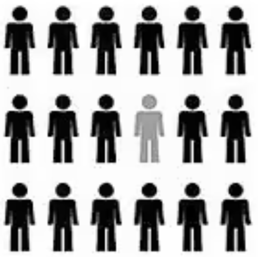
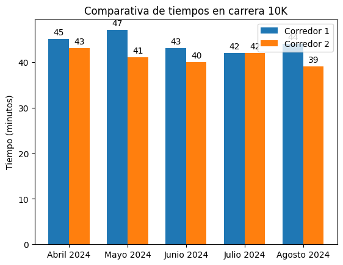

<!--
SPDX-FileCopyrightText: 2026 Colaboradores de apuntes_muicd_uned

SPDX-License-Identifier: CC-BY-4.0
-->

# VD.EX.2025J2

Ejercicios elaborados con fines educativos, inspirados en los contenidos evaluados en el exámen de la sesión de la 2.ª semana de junio 2025 de Visualización de Datos del MUICD de la UNED.

Este documento no es una copia ni una transcripción del examen oficial, sino una redacción propia de ejercicios conceptualmente equivalentes.

La prueba es de desarrollo y está formada por cuatro cuestiones teórico-prácticas. Cada una tiene una valoración de 2,5 puntos. El tiempo disponible para completarla es de 120 minutos y no se permite el uso de material de apoyo durante su realización.

Para responder a todas las preguntas se podrá emplear, como máximo, el espacio equivalente a dos caras de un folio.

PREGUNTAS

## VD.EX.2025J2.1

Una persona responsable de una empresa quiere estudiar el consumo de café de su plantilla porque sospecha que puede influir tanto en el rendimiento laboral como en la salud. Para ello implanta un sistema de registro que guarda, para cada uso de la máquina, la hora, el día de la semana, el tipo de café seleccionado y la cantidad de azúcar. Además, desea relacionar estos datos con la productividad, solicitando un informe que refleje el número de pedidos procesados por trabajador en función de la hora y del día.

a. Describe las etapas necesarias para construir esta visualización siguiendo un proceso estructurado de análisis de la información.

b. Indica qué preguntas clave deberían guiar el análisis y qué tipo de respuestas se espera obtener.

c. Señala qué roles, de los estudiados en la asignatura, participarían en este proceso de visualización.

## VD.EX.2025J2.2

### Enunciado VD.EX.2025J2.2

Responde a las siguientes cuestiones relacionadas con la representación de la información.

a. Explica el proceso incremental de análisis de datos, describiendo las fases que lo componen.

b. La correlación es una tarea relevante del procesado de datos. Define en qué consiste, aporta un ejemplo y señala qué tipo de gráfico puede emplearse para representarla.

c. ¿Qué tipo de gráfico permite mostrar la coocurrencia de varios valores? Describe sus principales características.

### Solución VD.EX.2025J2.2

## VD.EX.2025J2.3

### Enunciado VD.EX.2025J2.3

Identifica los principios compositivos de las listas G y C presentes en cada una de las composiciones mostradas. No basta con enumerarlos: es necesario justificar la función que cumplen dentro de cada composición concreta.

G = [Figura-fondo, Continuidad/buena forma/pregnancia, Proximidad, Similitud, Cierre, Destino común, Juego de objetivos]

C = [Unidad, Jerarquía, Espacio, Balance, Contraste, Escala, Dominancia, Similaridad]

Composición A

Composición B

Composición C

### Solución VD.EX.2025J2.3

## VD.EX.2025J2.4

### Enunciado VD.EX.2025J2.4

Se dispone de un gráfico estático utilizado para comparar tiempos en carreras de 10 kilómetros. A partir de él, responde:

a. ¿Cuál es el propósito principal de seleccionar un gráfico como el mostrado? Describe brevemente qué información comunica.

b. De los cinco tipos de representaciones visuales estudiados, explica en qué consiste el tipo “evolución a lo largo del tiempo”.

c. Indica si el gráfico refleja evolución temporal y si propondrías una representación alternativa más adecuada, justificando tu respuesta.

### Solución VD.EX.2025J2.4
