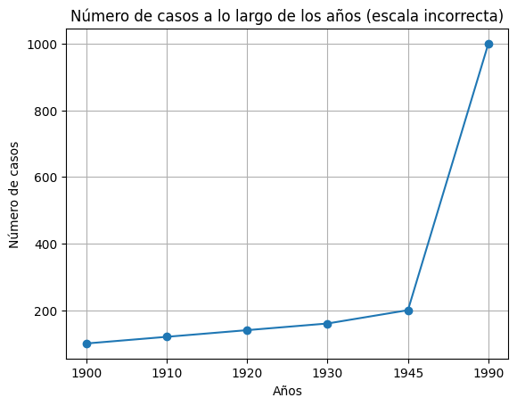
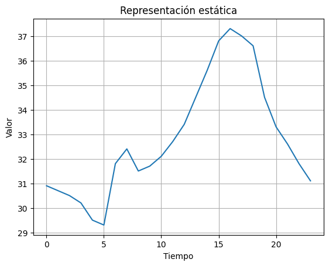

<!--
SPDX-FileCopyrightText: 2026 Colaboradores de apuntes_muicd_uned

SPDX-License-Identifier: CC-BY-4.0
-->

# VD.EX.2025SO

Ejercicios elaborados con fines educativos, inspirados en los contenidos evaluados en el exámen de la sesión ordinaria de septiembre 2025 de Visualización de Datos del MUICD de la UNED.

Este documento no es una copia ni una transcripción del examen oficial, sino una redacción propia de ejercicios conceptualmente equivalentes.

La prueba es de desarrollo y está formada por cuatro cuestiones teórico-prácticas. Cada una tiene una valoración de 2,5 puntos. El tiempo disponible para completarla es de 120 minutos y no se permite el uso de material de apoyo durante su realización.

Para responder a todas las preguntas se podrá emplear, como máximo, el espacio equivalente a dos caras de un folio.

PREGUNTAS

## VD.EX.2025SO.1

### Enunciado VD.EX.2025SO.1

Se proporciona un gráfico que representa una evolución de casos a lo largo del tiempo.

a. Señala qué principios de representación estudiados en la asignatura no se respetan en dicho gráfico.

b. Describe qué dificultades de interpretación podría tener la audiencia al analizarlo.

c. Propón cómo corregir los errores del gráfico teniendo en cuenta que en 1990 se registraron 1000 casos y en 1945 se contabilizaron 200.

### Solución VD.EX.2025SO.1

## VD.EX.2025SO.2

### Enunciado VD.EX.2025SO.2

Se dispone de un conjunto de datos que recoge información sobre alimentos consumidos por estudiantes universitarios durante una semana. Para cada registro se conocen: nombre del alimento, cantidad ingerida en gramos, valor calórico, grupo alimenticio (proteínas, carbohidratos, grasas, vegetales, frutas, etc.), frecuencia de consumo semanal y nivel de satisfacción declarado en una escala de 1 a 10.

a. Se desea identificar alimentos considerados no saludables, definidos como aquellos que superan las 500 calorías por ración y pertenecen a grasas o carbohidratos simples. ¿Qué técnicas serían apropiadas para este objetivo? Justifica tu respuesta.

b. Propón una implementación sencilla en código para resolver el apartado anterior.

c. Los especialistas en nutrición quieren comparar visualmente los alimentos más consumidos según la cantidad ingerida y, además, conocer qué porcentaje del total semanal representa cada uno. ¿Qué transformaciones de datos aplicarías?

### Solución VD.EX.2025SO.2

## VD.EX.2025SO.3

### Enunciado VD.EX.2025SO.3

Identifica los principios compositivos de las listas G y C presentes en cada una de las composiciones mostradas. No basta con enumerarlos: es necesario justificar la función que cumplen dentro de cada composición concreta.

G = [Figura-fondo, Continuidad/buena forma/pregnancia, Proximidad, Similitud, Cierre, Destino común, Juego de objetivos]

C = [Unidad, Jerarquía, Espacio, Balance, Contraste, Escala, Dominancia, Similaridad]

Composición A

Composición B

Composición C

### Solución VD.EX.2025SO.3

## VD.EX.2025SO.4

### Enunciado VD.EX.2025SO.4

Se muestra un gráfico estático empleado como técnica de representación. A partir de él, responde:

a. Explica cuál es el objetivo principal del gráfico y justifica tu respuesta.

b. Describe qué relación entre variables parece estar representándose, aportando un ejemplo razonado.

c. Indica qué mejoras introducirías tanto en la representación como en los aspectos estéticos, justificando tu propuesta.

### Solución VD.EX.2025SO.4
